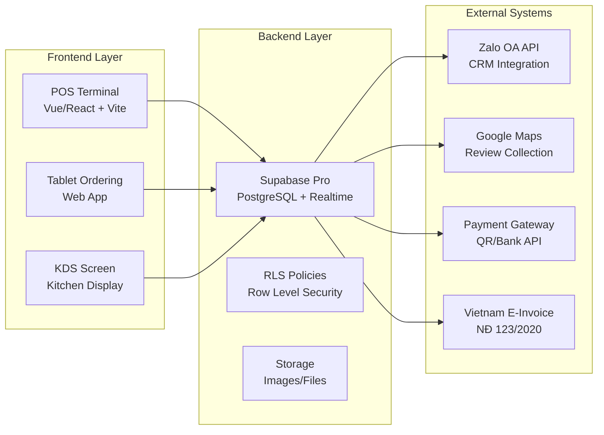
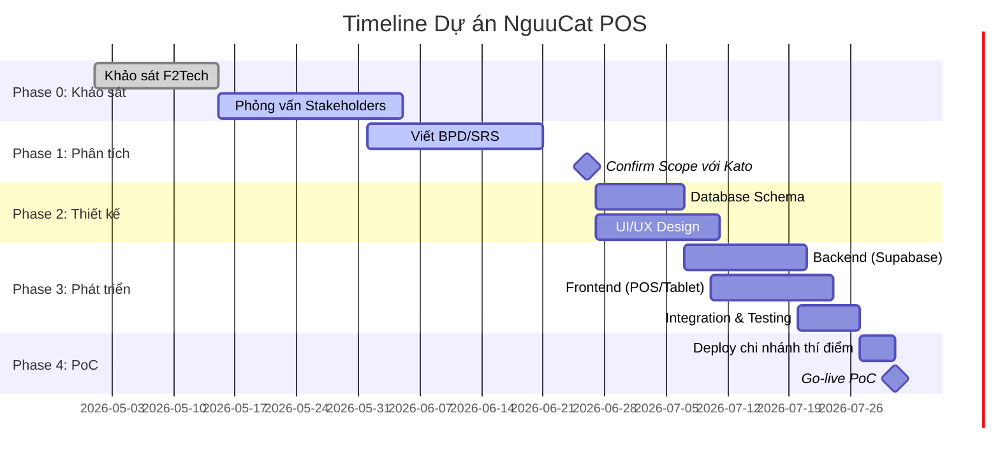
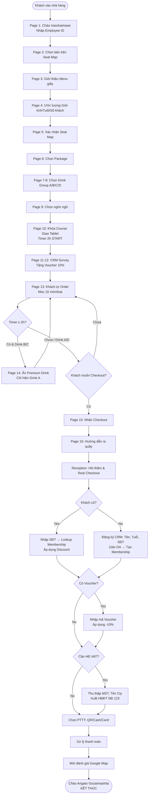
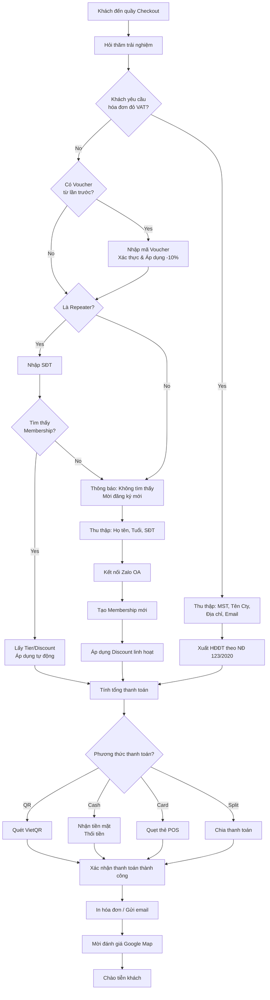
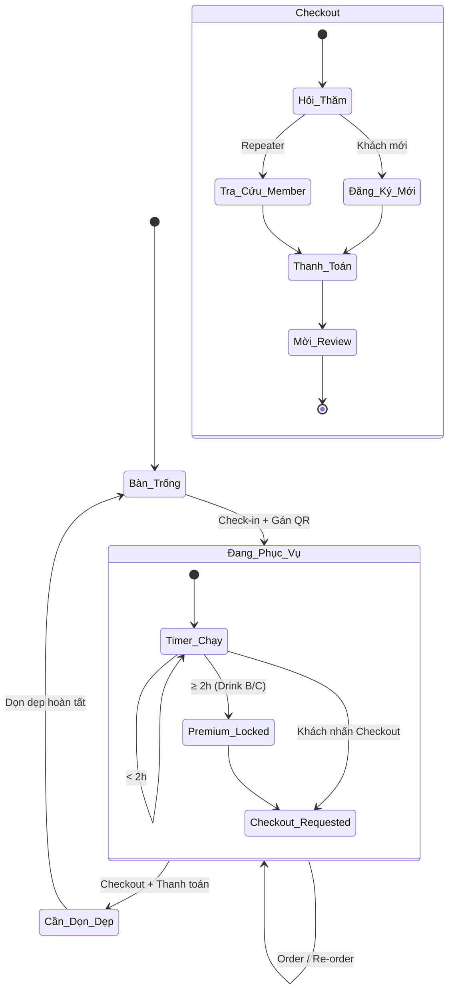
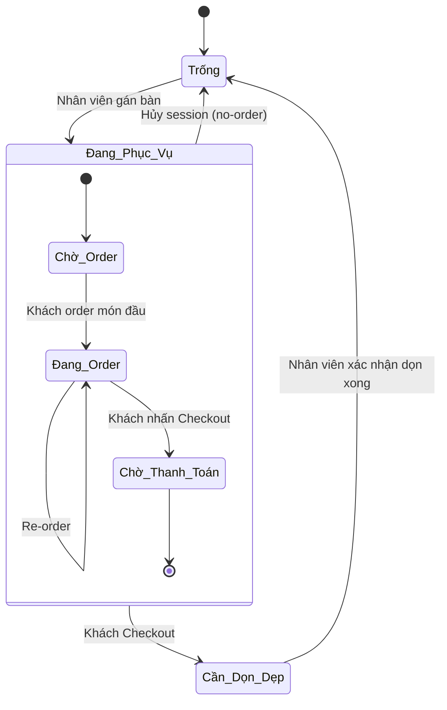
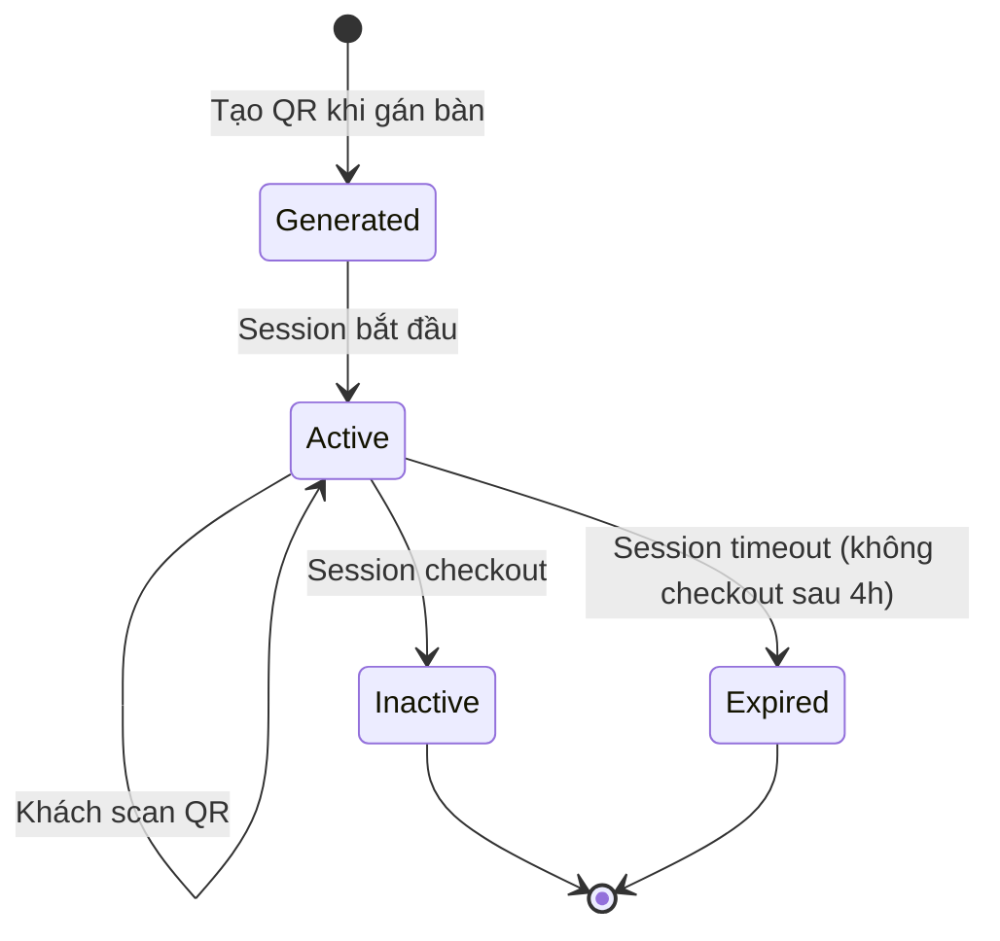
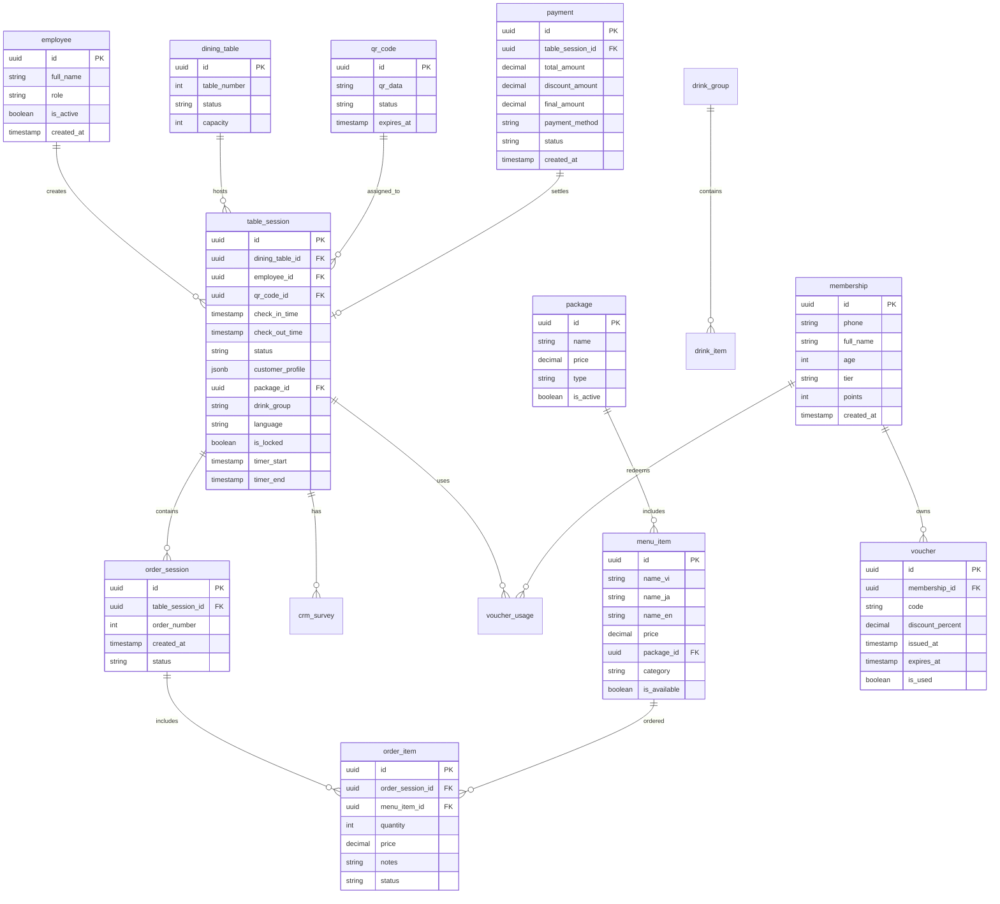

# TÀI LIỆU QUY TRÌNH NGHIỆP VỤ CHÍNH THỨC (BUSINESS PROCESS DOCUMENT)

## HỆ THỐNG POS TỰ PHÁT TRIỂN NGƯU CÁT (NGUUCAT POS)

---

**Thông tin Tài liệu**

| Thuộc tính             | Chi tiết                                                     |
| ---------------------- | ------------------------------------------------------------ |
| **Tên dự án**          | NguuCat POS – Hệ thống POS đa chi nhánh tự phát triển        |
| **Phiên bản**          | 2.0 (Hoàn chỉnh)                                             |
| **Ngày phát hành**     | 24/06/2026                                                   |
| **Người soạn thảo**    | Senior Business Analyst                                      |
| **Người phê duyệt**    | Kato (BA/PM Reviewer) – _Đang chờ xác nhận trước 26/06/2026_ |
| **Mốc mục tiêu (PoC)** | 31/07/2026 – Vận hành thử nghiệm tại 1 chi nhánh thí điểm    |
| **Ngân sách hạ tầng**  | ~25 USD/tháng (Supabase Pro) cho 5 chi nhánh                 |
| **Trạng thái**         | Draft – Chờ Review & Confirm Scope                           |

---

## MỤC LỤC

1. [Tổng quan Nghiệp vụ](#1-tổng-quan-nghiệp-vụ)
2. [Bối cảnh Dự án & Tổ chức](#2-bối-cảnh-dự-án--tổ-chức)
3. [Danh sách Actor & Stakeholder](#3-danh-sách-actor--stakeholder)
4. [Danh sách Quy trình Nghiệp vụ](#4-danh-sách-quy-trình-nghiệp-vụ)
5. [Chi tiết Từng Quy trình](#5-chi-tiết-từng-quy-trình)
6. [Business Rules](#6-business-rules)
7. [Dữ liệu Đầu vào và Đầu ra theo Màn hình](#7-dữ-liệu-đầu-vào-và-đầu-ra-theo-màn-hình)
8. [Mapping Màn hình và Nghiệp vụ](#8-mapping-màn-hình-và-nghiệp-vụ)
9. [BPMN / Flowchart](#9-bpmn--flowchart)
10. [Use Case List](#10-use-case-list)
11. [Database Schema Mapping](#11-database-schema-mapping)
12. [Gap Analysis](#12-gap-analysis)
13. [Assumptions](#13-assumptions)
14. [Risks & Mitigation Plan](#14-risks--mitigation-plan)
15. [Phụ lục](#15-phụ-lục)

---

## 1. Tổng quan Nghiệp vụ

### 1.1 Mục tiêu Dự án

Dự án **NguuCat POS** được khởi xướng nhằm thay thế hoàn toàn hệ thống POS hiện tại từ nhà cung cấp bên ngoài **F2Tech** bằng giải pháp tự phát triển nội bộ. Mục tiêu chiến lược bao gồm:

| Mục tiêu                       | Mô tả chi tiết                                                                                                                                       | KPI đo lường                                |
| ------------------------------ | ---------------------------------------------------------------------------------------------------------------------------------------------------- | ------------------------------------------- |
| **Giảm phụ thuộc vendor**      | Loại bỏ sự phụ thuộc vào F2Tech, chủ động kiểm soát source code và roadmap                                                                           | 100% sở hữu source code                     |
| **Tối ưu chi phí vận hành**    | Giảm chi phí hàng tháng từ ~200-500 USD (F2Tech) xuống ~25 USD (Supabase Pro)                                                                        | Tiết kiệm ≥80% chi phí                      |
| **Tùy biến nghiệp vụ đặc thù** | Đáp ứng các yêu cầu riêng của mô hình nhà hàng nướng Nhật Bản: chọn món theo set, giới hạn thời gian 2h, quản lý bếp than, kiểm soát đồ uống premium | 100% nghiệp vụ đặc thù được cover           |
| **Quản lý tập trung CRM**      | Xây dựng hệ sinh thái khách hàng thân thiết, kết nối Zalo OA, thu thập đánh giá Google Map                                                           | ≥70% khách mới đăng ký CRM                  |
| **Mở rộng đa chi nhánh**       | Kiến trúc cho phép triển khai nhanh cho 5+ chi nhánh                                                                                                 | PoC tại 1 chi nhánh, scale-up trong 3 tháng |

### 1.2 Phạm vi Áp dụng

#### 1.2.1 Phạm vi Giai đoạn 1 (PoC – 31/07/2026)

| Hạng mục                 | Chi tiết                                                                                                    |
| ------------------------ | ----------------------------------------------------------------------------------------------------------- |
| **Chi nhánh triển khai** | 01 chi nhánh thí điểm (sẽ được chọn sau khi confirm scope)                                                  |
| **Đối tượng sử dụng**    | Nhân viên phục vụ, Lễ tân, Bếp, Quản lý chi nhánh                                                           |
| **Thiết bị**             | Tablet (khách tự order), POS Terminal (nhân viên/lễ tân), PC quầy lễ tân                                    |
| **Phạm vi nghiệp vụ**    | Walk-in Check-in → Chọn Menu → Dùng bữa → CRM → Checkout → Review                                           |
| **Công nghệ**            | Frontend: Vue/React + Vite (deploy Vercel Free); Backend: Supabase Pro (PostgreSQL, Realtime, RLS, Storage) |

#### 1.2.2 Ngoài phạm vi Giai đoạn 1 (Chuyển sang Phase 2)

| Hạng mục                                 | Lý do defer                                     |
| ---------------------------------------- | ----------------------------------------------- |
| Quản lý Đặt bàn Online (Reservation)     | Cần tích hợp website/app, ưu tiên walk-in trước |
| Quản lý Kho & Định lượng (Inventory/BOM) | Phức tạp, cần Naka (Thu mua) confirm chi tiết   |
| Quản lý Nhà cung cấp (Procurement)       | Nghiệp vụ riêng của OPT Team, tách riêng        |
| Báo cáo Tài chính chuyên sâu             | Clara (Kế toán) cần thời gian define yêu cầu    |
| Tích hợp HĐĐT (Hóa đơn điện tử NĐ 123)   | Cần xác nhận cấu trúc dữ liệu với Clara         |
| Multi-branch Sync                        | Chỉ áp dụng khi PoC thành công                  |

### 1.3 Các Hệ thống Liên quan



| Hệ thống                         | Vai trò                                  | Công nghệ                       | Chi phí             |
| -------------------------------- | ---------------------------------------- | ------------------------------- | ------------------- |
| **NguuCat POS (Frontend)**       | Giao diện POS cho nhân viên & lễ tân     | Vue/React + Vite, deploy Vercel | Free tier           |
| **Tablet Ordering System**       | Giao diện tự phục vụ cho khách tại bàn   | Web App responsive, scan QR     | Free tier           |
| **Kitchen Display System (KDS)** | Hiển thị order real-time xuống bếp       | Web App + Supabase Realtime     | Included            |
| **Supabase Backend**             | Database, Auth, Realtime, Storage        | PostgreSQL, RLS, Edge Functions | $25/tháng           |
| **Zalo OA**                      | Kết nối CRM, gửi tin nhắn chăm sóc khách | Zalo Official Account API       | Theo gói            |
| **Google Maps**                  | Thu thập đánh giá từ khách hàng          | Google My Business Link         | Free                |
| **Payment Gateway**              | Xử lý thanh toán QR code ngân hàng       | VietQR / Bank API               | Theo giao dịch      |
| **E-Invoice Provider**           | Xuất hóa đơn điện tử theo NĐ 123/2020    | Viettel/BKAV/MeInvoice          | ~0.5-1K VND/hóa đơn |

### 1.4 Các Phòng ban Tham gia

| Phòng ban        | Đại diện              | Vai trò trong dự án              | Trách nhiệm chính                                 |
| ---------------- | --------------------- | -------------------------------- | ------------------------------------------------- |
| **Project Team** | Ishii-san (PM)        | Quản lý dự án, yêu cầu, UI/UX    | Khảo sát, phỏng vấn, thiết kế UI, quản lý tiến độ |
|                  | Per & Phu (Backend)   | Phát triển backend, DB, API      | Thiết kế DB, API, logic thanh toán, RLS, Realtime |
|                  | Kato (BA/PM Reviewer) | Phê duyệt scope, review tài liệu | Confirm scope trước 26/06, phê duyệt BPD/SRS      |
| **Admin Team**   | Clara (Kế toán)       | Stakeholder – Tài chính          | Đối soát doanh thu, hóa đơn VAT, báo cáo thuế     |
|                  | Matta (HR/Admin)      | Stakeholder – Nhân sự & CRM      | Phân quyền, voucher, loyalty, audit log           |
|                  | Wynne (TBD)           | Stakeholder – _Chưa xác định_    | Cần phỏng vấn để xác định vai trò                 |
| **OPT Team**     | Naka (Thu mua)        | Stakeholder – Nguyên liệu        | Định lượng BOM, Food Cost, kiểm soát hao hụt      |
|                  | Hataken (TBD)         | Stakeholder – _Chưa xác định_    | Dự kiến Marketing/CRM, KOL/KOC tracking           |
| **Store Team**   | Minh (Bếp)            | Stakeholder – Vận hành bếp       | Nhận order, chế biến, xử lý hủy/sai               |
|                  | Luc (QL Bếp)          | Stakeholder – Quản lý bếp        | Hiệu suất bếp, thời gian chế biến                 |

---

## 2. Bối cảnh Dự án & Tổ chức

### 2.1 Cấu trúc Thư mục Dự án

```
E:\Công ty\Task\260\
├── Nghiệp vụ/                          # Tài liệu nghiệp vụ gốc
│   ├── Nghiệp vụ.docx                  # ERD và quy trình check-in
│   └── dig.txt                         # Mermaid Graph luồng nghiệp vụ
├── docs/                               # Tài liệu phân tích & thiết kế
│   ├── Business_Analysis_Report.md     # Báo cáo đối chiếu nghiệp vụ & DB
│   ├── OrderFlowChart 2026 ver1.4.md   # Mô tả chi tiết 16 trang Tablet/POS
│   ├── POS report.xlsx - check list.csv# Khảo sát so sánh các POS trên thị trường
│   ├── WEEKLY_REPORT_2026-06-21.md     # Báo cáo tiến độ Tuần 3
│   ├── DATABASE_SCHEMA.sql             # 19 bảng PostgreSQL
│   ├── DATABASE_DESIGN.md              # Lý giải thiết kế DB + 26 views
│   └── COST_ANALYSIS.md                # Phân tích chi phí Supabase Pro
├── POS/                                # Kế hoạch & thu thập yêu cầu
│   ├── plan (1).md                     # Lộ trình dự án
│   └── NguuCat_POS_Requirement_Gathering_Package.docx
├── Product/                            # Source code Frontend chính thức
│   ├── src/                            # Views, components, mock data
│   ├── package.json                    # Vite + Vue/React config
│   └── plan.md                         # Chi tiết hạ tầng Supabase
├── UI clone/                           # Nghiên cứu UI (Next.js)
├── Interview/                          # Tài liệu phỏng vấn
│   ├── phan tich vai tro.docx          # Phân tích 6 stakeholders
│   └── NguuCat_POS_Business_Survey_Forms.docx
└── Thông tin cần tìm thêm.docx         # Câu hỏi cần làm rõ
```

### 2.2 Timeline Dự án



### 2.3 Ngân sách & Chi phí Vận hành

| Hạng mục              | Chi phí/tháng       | Ghi chú                                |
| --------------------- | ------------------- | -------------------------------------- |
| **Supabase Pro**      | $25                 | Database, Realtime, Auth, Storage, RLS |
| **Vercel (Frontend)** | $0                  | Free tier cho 5 chi nhánh              |
| **Domain**            | ~$1                 | 1 domain chính + subdomain             |
| **Zalo OA**           | ~$10-20             | Tùy gói tin nhắn                       |
| **Payment Gateway**   | ~0.1-0.3%           | Theo giao dịch                         |
| **E-Invoice**         | ~0.5-1K VND/hóa đơn | Theo số lượng                          |
| **Tổng cộng**         | **~$35-50/tháng**   | Cho 5 chi nhánh                        |

> **So sánh với F2Tech:** ~200-500 USD/tháng + phí tùy chỉnh → Tiết kiệm **80-90%** chi phí vận hành.

---

## 3. Danh sách Actor & Stakeholder

### 3.1 Human Actors

#### 3.1.1 Customer (Khách hàng)

| Thuộc tính             | Mô tả                                                                                                       |
| ---------------------- | ----------------------------------------------------------------------------------------------------------- |
| **Vai trò**            | Người sử dụng dịch vụ ăn uống tại nhà hàng                                                                  |
| **Phân loại**          | Walk-in (vãng lai), Repeater (quay lại), Member (thành viên), First-time (lần đầu)                          |
| **Trách nhiệm**        | Quét QR bàn, chọn món trên Tablet, tuân thủ quy tắc 2h & giới hạn 10 món/loại, thực hiện checkout, đánh giá |
| **Dữ liệu xử lý**      | Thông tin cá nhân (Tên, Tuổi, SĐT), Order Items, Voucher, Membership ID, Consent (chụp ảnh)                 |
| **Thiết bị tương tác** | Tablet (tại bàn), Quầy lễ tân (checkout)                                                                    |

#### 3.1.2 Service Staff (Nhân viên Phục vụ)

| Thuộc tính             | Mô tả                                                                                                           |
| ---------------------- | --------------------------------------------------------------------------------------------------------------- |
| **Vai trò**            | Người trực tiếp đón khách, gán bàn, chọn menu, giao tablet                                                      |
| **Trách nhiệm**        | Thực hiện quy trình Check-in (Page 1-12), ước lượng khách hàng, chọn package & drink, khóa course, tặng voucher |
| **Dữ liệu xử lý**      | Employee ID, Table Assignment, QR Code, Package Selection, Drink Group, Language, Customer Estimation           |
| **Quyền hạn**          | Tạo session, khóa course, xem order; KHÔNG được mở khóa course, áp dụng discount lớn                            |
| **Thiết bị tương tác** | POS Terminal hoặc Tablet nhân viên                                                                              |

#### 3.1.3 Reception Staff (Nhân viên Lễ tân)

| Thuộc tính             | Mô tả                                                                                                |
| ---------------------- | ---------------------------------------------------------------------------------------------------- |
| **Vai trò**            | Người thực hiện thanh toán thực tế tại quầy, quản lý CRM, đối soát                                   |
| **Trách nhiệm**        | Real Check Out trên POS, tra cứu Membership, đăng ký khách mới, thu thập đánh giá, xử lý VAT invoice |
| **Dữ liệu xử lý**      | Payment Method, Membership Lookup, CRM Registration, Discount Application, Invoice/VAT               |
| **Quyền hạn**          | Thanh toán, áp dụng discount cố định, tạo membership, xuất hóa đơn                                   |
| **Thiết bị tương tác** | POS Terminal tại quầy lễ tân, PC đối soát                                                            |

#### 3.1.4 Kitchen Staff (Nhân viên Bếp)

| Thuộc tính             | Mô tả                                                                                                       |
| ---------------------- | ----------------------------------------------------------------------------------------------------------- |
| **Vai trò**            | Người nhận và chế biến món ăn từ order                                                                      |
| **Trách nhiệm**        | Nhận order từ KDS, cập nhật trạng thái (New → Preparing → Ready), xử lý order hủy/sai sót, quản lý bếp than |
| **Dữ liệu xử lý**      | Order Items, Order Status, Kitchen Notes, Preparation Time                                                  |
| **Quyền hạn**          | Xem order, cập nhật trạng thái, báo hủy (với lý do)                                                         |
| **Thiết bị tương tác** | KDS Screen (Kitchen Display System) hoặc Printer                                                            |

#### 3.1.5 Manager (Quản lý Chi nhánh)

| Thuộc tính        | Mô tả                                                                               |
| ----------------- | ----------------------------------------------------------------------------------- |
| **Vai trò**       | Người giám sát vận hành, xử lý ngoại lệ                                             |
| **Trách nhiệm**   | Mở khóa course (khi cần), phê duyệt discount lớn, xử lý khiếu nại, xem báo cáo ngày |
| **Dữ liệu xử lý** | Override PIN, Discount Approval, Reports                                            |
| **Quyền hạn**     | Tất cả quyền của Staff + mở khóa course, áp dụng discount linh hoạt, xem báo cáo    |

#### 3.1.6 Admin/Accounting (Kế toán & Admin)

| Thuộc tính        | Mô tả                                                                                    |
| ----------------- | ---------------------------------------------------------------------------------------- |
| **Vai trò**       | Người quản trị hệ thống, đối soát tài chính                                              |
| **Trách nhiệm**   | Cấu hình menu, quản lý nhân viên, đối soát doanh thu, xuất báo cáo thuế, quản lý voucher |
| **Dữ liệu xử lý** | System Config, Employee Management, Financial Reports, VAT Reports                       |
| **Quyền hạn**     | Full access, cấu hình hệ thống, quản lý chi nhánh                                        |

### 3.2 System Actors

#### 3.2.1 POS System (Hệ thống POS Trung tâm)

| Thuộc tính        | Mô tả                                                                                                    |
| ----------------- | -------------------------------------------------------------------------------------------------------- |
| **Vai trò**       | Hệ thống phần mềm trung tâm quản lý toàn bộ nghiệp vụ                                                    |
| **Trách nhiệm**   | Quản lý Table Session, đếm thời gian 2h, tính toán giá, xử lý thanh toán, xuất hóa đơn, đồng bộ Realtime |
| **Dữ liệu xử lý** | Table Session, Order Data, Payment Data, Employee Data, Financial Reports                                |
| **Công nghệ**     | Vue/React + Vite, Supabase Realtime                                                                      |

#### 3.2.2 Tablet Ordering System

| Thuộc tính        | Mô tả                                                                                                   |
| ----------------- | ------------------------------------------------------------------------------------------------------- |
| **Vai trò**       | Giao diện tự phục vụ cho khách đặt món tại bàn                                                          |
| **Trách nhiệm**   | Hiển thị menu theo package, kiểm soát giới hạn 10 món, quản lý timer premium drink, gửi order xuống bếp |
| **Dữ liệu xử lý** | Session QR, Menu Items, Order Cart, Timer Status, Drink Restriction Rules                               |
| **Công nghệ**     | Web App responsive, scan QR để join session                                                             |

#### 3.2.3 Kitchen Display System (KDS)

| Thuộc tính        | Mô tả                                                                                    |
| ----------------- | ---------------------------------------------------------------------------------------- |
| **Vai trò**       | Hiển thị order real-time xuống bếp                                                       |
| **Trách nhiệm**   | Nhận order từ POS, hiển thị theo thứ tự, cập nhật trạng thái, cảnh báo món quá thời gian |
| **Dữ liệu xử lý** | Order Queue, Status Updates, Timer per dish                                              |
| **Công nghệ**     | Supabase Realtime subscriptions                                                          |

#### 3.2.4 CRM System

| Thuộc tính        | Mô tả                                                                              |
| ----------------- | ---------------------------------------------------------------------------------- |
| **Vai trò**       | Quản lý dữ liệu khách hàng và chiến dịch marketing                                 |
| **Trách nhiệm**   | Lưu trữ hồ sơ khách, quản lý voucher 10%, khảo sát nguồn biết đến, kết nối Zalo OA |
| **Dữ liệu xử lý** | Customer Profile, Survey Answers, Voucher Codes, Zalo OA Binding                   |

#### 3.2.5 Membership System

| Thuộc tính        | Mô tả                                                                        |
| ----------------- | ---------------------------------------------------------------------------- |
| **Vai trò**       | Quản lý chương trình khách hàng thân thiết                                   |
| **Trách nhiệm**   | Nhận diện Repeater qua SĐT, áp dụng discount policy, tích điểm, quản lý tier |
| **Dữ liệu xử lý** | Membership ID, Phone Number, Tier Level, Discount Rules, Transaction History |

---

## 4. Danh sách Quy trình Nghiệp vụ

### 4.1 Phân loại theo Nhóm Nghiệp vụ

#### 4.1.1 Nhóm A: Reservation Management (Quản lý Đặt bàn)

> ⚠️ **Ghi chú:** Các quy trình này thuộc **Phase 2**, không nằm trong scope PoC 31/07/2026.

| Mã      | Tên Quy trình        | Mô tả                                      | Trạng thái |
| ------- | -------------------- | ------------------------------------------ | ---------- |
| RES-001 | Online Booking       | Khách đặt bàn qua website/app              | 🔲 Phase 2 |
| RES-002 | Offline Booking      | Đặt bàn qua điện thoại/walk-in reservation | 🔲 Phase 2 |
| RES-003 | Booking Confirmation | Gửi xác nhận đặt bàn (SMS/Zalo)            | 🔲 Phase 2 |
| RES-004 | Booking Modification | Khách sửa đổi đặt bàn                      | 🔲 Phase 2 |
| RES-005 | Booking Cancellation | Khách hủy đặt bàn                          | 🔲 Phase 2 |
| RES-006 | No-show Handling     | Xử lý khách không đến                      | 🔲 Phase 2 |

#### 4.1.2 Nhóm B: Customer Service (Dịch vụ Khách hàng – Phase 1)

| Mã     | Tên Quy trình               | Mô tả ngắn                                     | Priority |
| ------ | --------------------------- | ---------------------------------------------- | -------- |
| CS-001 | Customer Check-in & Welcome | Đón khách, chào Irasshaimase, nhập Employee ID | P0       |
| CS-002 | Table Assignment (QR)       | Gán mã QR động cho bàn, chọn trên Seat Map     | P0       |
| CS-003 | Customer Classification     | Ước lượng giới tính, độ tuổi, số lượng khách   | P1       |
| CS-004 | Package Selection           | Chọn gói Buffet/Biz/Kids Meal                  | P0       |
| CS-005 | Drink Selection             | Chọn nhóm đồ uống A/B/C/D                      | P0       |
| CS-006 | Language Selection          | Chọn ngôn ngữ hiển thị trên Tablet             | P1       |

#### 4.1.3 Nhóm C: Dining Process (Quy trình Dùng bữa – Phase 1)

| Mã     | Tên Quy trình                | Mô tả ngắn                              | Priority |
| ------ | ---------------------------- | --------------------------------------- | -------- |
| DN-001 | Course Locking & Timer Start | Khóa course, giao Tablet, POS đếm 2h    | P0       |
| DN-002 | Tablet Self-Ordering         | Khách tự đặt món (max 10 món/loại/lượt) | P0       |
| DN-003 | Re-order                     | Khách đặt thêm món trong phiên          | P0       |
| DN-004 | 2-Hour Dining Control        | Kiểm soát thời gian dùng bữa 2h         | P0       |
| DN-005 | Premium Drink Restriction    | Ẩn đồ uống B/C sau 2h, chỉ hiện A       | P0       |
| DN-006 | Order Modification/Cancel    | Khách/Bếp hủy hoặc sửa món              | P1       |
| DN-007 | Kitchen Order Processing     | Bếp nhận và chế biến order              | P0       |

#### 4.1.4 Nhóm D: CRM & Membership (Phase 1)

| Mã      | Tên Quy trình                | Mô tả ngắn                                  | Priority |
| ------- | ---------------------------- | ------------------------------------------- | -------- |
| CRM-001 | CRM Survey                   | Khảo sát nguồn biết đến, xin phép chụp ảnh  | P1       |
| CRM-002 | Voucher Issuance             | Tặng voucher 10% cho lần sau                | P1       |
| CRM-003 | Repeater Detection           | Nhận diện khách cũ qua SĐT                  | P0       |
| CRM-004 | Membership Registration      | Đăng ký khách mới (Tên, Tuổi, SĐT, Zalo OA) | P0       |
| CRM-005 | Membership Lookup & Discount | Tra cứu membership, áp dụng giảm giá        | P0       |

#### 4.1.5 Nhóm E: Checkout Process (Quy trình Thanh toán – Phase 1)

| Mã     | Tên Quy trình                 | Mô tả ngắn                               | Priority |
| ------ | ----------------------------- | ---------------------------------------- | -------- |
| CO-001 | Checkout Request (Tablet)     | Khách nhấn nút Checkout trên Tablet      | P0       |
| CO-002 | Reception Checkout            | Lễ tân thực hiện Real Check Out trên POS | P0       |
| CO-003 | Payment Processing            | Xử lý thanh toán (QR/Cash/Card)          | P0       |
| CO-004 | Review Collection             | Mời khách đánh giá trên Google Map       | P2       |
| CO-005 | VAT Invoice Issuance          | Xuất hóa đơn đỏ theo NĐ 123/2020         | P1       |
| CO-006 | Split Bill / Partial Checkout | Tách hóa đơn cho nhóm khách              | P2       |

#### 4.1.6 Nhóm F: Administration & Reporting (Quản trị & Báo cáo – Phase 1)

| Mã      | Tên Quy trình        | Mô tả ngắn                              | Priority |
| ------- | -------------------- | --------------------------------------- | -------- |
| ADM-001 | Employee Management  | Quản lý tài khoản nhân viên, phân quyền | P0       |
| ADM-002 | Menu Configuration   | Cấu hình menu, package, drink groups    | P0       |
| ADM-003 | Table Management     | Quản lý sơ đồ bàn, trạng thái           | P0       |
| ADM-004 | Daily Reconciliation | Đối soát doanh thu cuối ngày            | P0       |
| ADM-005 | Financial Reporting  | Báo cáo tài chính (Clara)               | P1       |
| ADM-006 | Audit Log Review     | Xem lịch sử thao tác (Matta)            | P1       |

---

## 5. Chi tiết Từng Quy trình

### 5.1 CS-001: Customer Check-in & Welcome

| Thuộc tính        | Chi tiết                                                                                |
| ----------------- | --------------------------------------------------------------------------------------- |
| **Objective**     | Ghi nhận sự hiện diện của nhân viên, bắt đầu phiên phục vụ mới theo phong cách Nhật Bản |
| **Trigger**       | Khách hàng bước vào nhà hàng                                                            |
| **Preconditions** | Nhân viên đã đăng nhập hệ thống; POS đang hoạt động; Có bàn trống                       |
| **Actor chính**   | Service Staff                                                                           |
| **Actor phụ**     | POS System                                                                              |

**Main Flow:**

| Bước | Mô tả                                                                                   | Actor         | Hệ thống                 |
| ---- | --------------------------------------------------------------------------------------- | ------------- | ------------------------ |
| 1    | Nhân viên chào khách bằng câu chào chuẩn Nhật: **"Irasshaimase !!"**                    | Service Staff | -                        |
| 2    | Nhân viên mở ứng dụng POS, chọn chức năng "Check-in khách mới"                          | Service Staff | POS hiển thị Page 1      |
| 3    | Nhân viên nhập **Employee ID** (hoặc quét thẻ nhân viên)                                | Service Staff | POS xác thực Employee ID |
| 4    | Hệ thống kiểm tra Employee ID có hợp lệ và đang active không                            | -             | POS check DB `employee`  |
| 5    | Nếu hợp lệ, hệ thống ghi nhận thời gian bắt đầu ca làm việc của nhân viên tại phiên này | -             | POS log `check_in_time`  |
| 6    | Hệ thống chuyển sang màn hình Seat Map (Page 2)                                         | -             | POS navigate to Page 2   |

**Alternative Flow:**

| Mã    | Điều kiện                   | Xử lý                                                 |
| ----- | --------------------------- | ----------------------------------------------------- |
| A-001 | Nhân viên quên Employee ID  | Nhập mã PIN 6 số thay thế, hoặc quét QR thẻ nhân viên |
| A-002 | Nhân viên chưa có tài khoản | Liên hệ Manager/Admin (Matta) tạo tài khoản mới       |

**Exception Flow:**

| Mã    | Điều kiện                               | Xử lý                                                                   |
| ----- | --------------------------------------- | ----------------------------------------------------------------------- |
| E-001 | Employee ID không tồn tại               | Hiển thị lỗi "ID không hợp lệ", yêu cầu nhập lại                        |
| E-002 | Employee ID bị khóa (is_active = false) | Hiển thị lỗi "Tài khoản đã bị khóa", liên hệ Admin                      |
| E-003 | POS mất kết nối Internet                | Cho phép nhập Employee ID offline, lưu local queue, đồng bộ khi có mạng |

**Postconditions:**

- Employee ID được ghi nhận trong `table_session`.
- Hệ thống sẵn sàng cho bước gán bàn.
- Audit log ghi nhận sự kiện "check-in".

**Business Rules áp dụng:** BR-001, BR-003

---

### 5.2 CS-002: Table Assignment (QR)

| Thuộc tính        | Chi tiết                                                        |
| ----------------- | --------------------------------------------------------------- |
| **Objective**     | Gán bàn cụ thể cho nhóm khách, tạo mã QR động cho phiên phục vụ |
| **Trigger**       | Nhân viên hoàn thành nhập Employee ID                           |
| **Preconditions** | Seat Map hiển thị trạng thái các bàn theo thời gian thực        |
| **Actor chính**   | Service Staff                                                   |
| **Actor phụ**     | POS System                                                      |

**Main Flow:**

| Bước | Mô tả                                                                                | Actor         | Hệ thống                                |
| ---- | ------------------------------------------------------------------------------------ | ------------- | --------------------------------------- |
| 1    | Hệ thống hiển thị **Seat Map** (sơ đồ bàn) với trạng thái real-time                  | -             | POS load từ `dining_table`              |
| 2    | Các bàn được tô màu theo trạng thái: Xanh (Trống), Đỏ (Đang phục vụ), Vàng (Cần dọn) | -             | POS UI render                           |
| 3    | Nhân viên chọn bàn trống phù hợp với số lượng khách                                  | Service Staff | POS highlight selected table            |
| 4    | Hệ thống kiểm tra bàn có sẵn sàng không (status = 'Trống')                           | -             | POS validate                            |
| 5    | Hệ thống tạo **mã QR động** (`qr_code`) gán cho bàn được chọn                        | -             | POS generate QR, insert `qr_code` table |
| 6    | QR Code được in ra hoặc hiển thị trên màn hình, đặt tại bàn                          | Service Staff | -                                       |
| 7    | Hệ thống tạo bản ghi `table_session` mới                                             | -             | POS insert `table_session`              |
| 8    | Bàn được cập nhật trạng thái "Đang phục vụ"                                          | -             | POS update `dining_table.status`        |
| 9    | Hệ thống chuyển sang Page 3 (Giới thiệu Menu giấy)                                   | -             | POS navigate to Page 3                  |

**Alternative Flow:**

| Mã    | Điều kiện             | Xử lý                                                                                                   |
| ----- | --------------------- | ------------------------------------------------------------------------------------------------------- |
| A-001 | Không còn bàn trống   | Hiển thị thông báo "Hết bàn", nhân viên thông báo thời gian chờ cho khách, tạo Waitlist entry (Phase 2) |
| A-002 | Khách yêu cầu đổi bàn | Hủy session cũ (status = 'Đã hủy'), tạo session mới tại bàn khác, QR cũ hết hiệu lực                    |
| A-003 | Bàn đang "Cần dọn"    | Nhân viên xác nhận đã dọn xong → chuyển sang "Trống" → có thể chọn                                      |

**Exception Flow:**

| Mã    | Điều kiện                   | Xử lý                                                                 |
| ----- | --------------------------- | --------------------------------------------------------------------- |
| E-001 | QR Code generation thất bại | Retry tự động 3 lần, nếu vẫn lỗi → Báo IT support, không cho tiếp tục |
| E-002 | Mất kết nối khi tạo session | Lưu local queue, retry khi có mạng, hiển thị thông báo "Đang đồng bộ" |

**Postconditions:**

- Bản ghi `table_session` được tạo với status = "Đang phục vụ".
- `qr_code` có trạng thái "Active".
- `dining_table.status` = "Đang phục vụ".
- Seat Map cập nhật real-time cho tất cả các POS khác.

**Business Rules áp dụng:** BR-010

---

### 5.3 CS-003: Customer Classification

| Thuộc tính        | Chi tiết                                                                     |
| ----------------- | ---------------------------------------------------------------------------- |
| **Objective**     | Phân loại nhóm khách hàng để tự động đề xuất gói phù hợp và phục vụ thống kê |
| **Trigger**       | Hoàn thành Page 3 (Giới thiệu Menu giấy)                                     |
| **Preconditions** | Bàn đã được gán, session đang hoạt động                                      |
| **Actor chính**   | Service Staff                                                                |
| **Actor phụ**     | POS System                                                                   |

**Main Flow:**

| Bước | Mô tả                                                        | Actor         | Hệ thống                 |
| ---- | ------------------------------------------------------------ | ------------- | ------------------------ |
| 1    | Hệ thống hiển thị Page 4: Form phân loại khách hàng          | -             | POS UI                   |
| 2    | Nhân viên **quan sát và ước lượng** (KHÔNG hỏi trực tiếp):   | Service Staff | -                        |
|      | • Giới tính: Woman / Man / Kids                              |               |                          |
|      | • Độ tuổi: khoảng (18-25, 26-35, 36-45, 46-60, >60)          |               |                          |
|      | • Số lượng khách: số nguyên                                  |               |                          |
| 3    | Nhân viên nhập thông tin ước lượng vào form                  | Service Staff | POS capture input        |
| 4    | Nếu không chắc chắn, nhân viên nhấn **Skip** để bỏ qua nhanh | Service Staff | POS skip validation      |
| 5    | Thông tin được gửi về **PC quầy lễ tân** để đối soát         | -             | POS sync to reception PC |
| 6    | Hệ thống tự động ánh xạ gói phù hợp dựa trên phân loại       | -             | POS suggest package      |
| 7    | Hệ thống chuyển sang Page 5 (Xác nhận Seat Map)              | -             | POS navigate to Page 5   |

**Alternative Flow:**

| Mã    | Điều kiện                             | Xử lý                                                                  |
| ----- | ------------------------------------- | ---------------------------------------------------------------------- |
| A-001 | Nhóm khách có cả người lớn và trẻ em  | Nhân viên tạo nhiều sub-profile cho session (ví dụ: 2 Adults + 1 Kids) |
| A-002 | Nhân viên muốn chỉnh sửa sau khi nhập | Có thể sửa tại Page 5 trước khi khóa                                   |

**Exception Flow:**

| Mã    | Điều kiện                   | Xử lý                                                                     |
| ----- | --------------------------- | ------------------------------------------------------------------------- |
| E-001 | Nhân viên nhập sai số lượng | Có thể chỉnh sửa tại Page 5, nhưng sau khi khóa Course thì không sửa được |

**Postconditions:**

- Customer estimation data được lưu trong `table_session.customer_profile`.
- Hệ thống đã sẵn sàng đề xuất package phù hợp.

**Business Rules áp dụng:** BR-004, BR-005

---

### 5.4 CS-004: Package Selection

| Thuộc tính        | Chi tiết                                   |
| ----------------- | ------------------------------------------ |
| **Objective**     | Chọn gói Buffet/Set phù hợp cho nhóm khách |
| **Trigger**       | Hoàn thành xác nhận Seat Map (Page 5)      |
| **Preconditions** | Customer classification đã hoàn thành      |
| **Actor chính**   | Service Staff                              |
| **Actor phụ**     | POS System                                 |

**Main Flow:**

| Bước | Mô tả                                                                   | Actor         | Hệ thống                     |
| ---- | ----------------------------------------------------------------------- | ------------- | ---------------------------- |
| 1    | Hệ thống hiển thị Page 6: Danh sách các nhóm Menu chính                 | -             | POS UI                       |
| 2    | Nhân viên tư vấn và chọn package phù hợp từ danh sách:                  | Service Staff | -                            |
|      | • **Buffet 1380** (Cao cấp nhất)                                        |               |                              |
|      | • **Buffet 1150**                                                       |               |                              |
|      | • **Buffet 680**                                                        |               |                              |
|      | • **Buffet 490**                                                        |               |                              |
|      | • **Lunch Buffet 380** (Chỉ buổi trưa)                                  |               |                              |
|      | • **Biz 1200 / Biz 900 / Biz 700** (Set doanh nhân)                     |               |                              |
|      | • **Kids Meal** (Trẻ em)                                                |               |                              |
| 3    | Hệ thống hiển thị chi tiết package: giá, món bao gồm, thời gian áp dụng | -             | POS show details             |
| 4    | Nhân viên xác nhận chọn package                                         | Service Staff | POS confirm                  |
| 5    | Hệ thống ghi nhận package được chọn, liên kết với session               | -             | POS insert `session_package` |
| 6    | Chuyển sang Page 7-8 (Chọn Course chi tiết & Drink Group)               | -             | POS navigate to Page 7-8     |

**Alternative Flow:**

| Mã    | Điều kiện                                       | Xử lý                                                                                    |
| ----- | ----------------------------------------------- | ---------------------------------------------------------------------------------------- |
| A-001 | Khách trong cùng bàn chọn các package khác nhau | Hệ thống cho phép gán package theo từng khách (per-person basis), cần xác nhận với Clara |
| A-002 | Khách muốn nâng cấp package sau khi đã chọn     | Chỉ cho phép trước khi khóa Course, sau khi khóa cần Manager override                    |

**Exception Flow:**

| Mã    | Điều kiện                                 | Xử lý                                                             |
| ----- | ----------------------------------------- | ----------------------------------------------------------------- |
| E-001 | Package đã hết (hết nguyên liệu)          | Hiển thị trạng thái "Sold Out", không cho chọn, thông báo cho Bếp |
| E-002 | Package chưa được cấu hình trong hệ thống | Báo lỗi Admin, không cho tiếp tục                                 |

**Postconditions:**

- Package được lưu trong `session_package`.
- Menu items tương ứng với package được load sẵn cho Tablet.

**Business Rules áp dụng:** BR-PKG-001 (Package phải active và available)

---

### 5.5 CS-005: Drink Selection

| Thuộc tính        | Chi tiết                         |
| ----------------- | -------------------------------- |
| **Objective**     | Chọn nhóm đồ uống đi kèm package |
| **Trigger**       | Đã chọn Package                  |
| **Preconditions** | Package đã được chọn             |
| **Actor chính**   | Service Staff                    |
| **Actor phụ**     | POS System                       |

**Main Flow:**

| Bước | Mô tả                                                          | Actor         | Hệ thống                         |
| ---- | -------------------------------------------------------------- | ------------- | -------------------------------- |
| 1    | Hệ thống hiển thị Page 7-8: Các nhóm đồ uống                   | -             | POS UI                           |
| 2    | Nhân viên hỏi khách và chọn nhóm:                              | Service Staff | -                                |
|      | **A** – Soft Drink (Nước ngọt, free, không giới hạn)           |               |                                  |
|      | **B** – Premium Drink (Alcohol free cao cấp, giới hạn 2h)      |               |                                  |
|      | **C** – Premium Drink thay thế (Alcohol free, giới hạn 2h)     |               |                                  |
|      | **D** – None (Gọi riêng A La Carte, tính tiền riêng)           |               |                                  |
| 3    | Hệ thống hiển thị chi tiết từng nhóm: danh sách món, giá, rule | -             | POS show details                 |
| 4    | Nhân viên xác nhận chọn Drink Group                            | Service Staff | POS confirm                      |
| 5    | Hệ thống ghi nhận Drink Group vào session                      | -             | POS update `session_drink_group` |
| 6    | Nếu chọn B/C, hệ thống thiết lập rule timer premium drink      | -             | POS set `premium_drink_rule`     |

**Alternative Flow:**

| Mã    | Điều kiện                                 | Xử lý                                                                        |
| ----- | ----------------------------------------- | ---------------------------------------------------------------------------- |
| A-001 | Khách chọn D (A La Carte)                 | Đồ uống sẽ được tính tiền theo đơn giá riêng khi order, không bị giới hạn 2h |
| A-002 | Khách muốn đổi nhóm drink sau khi đã chọn | Chỉ cho phép trước khi khóa Course                                           |

**Exception Flow:**

| Mã    | Điều kiện                      | Xử lý         |
| ----- | ------------------------------ | ------------- |
| E-001 | Drink Group chưa được cấu hình | Báo lỗi Admin |

**Postconditions:**

- Drink Group được lưu trong session.
- Hệ thống thiết lập rule cho timer premium drink (nếu B/C).

**Business Rules áp dụng:** BR-008 (Premium Drink Timeout)

---

### 5.6 CS-006: Language Selection

| Thuộc tính        | Chi tiết                                          |
| ----------------- | ------------------------------------------------- |
| **Objective**     | Thiết lập ngôn ngữ hiển thị trên Tablet cho khách |
| **Trigger**       | Hoàn thành chọn Drink Group                       |
| **Preconditions** | Package và Drink Group đã được chọn               |
| **Actor chính**   | Service Staff                                     |
| **Actor phụ**     | POS System                                        |

**Main Flow:**

| Bước | Mô tả                                                        | Actor         | Hệ thống                      |
| ---- | ------------------------------------------------------------ | ------------- | ----------------------------- |
| 1    | Hệ thống hiển thị Page 9: Chọn ngôn ngữ                      | -             | POS UI                        |
| 2    | Danh sách ngôn ngữ hỗ trợ:                                   | -             | -                             |
|      | • Tiếng Việt (vi) – mặc định                                 |               |                               |
|      | • Tiếng Nhật (ja)                                            |               |                               |
|      | • Tiếng Anh (en)                                             |               |                               |
|      | • Tiếng Hàn (ko)                                             |               |                               |
|      | • Tiếng Trung (zh)                                           |               |                               |
| 3    | Nhân viên chọn ngôn ngữ phù hợp với khách                    | Service Staff | POS capture selection         |
| 4    | Hệ thống lưu ngôn ngữ và cấu hình giao diện Tablet tương ứng | -             | POS update `session_language` |
| 5    | Chuyển sang Page 10 (Khóa Course)                            | -             | POS navigate to Page 10       |

**Postconditions:**

- Tablet sẽ hiển thị theo ngôn ngữ đã chọn khi khách tự order.

---

### 5.7 DN-001: Course Locking & Timer Start

| Thuộc tính        | Chi tiết                                                                 |
| ----------------- | ------------------------------------------------------------------------ |
| **Objective**     | Khóa cấu hình course, giao Tablet cho khách, bắt đầu đếm thời gian 2 giờ |
| **Trigger**       | Hoàn thành chọn ngôn ngữ (Page 9)                                        |
| **Preconditions** | Package, Drink Group, Language đã được cấu hình                          |
| **Actor chính**   | Service Staff                                                            |
| **Actor phụ**     | POS System, Tablet System                                                |

**Main Flow:**

| Bước | Mô tả                                                                               | Actor         | Hệ thống                        |
| ---- | ----------------------------------------------------------------------------------- | ------------- | ------------------------------- |
| 1    | Hệ thống hiển thị Page 10: Tóm tắt cấu hình và nút "Lock Course"                    | -             | POS UI                          |
| 2    | Nhân viên xem lại: Package, Drink Group, Language, Số khách                         | Service Staff | POS show summary                |
| 3    | Nhân viên nhấn nút **"Lock Course"**                                                | Service Staff | POS trigger lock                |
| 4    | Hệ thống hiển thị cảnh báo: "Sau khi khóa, không thể quay lại chỉnh sửa. Xác nhận?" | -             | POS show confirm dialog         |
| 5    | Nhân viên xác nhận                                                                  | Service Staff | POS confirm                     |
| 6    | Hệ thống khóa toàn bộ cấu hình (Package, Drink, Language) – **read-only**           | -             | POS set `session.locked = true` |
| 7    | Hệ thống kích hoạt **bộ đếm ngược 2 giờ** trên POS                                  | -             | POS start `timer_2h`            |
| 8    | Hệ thống kích hoạt thuộc tính **"No return to previous page"**                      | -             | POS set `navigation_lock`       |
| 9    | Nhân viên giao Tablet cho khách                                                     | Service Staff | -                               |
| 10   | Tablet tự động kích hoạt, hiển thị menu theo package và ngôn ngữ đã chọn            | -             | Tablet activate                 |
| 11   | Chuyển sang Page 11-12 (CRM Survey)                                                 | -             | POS navigate to Page 11-12      |

**Alternative Flow:**

| Mã    | Điều kiện                 | Xử lý                                                                               |
| ----- | ------------------------- | ----------------------------------------------------------------------------------- |
| A-001 | Cần thay đổi sau khi khóa | Chỉ Manager trở lên có quyền mở khóa (yêu cầu nhập Manager PIN), ghi nhận audit log |
| A-002 | Nhân viên nhấn nhầm Lock  | Có 10 giây để hủy (cancel), sau đó phải dùng Manager PIN                            |

**Exception Flow:**

| Mã    | Điều kiện                 | Xử lý                                      |
| ----- | ------------------------- | ------------------------------------------ |
| E-001 | Tablet không kết nối được | Hiển thị lỗi, yêu cầu kiểm tra WiFi, retry |
| E-002 | Timer không start được    | Báo lỗi hệ thống, liên hệ IT               |

**Postconditions:**

- Timer 2 giờ bắt đầu chạy.
- Tablet chuyển sang chế độ "Khách tự phục vụ".
- Cấu hình session bị khóa (read-only).
- Navigation lock được kích hoạt.

**Business Rules áp dụng:** BR-007, BR-009

---

### 5.8 DN-002: Tablet Self-Ordering

| Thuộc tính        | Chi tiết                                                       |
| ----------------- | -------------------------------------------------------------- |
| **Objective**     | Cho phép khách tự đặt món trên Tablet trong giới hạn kiểm soát |
| **Trigger**       | Tablet được giao cho khách, Course đã khóa                     |
| **Preconditions** | Session đang hoạt động, Timer đang chạy, Tablet đã kích hoạt   |
| **Actor chính**   | Customer                                                       |
| **Actor phụ**     | Tablet System, Kitchen Staff                                   |

**Main Flow:**

| Bước | Mô tả                                                                           | Actor         | Hệ thống                |
| ---- | ------------------------------------------------------------------------------- | ------------- | ----------------------- |
| 1    | Khách mở Tablet, hệ thống hiển thị menu theo package đã chọn                    | Customer      | Tablet load menu        |
| 2    | Khách duyệt các danh mục món: Khai vị, Món nướng, Lẩu, Tráng miệng, v.v.        | Customer      | Tablet show categories  |
| 3    | Khách chọn món, xem hình ảnh, mô tả, giá                                        | Customer      | Tablet show details     |
| 4    | Khách thêm món vào giỏ hàng, chọn số lượng                                      | Customer      | Tablet add to cart      |
| 5    | Hệ thống **kiểm tra giới hạn**: Tối đa 10 món cho mỗi loại trong mỗi lượt order | -             | Tablet validate         |
| 6    | Nếu vượt giới hạn → Hiển thị cảnh báo, không cho thêm                           | -             | Tablet show warning     |
| 7    | Khách xem lại giỏ hàng, có thể sửa/xóa                                          | Customer      | Tablet show cart        |
| 8    | Khách xác nhận order                                                            | Customer      | Tablet submit           |
| 9    | Hệ thống gửi order xuống bếp (KDS) qua Supabase Realtime                        | -             | Tablet → Supabase → KDS |
| 10   | Bếp nhận order, cập nhật trạng thái (New → Preparing → Ready)                   | Kitchen Staff | KDS update status       |
| 11   | Khách theo dõi trạng thái món trên Tablet                                       | Customer      | Tablet show status      |

**Alternative Flow:**

| Mã    | Điều kiện                                  | Xử lý                                                                                                       |
| ----- | ------------------------------------------ | ----------------------------------------------------------------------------------------------------------- |
| A-001 | Khách muốn đặt đồ uống nhóm D (A La Carte) | Món đồ uống được thêm vào order với giá riêng, không tính vào package                                       |
| A-002 | Khách muốn hủy món đã đặt                  | Nếu bếp chưa chế biến (status = New) → Cho phép hủy; Nếu đang chế biến → Không cho phép, hiển thị thông báo |
| A-003 | Khách muốn đặt thêm lượt mới (re-order)    | Hệ thống reset giới hạn 10 món cho lượt mới, nhưng vẫn kiểm tra tổng số món để chống lãng phí               |

**Exception Flow:**

| Mã    | Điều kiện                           | Xử lý                                                                              |
| ----- | ----------------------------------- | ---------------------------------------------------------------------------------- |
| E-001 | Mất kết nối khi gửi order           | Order được lưu trong offline queue, tự đồng bộ khi có mạng, hiển thị "Đang gửi..." |
| E-002 | Bếp từ chối order (hết nguyên liệu) | Tablet hiển thị thông báo "Món tạm hết", khách chọn món khác                       |

**Postconditions:**

- Order items được tạo trong database với liên kết tới `table_session`.
- Bếp nhận được order real-time qua Supabase Realtime.
- Trạng thái order được cập nhật liên tục.

**Business Rules áp dụng:** BR-006

---

### 5.9 DN-004 & DN-005: 2-Hour Dining Control & Premium Drink Restriction

| Thuộc tính        | Chi tiết                                                                  |
| ----------------- | ------------------------------------------------------------------------- |
| **Objective**     | Tự động kiểm soát thời gian dùng bữa và hạn chế đồ uống premium sau 2 giờ |
| **Trigger**       | Timer đếm đủ 2 giờ                                                        |
| **Preconditions** | Session đang hoạt động, Timer đang chạy                                   |
| **Actor chính**   | POS System (tự động)                                                      |
| **Actor phụ**     | Tablet System, Customer                                                   |

**Main Flow:**

| Bước | Mô tả                                                                                                                   | Actor    | Hệ thống                        |
| ---- | ----------------------------------------------------------------------------------------------------------------------- | -------- | ------------------------------- |
| 1    | Timer đếm đủ 2 giờ → Hệ thống kích hoạt sự kiện `timer_expired`                                                         | -        | POS trigger event               |
| 2    | Hệ thống kiểm tra Drink Group của session                                                                               | -        | POS check `session_drink_group` |
| 3    | **Nếu Drink Group = B hoặc C:**                                                                                         | -        | -                               |
|      | → Hệ thống gửi lệnh đến Tablet: ẩn toàn bộ đồ uống Premium                                                              | -        | POS → Tablet                    |
|      | → Tablet chỉ hiển thị đồ uống nhóm A (Soft Drink)                                                                       | -        | Tablet update menu              |
|      | → Tablet hiển thị thông báo: "Thời gian đồ uống premium đã kết thúc. Quý khách có thể tiếp tục gọi nước ngọt miễn phí." | -        | Tablet show notification        |
| 4    | **Nếu Drink Group = A hoặc D:**                                                                                         | -        | -                               |
|      | → Không thay đổi menu đồ uống                                                                                           | -        | Tablet no change                |
|      | → Hiển thị thông báo: "Thời gian dùng bữa 2 giờ đã kết thúc. Quý khách có thể tiếp tục order hoặc checkout."            | -        | Tablet show notification        |
| 5    | Khách tiếp tục order (nếu chưa checkout) hoặc nhấn Checkout                                                             | Customer | Tablet continue                 |
| 6    | Hệ thống ghi log sự kiện `timer_expired` để audit                                                                       | -        | POS log event                   |

**Business Logic Table:**

| Drink Group     | < 2 giờ                | ≥ 2 giờ                           | Ghi chú             |
| --------------- | ---------------------- | --------------------------------- | ------------------- |
| A (Soft Drink)  | Hiển thị A             | Hiển thị A (không đổi)            | Free không giới hạn |
| B (Premium)     | Hiển thị B             | **Chỉ hiển thị A**                | Ẩn B, chỉ còn A     |
| C (Premium Alt) | Hiển thị C             | **Chỉ hiển thị A**                | Ẩn C, chỉ còn A     |
| D (A La Carte)  | Hiển thị D (tính tiền) | Hiển thị D (tính tiền, không đổi) | Không bị ảnh hưởng  |

**Alternative Flow:**

| Mã    | Điều kiện                                  | Xử lý                                                            |
| ----- | ------------------------------------------ | ---------------------------------------------------------------- |
| A-001 | Khách muốn gia hạn thêm thời gian          | Liên hệ nhân viên, Manager có quyền gia hạn (cần ghi nhận lý do) |
| A-002 | Khách muốn gọi thêm đồ uống Premium sau 2h | Chỉ có thể gọi theo hình thức A La Carte (tính tiền riêng)       |

**Exception Flow:**

| Mã    | Điều kiện                   | Xử lý                                                                                     |
| ----- | --------------------------- | ----------------------------------------------------------------------------------------- |
| E-001 | Timer bị lỗi, không trigger | Hệ thống có cron job kiểm tra mỗi 5 phút, nếu phát hiện session quá 2h → trigger manually |

**Postconditions:**

- Menu đồ uống trên Tablet được cập nhật theo rule.
- Event `timer_expired` được ghi log để audit.
- Khách được thông báo rõ ràng.

**Business Rules áp dụng:** BR-007, BR-008

---

### 5.10 CRM-001: CRM Survey & Voucher Issuance

| Thuộc tính        | Chi tiết                                                             |
| ----------------- | -------------------------------------------------------------------- |
| **Objective**     | Thu thập thông tin khảo sát và tặng voucher trước khi khách dùng bữa |
| **Trigger**       | Hoàn thành Course Locking (Page 10)                                  |
| **Preconditions** | Course đã khóa, Timer đang chạy                                      |
| **Actor chính**   | Service Staff                                                        |
| **Actor phụ**     | CRM System                                                           |

**Main Flow:**

| Bước | Mô tả                                                                                                  | Actor         | Hệ thống                  |
| ---- | ------------------------------------------------------------------------------------------------------ | ------------- | ------------------------- |
| 1    | Hệ thống hiển thị Page 11-12: Màn hình khảo sát CRM                                                    | -             | POS UI                    |
| 2    | Nhân viên tặng **Voucher 10%** cho lần dùng bữa tiếp theo                                              | Service Staff | -                         |
| 3    | Hệ thống tự động tạo voucher code, hiển thị cho nhân viên                                              | -             | CRM generate voucher      |
| 4    | Nhân viên thực hiện khảo sát nhanh:                                                                    | Service Staff | -                         |
|      | • "Anh/chị biết đến nhà hàng qua kênh nào?" (Google, Facebook, Bạn bè, Zalo, Khác)                     |               |                           |
|      | • "Chúng em có thể chụp ảnh/quay phim không khí quán được không?" (Yes/No)                             |               |                           |
| 5    | Nhân viên nhập kết quả khảo sát vào form                                                               | Service Staff | POS capture input         |
| 6    | Kết quả khảo sát được lưu vào hệ thống CRM                                                             | -             | CRM insert survey record  |
| 7    | Voucher code được tạo và lưu, sẵn sàng cho lần sử dụng sau                                             | -             | CRM save voucher          |
| 8    | Hệ thống **kích hoạt thuộc tính "No return to previous page"** – không thể quay lại chỉnh sửa cấu hình | -             | POS set `navigation_lock` |
| 9    | Chuyển sang Page 13 (Khách tự Order)                                                                   | -             | POS navigate to Page 13   |

**Alternative Flow:**

| Mã    | Điều kiện                                        | Xử lý                                             |
| ----- | ------------------------------------------------ | ------------------------------------------------- |
| A-001 | Khách từ chối khảo sát                           | Nhân viên nhấn Skip, voucher vẫn được tặng        |
| A-002 | Khách từ chối chụp ảnh                           | Ghi nhận "Photo Consent = No"                     |
| A-003 | Khách muốn nhận voucher qua Zalo thay vì in giấy | Nhập SĐT → kết nối Zalo OA → gửi voucher qua Zalo |

**Exception Flow:**

| Mã    | Điều kiện      | Xử lý                               |
| ----- | -------------- | ----------------------------------- |
| E-001 | CRM system lỗi | Voucher được tạo local, đồng bộ sau |

**Postconditions:**

- CRM Survey data được lưu.
- Voucher 10% được tạo.
- Navigation lock được kích hoạt.

**Business Rules áp dụng:** BR-011, BR-014

---

### 5.11 CO-001 & CO-002: Checkout Process

| Thuộc tính        | Chi tiết                                                 |
| ----------------- | -------------------------------------------------------- |
| **Objective**     | Hoàn tất phiên phục vụ, thanh toán và thu thập đánh giá  |
| **Trigger**       | Khách nhấn nút Check Out trên Tablet (Page 15)           |
| **Preconditions** | Session đang hoạt động, các order đã hoàn thành          |
| **Actor chính**   | Customer, Reception Staff                                |
| **Actor phụ**     | POS System, Tablet System, CRM System, Membership System |

**Main Flow:**

| Bước | Mô tả                                                                                                                  | Actor           | Hệ thống                |
| ---- | ---------------------------------------------------------------------------------------------------------------------- | --------------- | ----------------------- |
| 1    | Khách nhấn nút **"Check Out"** trên Tablet (Page 15)                                                                   | Customer        | Tablet trigger checkout |
| 2    | Tablet hiển thị thông báo xác nhận: "Quý khách có muốn thanh toán không?"                                              | -               | Tablet show confirm     |
| 3    | Khách xác nhận                                                                                                         | Customer        | Tablet confirm          |
| 4    | Tablet hiển thị Page 16: **"Please come to reception"** với hình ảnh mũi tên chỉ hướng                                 | -               | Tablet show direction   |
| 5    | Đồng thời, Tablet gửi notification đến POS lễ tân                                                                      | -               | Tablet → POS (Realtime) |
| 6    | Khách di chuyển ra quầy lễ tân                                                                                         | Customer        | -                       |
| 7    | Lễ tân chào khách, hỏi thăm trải nghiệm dùng bữa                                                                       | Reception Staff | -                       |
| 8    | Lễ tân mở session trên POS, kiểm tra tổng hóa đơn                                                                      | Reception Staff | POS show bill           |
| 9    | Lễ tân hiển thị hóa đơn chi tiết cho khách xem                                                                         | Reception Staff | POS show details        |
| 10   | **Kiểm tra Repeater:**                                                                                                 | Reception Staff | -                       |
|      | • Hỏi: "Anh/chị đã dùng bữa ở Ngưu Cát chưa ạ?"                                                                        |                 |                         |
|      | • **Nếu là khách cũ:** Nhập SĐT → Tra cứu Membership → Áp dụng discount tự động                                        |                 | POS → Membership        |
|      | • **Nếu là khách mới:** Thu thập Họ tên, Tuổi, SĐT → Kết nối Zalo OA → Tạo Membership mới → Áp dụng giảm giá linh hoạt |                 | POS → CRM               |
| 11   | **Kiểm tra Voucher:**                                                                                                  | Reception Staff | -                       |
|      | • Hỏi: "Anh/chị có voucher từ lần trước không ạ?"                                                                      |                 |                         |
|      | • Nếu có: Nhập mã voucher → Hệ thống xác thực và áp dụng -10%                                                          |                 | POS validate voucher    |
| 12   | **Kiểm tra VAT Invoice:**                                                                                              | Reception Staff | -                       |
|      | • Hỏi: "Anh/chị có cần xuất hóa đơn đỏ không ạ?"                                                                       |                 |                         |
|      | • Nếu có: Thu thập MST, Tên Cty, Địa chỉ, Email → Xuất HĐĐT theo NĐ 123/2020                                           |                 | POS → E-Invoice         |
| 13   | Lễ tân chọn phương thức thanh toán: QR Code / Tiền mặt / Thẻ                                                           | Reception Staff | POS select payment      |
| 14   | Hệ thống xử lý thanh toán, cập nhật trạng thái                                                                         | -               | POS process payment     |
| 15   | Hệ thống in hóa đơn (hoặc gửi email)                                                                                   | -               | POS print/email receipt |
| 16   | Lễ tân mời khách **đánh giá trên Google Map** (hiển thị QR code)                                                       | Reception Staff | POS show Google QR      |
| 17   | Lễ tân chào tiễn khách: **"Arigato Gozaimashita !!"**                                                                  | Reception Staff | -                       |
| 18   | Hệ thống: QR Code → Inactive, Bàn → Cần dọn dẹp, Session → Đã thanh toán                                               | -               | POS update statuses     |

**Alternative Flow:**

| Mã    | Điều kiện                                  | Xử lý                                                                               |
| ----- | ------------------------------------------ | ----------------------------------------------------------------------------------- |
| A-001 | Khách muốn tách hóa đơn                    | Lễ tân chia order theo yêu cầu, thanh toán riêng (CO-006)                           |
| A-002 | Khách sử dụng Voucher 10% từ lần trước     | Nhập mã voucher → Hệ thống xác thực (check expiry, min bill, usage count) → áp dụng |
| A-003 | Khách muốn thanh toán bằng nhiều hình thức | Chia tổng tiền, thanh toán từng phần (ví dụ: 50% QR + 50% tiền mặt)                 |
| A-004 | Khách không muốn đăng ký CRM               | Lễ tân ghi nhận "Guest checkout", vẫn xử lý thanh toán bình thường                  |

**Exception Flow:**

| Mã    | Điều kiện                        | Xử lý                                                                           |
| ----- | -------------------------------- | ------------------------------------------------------------------------------- |
| E-001 | Thanh toán QR thất bại           | Chuyển sang tiền mặt hoặc thử lại với QR khác                                   |
| E-002 | Membership lookup không tìm thấy | Chuyển sang quy trình đăng ký khách mới                                         |
| E-003 | Voucher hết hạn hoặc đã sử dụng  | Hiển thị lỗi, không áp dụng, giải thích cho khách                               |
| E-004 | Hóa đơn đỏ (VAT) xuất lỗi        | Liên hệ nhà cung cấp HĐĐT, xuất hóa đơn giấy tạm thời                           |
| E-005 | Mất kết nối khi thanh toán       | Lưu local queue, retry khi có mạng, không cho khách rời đi cho đến khi hoàn tất |

**Postconditions:**

- `table_session.status` = "Đã thanh toán".
- `qr_code.status` = "Inactive/Expired".
- `dining_table.status` = "Cần dọn dẹp".
- Giao dịch tài chính được ghi nhận.
- CRM/Membership data được cập nhật.
- Audit log ghi nhận toàn bộ quá trình checkout.

**Business Rules áp dụng:** BR-002, BR-012, BR-013, BR-015, BR-016, BR-017, BR-018

---

## 6. Business Rules

### 6.1 Quy tắc Phục vụ & Nghi thức

| Mã Rule | Tên Rule             | Mô tả                                                                                                      | Mức độ    | Ví dụ                                                 |
| ------- | -------------------- | ---------------------------------------------------------------------------------------------------------- | --------- | ----------------------------------------------------- |
| BR-001  | Japanese Greeting    | Nhân viên bắt buộc chào khách bằng "Irasshaimase !!" khi khách vào                                         | Mandatory | Khách vừa bước vào → "Irasshaimase !!"                |
| BR-002  | Farewell Greeting    | Nhân viên bắt buộc chào tiễn "Arigato Gozaimashita !!" khi khách rời đi                                    | Mandatory | Khách thanh toán xong → "Arigato Gozaimashita !!"     |
| BR-003  | Employee ID Required | Mọi phiên phục vụ phải được gán với Employee ID của nhân viên thực hiện                                    | Mandatory | Page 1 bắt buộc nhập Employee ID                      |
| BR-004  | No Direct Asking     | Nhân viên phải **ước lượng** giới tính/tuổi/số lượng khách, **không được hỏi trực tiếp** để tránh phiền hà | Mandatory | Quan sát và đoán, không hỏi "Anh/chị bao nhiêu tuổi?" |
| BR-005  | Skip Allowed         | Nhân viên có thể bỏ qua (Skip) bước ước lượng nếu không chắc chắn                                          | Optional  | Nhấn nút Skip tại Page 4                              |

### 6.2 Quy tắc Order & Dùng bữa

| Mã Rule | Tên Rule                    | Mô tả                                                                                                             | Mức độ      | Ví dụ                                                                            |
| ------- | --------------------------- | ----------------------------------------------------------------------------------------------------------------- | ----------- | -------------------------------------------------------------------------------- |
| BR-006  | Max 10 Items Per Type       | Khách chỉ được đặt tối đa **10 món cho mỗi loại** trong mỗi lượt order trên Tablet                                | Mandatory   | Lượt 1: gọi 10 thịt bò → không thể gọi thêm thịt bò, nhưng có thể gọi 10 hải sản |
| BR-007  | 2-Hour Timer                | Mỗi phiên dùng bữa có giới hạn **2 giờ**, POS tự động đếm ngược từ lúc khóa Course                                | Mandatory   | Khóa Course lúc 18:00 → Timer hết lúc 20:00                                      |
| BR-008  | Premium Drink Timeout       | Sau 2 giờ, nếu khách chọn Drink Group B hoặc C, hệ thống **tự động ẩn đồ uống Premium** và chỉ hiển thị nhóm A    | Mandatory   | Drink B → sau 2h chỉ còn Drink A                                                 |
| BR-009  | Course Lock Irreversible    | Sau khi nhân viên nhấn "Lock Course", **không thể quay lại** trang cấu hình trước đó (No return to previous page) | Mandatory   | Đã khóa → không sửa được Package/Drink/Language                                  |
| BR-010  | QR Dynamic Assignment       | Mã QR được tạo động cho mỗi phiên phục vụ, hết hiệu lực khi session kết thúc để tránh quét từ xa                  | Mandatory   | QR chỉ active khi session = "Đang phục vụ"                                       |
| BR-011  | Voucher 10% Auto Issue      | Voucher giảm giá 10% được tự động tạo và tặng cho mọi khách trong bước CRM Survey                                 | Mandatory   | Mọi khách đều nhận voucher 10%                                                   |
| BR-012  | Repeater Phone Lookup       | Nhận diện khách cũ qua số điện thoại, tự động tra cứu Membership và áp dụng discount                              | Mandatory   | Nhập SĐT → auto lookup → apply discount                                          |
| BR-013  | New Customer CRM            | Khách mới bắt buộc được mời đăng ký: Họ tên, Tuổi, SĐT, Zalo OA trước khi áp dụng giảm giá linh hoạt              | Mandatory   | Khách mới → mời đăng ký CRM                                                      |
| BR-014  | Photo Consent               | Phải xin phép khách trước khi chụp ảnh/quay phim, ghi nhận consent vào CRM                                        | Mandatory   | Hỏi "Có thể chụp ảnh không?" → Yes/No                                            |
| BR-015  | Real Checkout at Reception  | Thanh toán thực tế chỉ được thực hiện tại quầy lễ tân trên POS, không phải trên Tablet                            | Mandatory   | Tablet chỉ hiển thị "Please come to reception"                                   |
| BR-016  | Table Status After Checkout | Sau khi thanh toán, bàn chuyển sang trạng thái "Cần dọn dẹp", QR Code hết hiệu lực                                | Mandatory   | Checkout xong → bàn = "Cần dọn dẹp"                                              |
| BR-017  | Google Review Request       | Mọi khách phải được mời đánh giá trên Google Map trước khi rời đi                                                 | Recommended | Lễ tân出示 QR Google Map                                                         |
| BR-018  | VAT Invoice (HĐĐT)          | Nếu khách yêu cầu hóa đơn đỏ, thực hiện theo Nghị định 123/2020/NĐ-CP (cần cấu hình riêng)                        | Conditional | Khách yêu cầu → thu thập MST → xuất HĐĐT                                         |

### 6.3 Quy tắc Bảo mật & Phân quyền

| Mã Rule | Tên Rule                  | Mô tả                                                                                                      | Mức độ    |
| ------- | ------------------------- | ---------------------------------------------------------------------------------------------------------- | --------- |
| BR-019  | Role-Based Access Control | Mỗi nhân viên chỉ truy cập được chức năng phù hợp với role                                                 | Mandatory |
| BR-020  | Manager Override          | Chỉ Manager mới có quyền mở khóa Course, áp dụng discount lớn, hủy order đã chế biến                       | Mandatory |
| BR-021  | Audit Log                 | Mọi thao tác quan trọng (checkout, discount, override) đều được ghi log với timestamp, employee_id, action | Mandatory |
| BR-022  | Data Encryption           | Thông tin nhạy cảm (SĐT, MST) được mã hóa khi lưu trữ                                                      | Mandatory |
| BR-023  | Session Timeout           | POS tự động logout sau 15 phút không hoạt động                                                             | Mandatory |

---

## 7. Dữ liệu Đầu vào và Đầu ra theo Màn hình

### 7.1 Page 1: Chào đón & Gán QR

| Loại                 | Chi tiết                                            |
| -------------------- | --------------------------------------------------- |
| **Input Data**       | Employee ID (string, 6-10 ký tự)                    |
| **Mandatory Fields** | Employee ID                                         |
| **Optional Fields**  | N/A                                                 |
| **Validation**       | Employee ID phải tồn tại trong DB, is_active = true |
| **Output Data**      | Employee Verification Status, Employee Name, Role   |
| **Navigation**       | Chuyển sang Page 2                                  |

### 7.2 Page 2: Chọn Seat Map

| Loại                 | Chi tiết                                                 |
| -------------------- | -------------------------------------------------------- |
| **Input Data**       | Table ID (click on seat map)                             |
| **Mandatory Fields** | Table ID                                                 |
| **Optional Fields**  | N/A                                                      |
| **Validation**       | Table phải có status = 'Trống'                           |
| **Output Data**      | QR Code (generated), Table Session Created, Table Number |
| **Navigation**       | Chuyển sang Page 3                                       |

### 7.3 Page 3: Giới thiệu Menu giấy

| Loại                 | Chi tiết                               |
| -------------------- | -------------------------------------- |
| **Input Data**       | N/A (màn hình thông tin)               |
| **Mandatory Fields** | N/A                                    |
| **Optional Fields**  | N/A                                    |
| **Output Data**      | Confirmation to proceed (button click) |
| **Navigation**       | Chuyển sang Page 4                     |

### 7.4 Page 4: Phân loại nhóm khách

| Loại                 | Chi tiết                                                                                                                              |
| -------------------- | ------------------------------------------------------------------------------------------------------------------------------------- |
| **Input Data**       | Gender (enum: Woman/Man/Kids), Age Range (enum: 18-25/26-35/36-45/46-60/>60), Customer Count (integer, 1-20), Repeater flag (boolean) |
| **Mandatory Fields** | Customer Count                                                                                                                        |
| **Optional Fields**  | Gender, Age Range, Repeater (có thể Skip)                                                                                             |
| **Validation**       | Customer Count ≥ 1                                                                                                                    |
| **Output Data**      | Customer Profile Estimation, Package Suggestion                                                                                       |
| **Navigation**       | Chuyển sang Page 5                                                                                                                    |

### 7.5 Page 5: Xác nhận Seat Map

| Loại                 | Chi tiết                                                 |
| -------------------- | -------------------------------------------------------- |
| **Input Data**       | Confirm action (button), Edit table selection (optional) |
| **Mandatory Fields** | Confirm action                                           |
| **Optional Fields**  | Edit table selection                                     |
| **Output Data**      | Finalized Table Session                                  |
| **Navigation**       | Chuyển sang Page 6                                       |

### 7.6 Page 6: Chọn Nhóm Menu

| Loại                 | Chi tiết                                                                                           |
| -------------------- | -------------------------------------------------------------------------------------------------- |
| **Input Data**       | Package Type (enum: Buffet1380/Buffet1150/Buffet680/Buffet490/Lunch380/Biz1200/Biz900/Biz700/Kids) |
| **Mandatory Fields** | Package Selection                                                                                  |
| **Optional Fields**  | N/A                                                                                                |
| **Validation**       | Package phải active và available                                                                   |
| **Output Data**      | Package ID, Package Price, Menu Items list                                                         |
| **Navigation**       | Chuyển sang Page 7-8                                                                               |

### 7.7 Page 7-8: Chọn Course & Drink Group

| Loại                 | Chi tiết                                                                   |
| -------------------- | -------------------------------------------------------------------------- |
| **Input Data**       | Course Detail Selection (optional variations), Drink Group (enum: A/B/C/D) |
| **Mandatory Fields** | Drink Group                                                                |
| **Optional Fields**  | Course detail variations                                                   |
| **Output Data**      | Course Configuration, Drink Rule Configuration                             |
| **Navigation**       | Chuyển sang Page 9                                                         |

### 7.8 Page 9: Chọn ngôn ngữ

| Loại                 | Chi tiết                             |
| -------------------- | ------------------------------------ |
| **Input Data**       | Language Code (enum: vi/ja/en/ko/zh) |
| **Mandatory Fields** | Language                             |
| **Optional Fields**  | N/A                                  |
| **Output Data**      | Tablet UI Language Setting           |
| **Navigation**       | Chuyển sang Page 10                  |

### 7.9 Page 10: Khóa Course

| Loại                 | Chi tiết                                                                        |
| -------------------- | ------------------------------------------------------------------------------- |
| **Input Data**       | Lock confirmation (button), Manager PIN (if override)                           |
| **Mandatory Fields** | Lock confirmation                                                               |
| **Optional Fields**  | Manager PIN (chỉ khi cần override)                                              |
| **Output Data**      | Timer Started (2h), Navigation Lock Activated, Tablet Activated, Session Locked |
| **Navigation**       | Chuyển sang Page 11-12                                                          |

### 7.10 Page 11-12: CRM Survey & Voucher

| Loại                 | Chi tiết                                                                                                                          |
| -------------------- | --------------------------------------------------------------------------------------------------------------------------------- |
| **Input Data**       | Survey answers (source channel: Google/Facebook/Friends/Zalo/Other), Photo consent (Yes/No), Voucher delivery method (Paper/Zalo) |
| **Mandatory Fields** | N/A (có thể Skip)                                                                                                                 |
| **Optional Fields**  | Source channel, Photo consent, Zalo phone number                                                                                  |
| **Output Data**      | Survey Record, Voucher Code Generated, Voucher Expiry Date                                                                        |
| **Navigation**       | Chuyển sang Page 13                                                                                                               |

### 7.11 Page 13: Khách tự Order (Tablet)

| Loại                 | Chi tiết                                                                                                   |
| -------------------- | ---------------------------------------------------------------------------------------------------------- |
| **Input Data**       | Selected Menu Items (array), Quantity per item (integer, max 10), Notes/Special requests per item (string) |
| **Mandatory Fields** | At least 1 item                                                                                            |
| **Optional Fields**  | Notes per item                                                                                             |
| **Validation**       | Quantity ≤ 10 per type per order                                                                           |
| **Output Data**      | Order Items sent to Kitchen (KDS), Order ID, Estimated preparation time                                    |
| **Navigation**       | Stay on Page 13 (có thể re-order)                                                                          |

### 7.12 Page 14: Premium Drink Restricted

| Loại                 | Chi tiết                                                  |
| -------------------- | --------------------------------------------------------- |
| **Input Data**       | N/A (auto-triggered by timer)                             |
| **Mandatory Fields** | N/A                                                       |
| **Optional Fields**  | N/A                                                       |
| **Output Data**      | Updated menu (only Drink A visible), Notification message |
| **Navigation**       | Return to Page 13                                         |

### 7.13 Page 15-16: Checkout Request

| Loại                 | Chi tiết                                                                       |
| -------------------- | ------------------------------------------------------------------------------ |
| **Input Data**       | Checkout button press, Confirmation (Yes/No)                                   |
| **Mandatory Fields** | Checkout action                                                                |
| **Optional Fields**  | N/A                                                                            |
| **Output Data**      | "Please come to reception" display, Notification to POS, Session status update |
| **Navigation**       | End of Tablet flow                                                             |

### 7.14 Reception: Real Checkout

| Loại                 | Chi tiết                                                                                                                                                     |
| -------------------- | ------------------------------------------------------------------------------------------------------------------------------------------------------------ |
| **Input Data**       | Phone Number (repeater lookup), Payment Method (QR/Cash/Card/Split), Voucher Code, VAT info (MST, Company Name, Address, Email), Split bill details (if any) |
| **Mandatory Fields** | Payment Method, Total Amount                                                                                                                                 |
| **Optional Fields**  | Phone Number, Voucher Code, VAT Invoice Info, Split bill details                                                                                             |
| **Validation**       | Voucher must be valid, VAT info must be complete if requested                                                                                                |
| **Output Data**      | Payment Receipt, Session Closed, Table Status Updated, Membership Created/Updated, Audit Log                                                                 |
| **Navigation**       | End of POS flow                                                                                                                                              |

---

## 8. Mapping Màn hình và Nghiệp vụ

| Page       | Screen Name                | Actor Chính     | Business Process                     | Hệ thống           | Priority |
| ---------- | -------------------------- | --------------- | ------------------------------------ | ------------------ | -------- |
| Page 1     | Welcome & Employee ID      | Service Staff   | CS-001: Customer Check-in            | POS                | P0       |
| Page 2     | Seat Map Selection         | Service Staff   | CS-002: Table Assignment             | POS                | P0       |
| Page 3     | Paper Menu Introduction    | Service Staff   | CS-002 (continuation)                | POS                | P0       |
| Page 4     | Customer Classification    | Service Staff   | CS-003: Customer Classification      | POS                | P1       |
| Page 5     | Seat Map Confirmation      | Service Staff   | CS-002 (finalize)                    | POS                | P0       |
| Page 6     | Menu Group Selection       | Service Staff   | CS-004: Package Selection            | POS                | P0       |
| Page 7-8   | Course & Drink Selection   | Service Staff   | CS-005: Drink Selection              | POS                | P0       |
| Page 9     | Language Selection         | Service Staff   | CS-006: Language Selection           | POS                | P1       |
| Page 10    | Course Lock & Handover     | Service Staff   | DN-001: Course Locking               | POS → Tablet       | P0       |
| Page 11-12 | CRM Survey & Voucher       | Service Staff   | CRM-001, CRM-002                     | POS/CRM            | P1       |
| Page 13    | Self Ordering              | Customer        | DN-002, DN-003: Tablet Self-Ordering | Tablet             | P0       |
| Page 14    | Drink Restriction          | System (auto)   | DN-005: Premium Drink Restriction    | Tablet             | P0       |
| Page 15    | Checkout Request           | Customer        | CO-001: Checkout Request             | Tablet             | P0       |
| Page 16    | Reception Direction        | System          | CO-001 (continuation)                | Tablet             | P0       |
| Reception  | Real Checkout              | Reception Staff | CO-002, CO-003, CO-005, CO-006       | POS                | P0       |
| Reception  | Membership Lookup/Register | Reception Staff | CRM-003, CRM-004, CRM-005            | POS/CRM/Membership | P0       |
| Reception  | Review & Farewell          | Reception Staff | CO-004: Review Collection            | POS                | P2       |

---

## 9. BPMN / Flowchart

### 9.1 Walk-in Customer Flow (End-to-End)



### 9.2 Membership Customer Flow (Checkout Detail)



### 9.3 Checkout Flow (System State Transition)



### 9.4 Table Status Lifecycle



### 9.5 QR Code Lifecycle



---

## 10. Use Case List

### 10.1 Use Case Diagram

```mermaid
graph TB
    subgraph "NguuCat POS System"
        UC1[UC-001: Employee Check-in]
        UC2[UC-002: Table Assignment]
        UC3[UC-003: Customer Classification]
        UC4[UC-004: Package Selection]
        UC5[UC-005: Drink Selection]
        UC6[UC-006: Language Selection]
        UC7[UC-007: Course Locking]
        UC8[UC-008: CRM Survey]
        UC9[UC-009: Tablet Self-Ordering]
        UC10[UC-010: Order Limit Control]
        UC11[UC-011: Premium Drink Restriction]
        UC12[UC-012: Checkout Request]
        UC13[UC-013: Real Checkout]
        UC14[UC-014: Membership Lookup]
        UC15[UC-015: Membership Registration]
        UC16[UC-016: Voucher Application]
        UC17[UC-017: Payment Processing]
        UC18[UC-018: VAT Invoice Issuance]
        UC19[UC-019: Review Collection]
        UC20[UC-020: Kitchen Order Processing]
        UC21[UC-021: Order Cancellation]
        UC22[UC-022: Table Transfer]
        UC23[UC-023: Manager Override]
    end

    SS[Service Staff] --> UC1
    SS --> UC2
    SS --> UC3
    SS --> UC4
    SS --> UC5
    SS --> UC6
    SS --> UC7
    SS --> UC8

    CUST[Customer] --> UC9
    CUST --> UC12

    RS[Reception Staff] --> UC13
    RS --> UC14
    RS --> UC15
    RS --> UC16
    RS --> UC17
    RS --> UC18
    RS --> UC19

    KS[Kitchen Staff] --> UC20
    KS --> UC21

    MGR[Manager] --> UC23
    MGR --> UC21
```



### 10.2 Chi tiết Use Cases

| Mã UC  | Tên Use Case                        | Actor Chính               | Actor Phụ         | Precondition             | Postcondition                       | Priority |
| ------ | ----------------------------------- | ------------------------- | ----------------- | ------------------------ | ----------------------------------- | -------- |
| UC-001 | Nhân viên Check-in (Employee Login) | Service Staff             | POS System        | POS hoạt động            | Employee session created            | P0       |
| UC-002 | Gán bàn & tạo QR Code               | Service Staff             | POS System        | Có bàn trống             | Table session created, QR Active    | P0       |
| UC-003 | Phân loại khách hàng                | Service Staff             | POS System        | Bàn đã gán               | Customer estimation saved           | P1       |
| UC-004 | Chọn Package Buffet/Biz/Kids        | Service Staff             | POS System        | Phân loại hoàn tất       | Package assigned to session         | P0       |
| UC-005 | Chọn nhóm đồ uống A/B/C/D           | Service Staff             | POS System        | Package đã chọn          | Drink group configured              | P0       |
| UC-006 | Chọn ngôn ngữ Tablet                | Service Staff             | POS System        | Drink group đã chọn      | Language set for tablet             | P1       |
| UC-007 | Khóa Course & bắt đầu Timer         | Service Staff             | POS System        | Cấu hình hoàn tất        | Timer started, nav locked           | P0       |
| UC-008 | Thực hiện CRM Survey                | Service Staff             | CRM System        | Course đã khóa           | Survey saved, voucher issued        | P1       |
| UC-009 | Khách tự đặt món trên Tablet        | Customer                  | Tablet System     | Tablet đang hoạt động    | Order sent to kitchen               | P0       |
| UC-010 | Kiểm soát giới hạn 10 món/lượt      | Tablet System             | -                 | Order đang tạo           | Order validated or rejected         | P0       |
| UC-011 | Tự động ẩn Premium Drink sau 2h     | POS System                | Tablet System     | Timer expired, Drink B/C | Drink menu updated                  | P0       |
| UC-012 | Khách yêu cầu Checkout              | Customer                  | Tablet System     | Session đang hoạt động   | Checkout notification sent          | P0       |
| UC-013 | Real Checkout tại quầy              | Reception Staff           | POS System        | Khách đến quầy           | Payment processed, session closed   | P0       |
| UC-014 | Tra cứu Membership (Repeater)       | Reception Staff           | Membership System | Khách cung cấp SĐT       | Discount applied or not found       | P0       |
| UC-015 | Đăng ký Membership mới              | Reception Staff           | CRM System        | Khách mới                | Membership created, Zalo linked     | P0       |
| UC-016 | Áp dụng Voucher giảm giá            | Reception Staff           | POS System        | Khách có voucher         | Discount applied to bill            | P1       |
| UC-017 | Xử lý thanh toán (QR/Cash/Card)     | Reception Staff           | POS System        | Tổng tiền đã tính        | Payment recorded                    | P0       |
| UC-018 | Xuất hóa đơn đỏ VAT                 | Reception Staff           | POS System        | Khách yêu cầu HĐĐT       | E-invoice issued (NĐ 123)           | P1       |
| UC-019 | Mời đánh giá Google Map             | Reception Staff           | -                 | Thanh toán hoàn tất      | Review link provided                | P2       |
| UC-020 | Bếp nhận và xử lý Order             | Kitchen Staff             | KDS               | Order mới từ Tablet      | Order status updated                | P0       |
| UC-021 | Hủy Order (trước khi chế biến)      | Kitchen Staff / Reception | POS System        | Order chưa chế biến      | Order cancelled, inventory restored | P1       |
| UC-022 | Đổi bàn (trong phiên)               | Service Staff             | POS System        | Session đang hoạt động   | Session transferred to new table    | P1       |
| UC-023 | Manager mở khóa Course              | Manager                   | POS System        | Course đã khóa           | Course unlocked for editing         | P1       |
| UC-024 | Xem báo cáo ngày                    | Manager / Admin           | POS System        | Có dữ liệu giao dịch     | Report displayed                    | P1       |
| UC-025 | Đối soát cuối ngày                  | Admin (Clara)             | POS System        | Cuối ngày làm việc       | Reconciliation completed            | P0       |
| UC-026 | Quản lý nhân viên                   | Admin (Matta)             | POS System        | Có quyền Admin           | Employee accounts managed           | P0       |
| UC-027 | Cấu hình Menu                       | Admin                     | POS System        | Có quyền Admin           | Menu updated                        | P0       |
| UC-028 | Xem Audit Log                       | Admin (Matta)             | POS System        | Có quyền Admin           | Audit log displayed                 | P1       |

---

## 11. Database Schema Mapping

### 11.1 Các Bảng Chính (Core Tables)

Dựa trên tài liệu `DATABASE_SCHEMA.sql`, hệ thống gồm 19 bảng chính:



### 11.2 Danh sách 19 Bảng

| STT | Tên bảng        | Mô tả                     | Số trường chính |
| --- | --------------- | ------------------------- | --------------- |
| 1   | `employee`      | Quản lý nhân viên         | 8               |
| 2   | `dining_table`  | Quản lý bàn ăn            | 6               |
| 3   | `qr_code`       | Mã QR động                | 7               |
| 4   | `table_session` | Phiên phục vụ (trung tâm) | 18              |
| 5   | `order_session` | Lượt order                | 7               |
| 6   | `order_item`    | Chi tiết món trong order  | 9               |
| 7   | `menu_item`     | Món ăn trong menu         | 12              |
| 8   | `package`       | Gói Buffet/Biz/Kids       | 8               |
| 9   | `drink_group`   | Nhóm đồ uống A/B/C/D      | 6               |
| 10  | `drink_item`    | Chi tiết đồ uống          | 8               |
| 11  | `membership`    | Thành viên CRM            | 10              |
| 12  | `voucher`       | Mã giảm giá               | 9               |
| 13  | `voucher_usage` | Lịch sử sử dụng voucher   | 7               |
| 14  | `crm_survey`    | Khảo sát CRM              | 8               |
| 15  | `payment`       | Giao dịch thanh toán      | 11              |
| 16  | `vat_invoice`   | Hóa đơn VAT               | 12              |
| 17  | `audit_log`     | Lịch sử thao tác          | 9               |
| 18  | `system_config` | Cấu hình hệ thống         | 6               |
| 19  | `waitlist`      | Danh sách chờ (Phase 2)   | 7               |

### 11.3 Các View Quan trọng (26 Views)

| STT | Tên View                    | Mục đích                       |
| --- | --------------------------- | ------------------------------ |
| 1   | `v_active_sessions`         | Các session đang phục vụ       |
| 2   | `v_table_status`            | Trạng thái tất cả bàn          |
| 3   | `v_daily_revenue`           | Doanh thu theo ngày            |
| 4   | `v_monthly_revenue`         | Doanh thu theo tháng           |
| 5   | `v_package_popularity`      | Độ phổ biến của các package    |
| 6   | `v_drink_consumption`       | Tiêu thụ đồ uống               |
| 7   | `v_staff_performance`       | Hiệu suất nhân viên            |
| 8   | `v_kitchen_performance`     | Hiệu suất bếp                  |
| 9   | `v_customer_demographics`   | Nhân khẩu học khách hàng       |
| 10  | `v_membership_tiers`        | Phân bổ tier membership        |
| 11  | `v_voucher_usage`           | Thống kê sử dụng voucher       |
| 12  | `v_crm_sources`             | Nguồn khách hàng biết đến      |
| 13  | `v_payment_methods`         | Phân bổ phương thức thanh toán |
| 14  | `v_repeater_rate`           | Tỷ lệ khách quay lại           |
| 15  | `v_average_dining_time`     | Thời gian dùng bữa trung bình  |
| 16  | `v_peak_hours`              | Giờ cao điểm                   |
| 17  | `v_order_cancellation_rate` | Tỷ lệ hủy order                |
| 18  | `v_food_waste`              | Lãng phí thực phẩm             |
| 19  | `v_table_turnover`          | Vòng quay bàn                  |
| 20  | `v_revenue_per_seat`        | Doanh thu trên mỗi chỗ ngồi    |
| 21  | `v_average_bill`            | Hóa đơn trung bình             |
| 22  | `v_vat_invoices`            | Thống kê hóa đơn VAT           |
| 23  | `v_audit_summary`           | Tóm tắt audit log              |
| 24  | `v_employee_checkins`       | Lịch sử check-in nhân viên     |
| 25  | `v_zalo_integration`        | Thống kê kết nối Zalo OA       |
| 26  | `v_google_reviews`          | Thống kê đánh giá Google       |

---

## 12. Gap Analysis

### 12.1 Thông tin Còn thiếu

| STT     | Hạng mục                               | Mô tả Gap                                                                                                               | Mức độ ảnh hưởng       | Action                                             | Owner      |
| ------- | -------------------------------------- | ----------------------------------------------------------------------------------------------------------------------- | ---------------------- | -------------------------------------------------- | ---------- |
| GAP-001 | **Quy trình Reservation (Đặt bàn)**    | Tài liệu hiện tại chỉ cover Walk-in flow. Chưa có quy trình đặt bàn Online/Offline, confirmation, no-show               | Cao (Phase 2)          | Xác nhận với Kato: Có cần trong Phase 1 không?     | Kato       |
| GAP-002 | **Chi tiết hóa đơn đỏ (VAT)**          | Cấu trúc dữ liệu cho HĐĐT theo NĐ 123/2020 chưa được định nghĩa (MST, ký hiệu hóa đơn, mẫu số, email nhận HĐ, template) | Cao                    | Phỏng vấn Clara (Kế toán) để lấy cấu trúc chi tiết | Clara      |
| GAP-003 | **Waitlist Management**                | Khi hết bàn trống, quy trình chờ (waitlist) chưa được mô tả                                                             | Trung bình             | Xác nhận với Store Team                            | Minh/Luc   |
| GAP-004 | **Kitchen Order Routing**              | Chi tiết phân luồng order xuống bếp (bếp than, bếp salad, bếp tráng miệng) chưa rõ                                      | Trung bình             | Phỏng vấn Minh/Luc                                 | Minh/Luc   |
| GAP-005 | **Discount Policy Matrix**             | Quy tắc giảm giá linh hoạt cho khách mới vs khách cũ chưa được định nghĩa chi tiết (bao nhiêu %, theo tier nào)         | Cao                    | Phỏng vấn Matta (HR/Admin)                         | Matta      |
| GAP-006 | **Voucher Expiry & Terms**             | Thời hạn sử dụng voucher 10%, điều kiện áp dụng (min bill, exclude ngày lễ?) chưa rõ                                    | Trung bình             | Xác nhận với Marketing/Admin                       | Matta      |
| GAP-007 | **Offline Mode Detail**                | Cơ chế offline queue khi mất mạng: những nghiệp vụ nào hoạt động offline, cách sync conflict resolution                 | Cao (Ổn định vận hành) | Thiết kế chi tiết cùng Per & Phu (Backend)         | Per/Phu    |
| GAP-008 | **Per-person vs Per-table Billing**    | Trong cùng 1 bàn, khách chọn các package khác nhau → tính tiền theo người hay theo bàn?                                 | Cao                    | Xác nhận nghiệp vụ với Clara                       | Clara      |
| GAP-009 | **Kids Pricing Rules**                 | Độ tuổi nào được tính là Kids? Kids dưới bao nhiêu tuổi miễn phí?                                                       | Trung bình             | Xác nhận với Store Team                            | Minh/Luc   |
| GAP-010 | **Table Cleaning Workflow**            | Sau checkout, ai xác nhận bàn đã dọn xong để chuyển sang "Trống"?                                                       | Thấp                   | Xác nhận với Store Team                            | Minh/Luc   |
| GAP-011 | **Wynne's Role**                       | Vai trò của Wynne (Admin Team) chưa xác định - CRM, Marketing hay Kho?                                                  | Trung bình             | Phỏng vấn Wynne                                    | Wynne      |
| GAP-012 | **Hataken's Role**                     | Vai trò của Hataken (OPT Team) chưa xác định - Marketing/CRM/SNS?                                                       | Trung bình             | Phỏng vấn Hataken                                  | Hataken    |
| GAP-013 | **Multi-language Menu Content**        | Danh sách ngôn ngữ cụ thể hỗ trợ và ai chịu trách nhiệm dịch nội dung menu?                                             | Thấp                   | Xác nhận với Ishii-san                             | Ishii-san  |
| GAP-014 | **Partial Checkout / Split Bill**      | Quy trình tách hóa đơn cho nhóm khách muốn trả riêng chưa được mô tả                                                    | Trung bình             | Xác nhận với Clara                                 | Clara      |
| GAP-015 | **Order Modification / Cancel Policy** | Khách muốn đổi/hủy món đã order: thời hạn cho phép, ai phê duyệt?                                                       | Trung bình             | Xác nhận với Store Team                            | Minh/Luc   |
| GAP-016 | **Charcoal Management (Bếp than)**     | Quy trình quản lý bếp than: timer thay than, cảnh báo an toàn, chi phí than                                             | Trung bình             | Phỏng vấn Minh/Luc                                 | Minh/Luc   |
| GAP-017 | **Inventory Integration**              | Có cần trừ kho tự động khi order không? Nếu có, cần BOM chi tiết                                                        | Cao (Phase 2)          | Phỏng vấn Naka (Thu mua)                           | Naka       |
| GAP-018 | **Food Cost Reporting**                | Báo cáo giá vốn hàng bán (COGS) cần những dữ liệu gì?                                                                   | Trung bình (Phase 2)   | Phỏng vấn Naka & Clara                             | Naka/Clara |
| GAP-019 | **Loyalty Points System**              | Cơ chế tích điểm, đổi điểm, tier upgrade chưa được định nghĩa                                                           | Trung bình             | Phỏng vấn Matta                                    | Matta      |
| GAP-020 | **Multi-branch Data Sync**             | Cơ chế đồng bộ dữ liệu giữa các chi nhánh (menu, giá, khuyến mãi)                                                       | Cao (Phase 2)          | Thiết kế cùng Per/Phu                              | Per/Phu    |

### 12.2 Câu hỏi Cần Xác nhận với End User

| STT   | Người cần phỏng vấn     | Câu hỏi                                                                                                   | Priority     | Deadline  |
| ----- | ----------------------- | --------------------------------------------------------------------------------------------------------- | ------------ | --------- |
| Q-001 | **Clara (Kế toán)**     | Cấu trúc dữ liệu hóa đơn đỏ (MST, ký hiệu, template)? Quy trình đối soát cuối ngày?                       | P0           | 26/06     |
| Q-002 | **Clara (Kế toán)**     | Tính tiền per-person hay per-table khi khách cùng bàn chọn package khác nhau?                             | P0           | 26/06     |
| Q-003 | **Matta (HR/Admin)**    | Ma trận phân quyền chi tiết (Permission Matrix)? Quy tắc giảm giá membership tiers?                       | P0           | 26/06     |
| Q-004 | **Matta (HR/Admin)**    | Quy trình quản lý voucher: hạn sử dụng, điều kiện, chống gian lận?                                        | P1           | 26/06     |
| Q-005 | **Naka (Thu mua)**      | Có cần tích hợp BOM (Bill of Materials) để tự động trừ kho khi order không?                               | P1 (Phase 2) | 30/06     |
| Q-006 | **Minh & Luc (Bếp)**    | Order routing: phân luồng theo loại món (nướng, lẩu, salad, tráng miệng)? Kitchen printer hay KDS screen? | P0           | 26/06     |
| Q-007 | **Minh & Luc (Bếp)**    | Quy trình xử lý bếp than: timer thay than, cảnh báo an toàn?                                              | P1           | 30/06     |
| Q-008 | **Wynne**               | Vai trò cụ thể trong quy trình vận hành?                                                                  | P1           | 30/06     |
| Q-009 | **Hataken**             | Vai trò cụ thể? Có cần tích hợp campaign tracking vào POS không?                                          | P1           | 30/06     |
| Q-010 | **Kato (Reviewer)**     | Xác nhận scope Phase 1: có bao gồm Reservation, Inventory không?                                          | P0           | **26/06** |
| Q-011 | **Kato (Reviewer)**     | Phê duyệt Business Rules, đặc biệt BR-006 (10 món), BR-008 (Premium Drink Timeout)                        | P0           | 26/06     |
| Q-012 | **Ishii-san (PM)**      | Danh sách ngôn ngữ hỗ trợ chính thức? Ai dịch menu?                                                       | P1           | 30/06     |
| Q-013 | **Per & Phu (Backend)** | Chiến lược offline mode: nghiệp vụ nào offline được, conflict resolution?                                 | P0           | 28/06     |
| Q-014 | **Per & Phu (Backend)** | Chiến lược Realtime: Supabase Realtime có đáp ứng được latency yêu cầu không?                             | P0           | 28/06     |
| Q-015 | **Clara (Kế toán)**     | Quy trình xuất hóa đơn VAT: nhà cung cấp HĐĐT nào đang dùng? API integration?                             | P1           | 30/06     |

### 12.3 Nghiệp vụ Chưa rõ

| STT     | Nghiệp vụ              | Vấn đề                                                                | Đề xuất                                                          |
| ------- | ---------------------- | --------------------------------------------------------------------- | ---------------------------------------------------------------- |
| AMB-001 | **Repeater Detection** | Làm sao nhận diện khách cũ nếu không có SĐT? (ví dụ: khách vãng lai)  | Chấp nhận guest checkout, không bắt buộc CRM                     |
| AMB-002 | **Package Upgrade**    | Khách muốn nâng cấp package sau khi đã order một phần                 | Chỉ cho phép trước khi order món đầu tiên, hoặc Manager override |
| AMB-003 | **Order Cancellation** | Khách muốn hủy món đã order nhưng bếp đã chế biến                     | Không cho hủy, tính tiền bình thường, ghi nhận lý do             |
| AMB-004 | **Timer Extension**    | Khách muốn gia hạn thêm thời gian dùng bữa                            | Manager có quyền gia hạn, ghi nhận lý do, có thể tính phí thêm   |
| AMB-005 | **Discount Stacking**  | Khách có cả Membership discount + Voucher 10% → áp dụng cả hai không? | Chỉ áp dụng 1 loại, chọn loại có lợi hơn cho khách               |
| AMB-006 | **Table Transfer**     | Khách muốn đổi bàn sau khi đã order                                   | Chuyển session sang bàn mới, in lại QR, thông báo bếp            |
| AMB-007 | **No-show Handling**   | Khách đặt bàn (Phase 2) nhưng không đến                               | Giữ bàn 15 phút, sau đó hủy và tính phí (nếu có policy)          |
| AMB-008 | **Refund Policy**      | Khách không hài lòng, yêu cầu hoàn tiền                               | Manager phê duyệt, ghi nhận lý do, hoàn tiền theo PTTT gốc       |

---

## 13. Assumptions

| Mã      | Giả định                                                                          | Lý do                                                          | Rủi ro nếu sai                                         | Mitigation                   |
| ------- | --------------------------------------------------------------------------------- | -------------------------------------------------------------- | ------------------------------------------------------ | ---------------------------- |
| ASM-001 | Quy trình Phase 1 chỉ bao gồm **Walk-in customers**, không có Reservation/Booking | Tài liệu hiện tại và Mermaid flow chỉ mô tả walk-in flow       | Nếu cần Reservation trong Phase 1 → delay timeline     | Confirm với Kato trước 26/06 |
| ASM-002 | **1 bàn = 1 package đồng nhất** cho tất cả khách tại bàn đó (tính tiền per-table) | Tài liệu không đề cập đến per-person billing                   | Nếu cần per-person → thay đổi cấu trúc DB và UI        | Confirm với Clara            |
| ASM-003 | Timer 2 giờ tính từ lúc **khóa Course (Page 10)**, không phải từ lúc check-in     | Theo mô tả "POS đếm ngược 2 giờ" tại Page 10                   | Nếu tính từ check-in → timer ngắn hơn thực tế          | Confirm với Store Team       |
| ASM-004 | Gói đồ uống **D (A La Carte)** không bị ảnh hưởng bởi timer 2 giờ                 | Chỉ B/C được đề cập bị restriction sau 2h                      | Nếu D cũng bị giới hạn → thay đổi logic                | Confirm với Ishii-san        |
| ASM-005 | **Kids dưới 6 tuổi** miễn phí hoặc có giá đặc biệt, cần xác nhận                  | Thường thấy trong nhà hàng buffet nhưng chưa có quy tắc cụ thể | Sai pricing → ảnh hưởng doanh thu                      | Confirm với Store Team       |
| ASM-006 | Mỗi Tablet phục vụ **1 bàn duy nhất** tại 1 thời điểm                             | Mô hình QR per-table, session per-table                        | Nếu 1 tablet phục vụ nhiều bàn → thay đổi architecture | Confirm với Ishii-san        |
| ASM-007 | Nhân viên có thể **ước lượng giới tính** theo 3 nhóm: Woman, Man, Kids            | Theo tài liệu nghiệp vụ gốc                                    | Nếu cần phân loại chi tiết hơn → thay đổi UI           | Confirm với Matta            |
| ASM-008 | Hệ thống hoạt động **realtime qua Supabase Realtime** cho order xuống bếp         | Kiến trúc Supabase đã được chọn                                | Nếu latency cao → trải nghiệm bếp bị ảnh hưởng         | Test performance trước PoC   |
| ASM-009 | Voucher 10% **có hạn sử dụng 30 ngày** và áp dụng cho mọi package                 | Chưa có quy tắc cụ thể từ Admin                                | Nếu không có hạn → rủi ro lạm dụng                     | Confirm với Matta            |
| ASM-010 | Thanh toán chỉ hỗ trợ **QR Code, Tiền mặt, Thẻ ngân hàng**                        | Các PTTT phổ biến tại Việt Nam                                 | Nếu cần thêm (Momo, VNPay...) → tích hợp thêm gateway  | Confirm với Clara            |
| ASM-011 | Ngôn ngữ mặc định là **Tiếng Việt**, hỗ trợ thêm Tiếng Nhật, Tiếng Anh, Tiếng Hàn | Dựa trên đối tượng khách của nhà hàng Nhật                     | Nếu cần thêm ngôn ngữ → effort dịch thuật              | Confirm với Ishii-san        |
| ASM-012 | Quy trình **bếp than** không cần module quản lý riêng trong Phase 1               | Tài liệu không đề cập chi tiết quản lý than                    | Nếu cần → thêm module Kitchen Operations               | Confirm với Minh/Luc         |
| ASM-013 | CRM Survey là **bắt buộc** nhưng có thể Skip (không blocking)                     | Theo mô tả flow, survey được thực hiện nhưng có thể bỏ qua     | Nếu bắt buộc không skip → ảnh hưởng throughput         | Confirm với Store Team       |
| ASM-014 | Zalo OA integration dùng **Zalo OA API** để gửi tin nhắn chăm sóc sau dùng bữa    | Matta phụ trách voucher và loyalty, Zalo OA là kênh chính      | Nếu thay đổi kênh → thay đổi integration               | Confirm với Matta            |
| ASM-015 | Scope của dự án sẽ được **Kato phê duyệt trước ngày 26/06/2026**                  | Theo tài liệu rủi ro, deadline confirm scope là 26/06          | Nếu trễ → ảnh hưởng timeline PoC 31/07                 | Escalate nếu cần             |
| ASM-016 | **Supabase Pro $25/tháng** đủ cho 5 chi nhánh với dữ liệu thực tế                 | Theo COST_ANALYSIS.md                                          | Nếu vượt giới hạn → nâng gói hoặc tối ưu               | Monitor usage                |
| ASM-017 | **Vercel Free tier** đủ cho frontend deploy                                       | Theo Vercel pricing                                            | Nếu vượt bandwidth → nâng gói                          | Monitor usage                |
| ASM-018 | **Discount stacking không được phép** (chỉ áp dụng 1 loại giảm giá)               | Chưa có quy tắc cụ thể                                         | Nếu cho phép stack → ảnh hưởng doanh thu               | Confirm với Clara            |
| ASM-019 | **Order cancellation** chỉ cho phép khi bếp chưa chế biến                         | Theo logic nghiệp vụ thông thường                              | Nếu cho phép hủy sau khi chế biến → lãng phí           | Confirm với Minh/Luc         |
| ASM-020 | **Manager override** yêu cầu nhập PIN, không cần approval workflow                | Đơn giản hóa cho Phase 1                                       | Nếu cần approval → thêm workflow                       | Confirm với Matta            |

---

## 14. Risks & Mitigation Plan

### 14.1 Ma trận Rủi ro

| ID    | Rủi ro                                                 | Xác suất   | Tác động   | Mức độ         | Mitigation                                                                                  | Owner      | Deadline |
| ----- | ------------------------------------------------------ | ---------- | ---------- | -------------- | ------------------------------------------------------------------------------------------- | ---------- | -------- |
| R-001 | Thiếu hoặc sai lệch yêu cầu nghiệp vụ giữa các bộ phận | Cao        | Cao        | **Rất cao**    | Phỏng vấn chi tiết theo `Requirement_Gathering_Package`, confirm scope với Kato trước 26/06 | Ishii-san  | 26/06    |
| R-002 | Nghiệp vụ Hóa đơn Đỏ (VAT) phức tạp theo NĐ 123/2020   | Trung bình | Cao        | **Cao**        | Phỏng vấn Clara để lấy cấu trúc dữ liệu, có thể defer sang Phase 2 nếu quá phức tạp         | Clara      | 30/06    |
| R-003 | Mất kết nối Internet tại nhà hàng                      | Trung bình | Cao        | **Cao**        | Thiết kế offline queue, sync tự động khi có mạng, test kỹ offline mode                      | Per/Phu    | 15/07    |
| R-004 | Supabase Realtime không đáp ứng latency yêu cầu        | Thấp       | Cao        | **Trung bình** | Test performance trước PoC, có phương án fallback (polling)                                 | Per/Phu    | 10/07    |
| R-005 | Nhân viên không quen với hệ thống mới                  | Cao        | Trung bình | **Cao**        | Đào tạo kỹ trước PoC, có tài liệu hướng dẫn, support 24/7 trong tuần đầu                    | Ishii-san  | 25/07    |
| R-006 | Khách không quen với Tablet ordering                   | Trung bình | Trung bình | **Trung bình** | Nhân viên hướng dẫn khách, có menu giấy backup                                              | Store Team | 31/07    |
| R-007 | Vượt ngân sách Supabase                                | Thấp       | Thấp       | **Thấp**       | Monitor usage hàng tuần, optimize queries, có phương án nâng gói                            | Per/Phu    | Ongoing  |
| R-008 | Delay timeline PoC                                     | Trung bình | Cao        | **Cao**        | Buffer 1 tuần trong timeline, prioritize P0 features, defer P2                              | Ishii-san  | Ongoing  |
| R-009 | Dữ liệu F2Tech không thể migrate                       | Trung bình | Trung bình | **Trung bình** | Phân tích schema F2Tech sớm, có phương án manual entry nếu cần                              | Per/Phu    | 10/07    |
| R-010 | Bảo mật dữ liệu khách hàng (SĐT, MST)                  | Thấp       | Rất cao    | **Cao**        | Mã hóa dữ liệu nhạy cảm, RLS policies, audit log, compliance NĐ 13/2023                     | Per/Phu    | 20/07    |

### 14.2 Kế hoạch Hành động Chi tiết

#### 14.2.1 Trước 26/06/2026 (Confirm Scope)

| Ngày  | Hành động                   | Người thực hiện       | Output                            |
| ----- | --------------------------- | --------------------- | --------------------------------- |
| 24/06 | Hoàn thành BPD v2.0         | BA                    | Tài liệu này                      |
| 25/06 | Review BPD với Ishii-san    | BA + Ishii-san        | Feedback                          |
| 25/06 | Phỏng vấn Clara (Kế toán)   | BA + Clara            | VAT requirements                  |
| 25/06 | Phỏng vấn Matta (HR/Admin)  | BA + Matta            | Permission matrix, discount rules |
| 26/06 | Trình bày BPD với Kato      | BA + Ishii-san + Kato | **Scope confirmed**               |
| 26/06 | Cập nhật BPD v2.1 (nếu cần) | BA                    | Final BPD                         |

#### 14.2.2 Trước 31/07/2026 (PoC)

| Tuần                   | Hành động                                     | Người thực hiện        | Output              |
| ---------------------- | --------------------------------------------- | ---------------------- | ------------------- |
| Tuần 4 (27/06 - 03/07) | Thiết kế DB schema chi tiết, API design       | Per/Phu                | DB schema, API docs |
| Tuần 4                 | Thiết kế UI/UX chi tiết cho 16 pages          | Ishii-san              | UI mockups          |
| Tuần 5 (04/07 - 10/07) | Phát triển backend: Auth, Employee, Table, QR | Per/Phu                | Backend APIs        |
| Tuần 5                 | Phát triển frontend: Page 1-5                 | Ishii-san              | Frontend pages      |
| Tuần 6 (11/07 - 17/07) | Phát triển backend: Order, Payment, CRM       | Per/Phu                | Backend APIs        |
| Tuần 6                 | Phát triển frontend: Page 6-13                | Ishii-san              | Frontend pages      |
| Tuần 7 (18/07 - 24/07) | Integration testing, bug fixing               | All                    | Stable build        |
| Tuần 7                 | Đào tạo nhân viên chi nhánh thí điểm          | Ishii-san + Store Team | Trained staff       |
| Tuần 8 (25/07 - 31/07) | Deploy chi nhánh thí điểm, soft launch        | All                    | **PoC live**        |

---

## 15. Phụ lục

### 15.1 Bảng Trạng thái Bàn ăn (Table Status Lifecycle)

| Trạng thái       | Mô tả                      | Điều kiện chuyển sang | Hành động tiếp theo                 |
| ---------------- | -------------------------- | --------------------- | ----------------------------------- |
| **Trống**        | Bàn sẵn sàng đón khách     | Dọn dẹp hoàn tất      | Nhân viên chọn bàn khi check-in     |
| **Đang phục vụ** | Bàn đang có khách          | Nhân viên gán bàn     | Khách order, dùng bữa               |
| **Cần dọn dẹp**  | Khách đã checkout, chờ dọn | Khách thanh toán xong | Nhân viên dọn dẹp                   |
| **Bảo trì**      | Bàn đang sửa chữa/bảo trì  | Admin đánh dấu        | Không thể chọn cho đến khi hoàn tất |

### 15.2 Bảng Trạng thái QR Code

| Trạng thái    | Mô tả                       | Điều kiện                        | Thời gian sống          |
| ------------- | --------------------------- | -------------------------------- | ----------------------- |
| **Generated** | QR đã tạo nhưng chưa active | Vừa tạo khi gán bàn              | -                       |
| **Active**    | Đang sử dụng                | Session đang phục vụ             | Tối đa 4h               |
| **Inactive**  | Đã hết hiệu lực             | Session đã checkout              | Vĩnh viễn (lưu history) |
| **Expired**   | Hết hạn tự động             | Session quá 4h mà không checkout | Vĩnh viễn (lưu history) |

### 15.3 Ma trận Phân quyền (Permission Matrix)

| Nghiệp vụ                      | Staff |   Cashier   | Manager | Admin |   Kitchen    |
| ------------------------------ | :---: | :---------: | :-----: | :---: | :----------: |
| Check-in & Gán bàn             |  ✅   |     ❌      |   ✅    |  ✅   |      ❌      |
| Chọn Package/Drink             |  ✅   |     ❌      |   ✅    |  ✅   |      ❌      |
| Khóa Course                    |  ✅   |     ❌      |   ✅    |  ✅   |      ❌      |
| **Mở khóa Course**             |  ❌   |     ❌      |   ✅    |  ✅   |      ❌      |
| Nhận Order (Tablet)            |  ❌   |     ❌      |   ❌    |  ❌   |  ✅ (view)   |
| Cập nhật trạng thái món        |  ❌   |     ❌      |   ❌    |  ❌   |      ✅      |
| Real Checkout                  |  ❌   |     ✅      |   ✅    |  ✅   |      ❌      |
| Áp dụng Discount cố định       |  ❌   |     ✅      |   ✅    |  ✅   |      ❌      |
| **Áp dụng Discount linh hoạt** |  ❌   |     ❌      |   ✅    |  ✅   |      ❌      |
| Xuất hóa đơn VAT               |  ❌   |     ✅      |   ✅    |  ✅   |      ❌      |
| Quản lý Membership             |  ❌   | ✅ (lookup) |   ✅    |  ✅   |      ❌      |
| Xem báo cáo chi nhánh          |  ❌   |     ❌      |   ✅    |  ✅   |      ❌      |
| Xem báo cáo hệ thống           |  ❌   |     ❌      |   ❌    |  ✅   |      ❌      |
| Cấu hình Menu                  |  ❌   |     ❌      |   ❌    |  ✅   |      ❌      |
| Quản lý Employee               |  ❌   |     ❌      |   ❌    |  ✅   |      ❌      |
| **Hủy Order đã chế biến**      |  ❌   |     ❌      |   ✅    |  ✅   | ✅ (request) |
| Gia hạn Timer 2h               |  ❌   |     ❌      |   ✅    |  ✅   |      ❌      |
| Xem Audit Log                  |  ❌   |     ❌      |   ✅    |  ✅   |      ❌      |

### 15.4 Danh sách Viết tắt

| Viết tắt | Đầy đủ                             |
| -------- | ---------------------------------- |
| POS      | Point of Sale                      |
| CRM      | Customer Relationship Management   |
| QR       | Quick Response (code)              |
| KDS      | Kitchen Display System             |
| VAT      | Value Added Tax                    |
| HĐĐT     | Hóa đơn điện tử                    |
| NĐ       | Nghị định                          |
| BOM      | Bill of Materials                  |
| COGS     | Cost of Goods Sold                 |
| RLS      | Row Level Security                 |
| API      | Application Programming Interface  |
| DB       | Database                           |
| UI/UX    | User Interface / User Experience   |
| PoC      | Proof of Concept                   |
| SRS      | Software Requirement Specification |
| BPD      | Business Process Document          |
| BR       | Business Rule                      |
| UC       | Use Case                           |
| PTTT     | Phương thức thanh toán             |
| MST      | Mã số thuế                         |
| OA       | Official Account (Zalo)            |

### 15.5 Tài liệu Tham khảo

| Tài liệu                                       | Đường dẫn                                                                  | Mô tả                          |
| ---------------------------------------------- | -------------------------------------------------------------------------- | ------------------------------ |
| Nghiệp vụ.docx                                 | `E:\Công ty\Task\260\Nghiệp vụ\Nghiệp vụ.docx`                             | ERD và quy trình check-in      |
| dig.txt                                        | `E:\Công ty\Task\260\Nghiệp vụ\dig.txt`                                    | Mermaid Graph luồng nghiệp vụ  |
| OrderFlowChart 2026 ver1.4.md                  | `E:\Công ty\Task\260\docs\OrderFlowChart 2026 ver1.4 - Mô tả nghiệp vụ.md` | Mô tả chi tiết 16 trang        |
| DATABASE_SCHEMA.sql                            | `E:\Công ty\Task\260\docs\DATABASE_SCHEMA.sql`                             | 19 bảng PostgreSQL             |
| DATABASE_DESIGN.md                             | `E:\Công ty\Task\260\docs\DATABASE_DESIGN.md`                              | Lý giải thiết kế DB + 26 views |
| COST_ANALYSIS.md                               | `E:\Công ty\Task\260\docs\COST_ANALYSIS.md`                                | Phân tích chi phí Supabase Pro |
| NguuCat_POS_Requirement_Gathering_Package.docx | `E:\Công ty\Task\260\POS\NguuCat_POS_Requirement_Gathering_Package.docx`   | Bộ câu hỏi phỏng vấn           |
| phan tich vai tro.docx                         | `E:\Công ty\Task\260\Interview\phan tich vai tro.docx`                     | Phân tích 6 stakeholders       |

### 15.6 Lịch sử Phiên bản

| Phiên bản | Ngày       | Người sửa | Mô tả thay đổi                                                                     |
| --------- | ---------- | --------- | ---------------------------------------------------------------------------------- |
| 1.0       | 24/06/2026 | BA        | Phiên bản đầu tiên, dựa trên dig.txt và Nghiệp vụ.docx                             |
| 2.0       | 24/06/2026 | BA        | Bổ sung hoàn chỉnh: Context dự án, DB Schema, Risks, chi tiết hóa tất cả quy trình |

---

## KẾT LUẬN

Tài liệu Business Process Document (BPD) v2.0 này đã mô tả **đầy đủ và chi tiết** toàn bộ quy trình nghiệp vụ của hệ thống NguuCat POS, bao gồm:

✅ **16 trang (Page)** từ Check-in đến Checkout
✅ **28 Use Cases** với chi tiết đầy đủ
✅ **23 Business Rules** rõ ràng
✅ **19 bảng Database** và **26 Views**
✅ **6 quy trình chính** với Main/Alternative/Exception flows
✅ **20 Gap Analysis** cần giải quyết
✅ **20 Assumptions** cần xác nhận
✅ **10 Rủi ro** với kế hoạch mitigation

**Bước tiếp theo:**

1. **Review nội bộ** với Ishii-san (PM) trong ngày 25/06/2026
2. **Phỏng vấn stakeholders** (Clara, Matta, Minh/Luc) để giải quyết các Gap P0
3. **Trình bày với Kato** vào ngày 26/06/2026 để **confirm scope**
4. **Cập nhật BPD v2.1** (nếu cần) sau khi có feedback
5. **Bắt đầu Phase 2: Thiết kế** (DB schema, API, UI/UX) từ 27/06/2026

---
