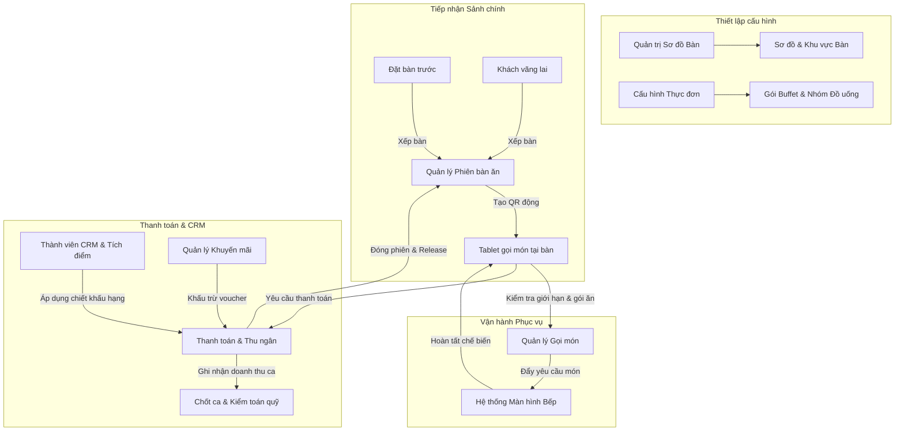

# PHÂN TÍCH QUY TRÌNH NGHIỆP VỤ: HỆ THỐNG POS NHÀ HÀNG NGƯU CÁT

---

# 1. Project Overview

Dự án Ngưu Cát POS (NguuCat POS) đại diện cho bước chuyển đổi chiến lược từ giải pháp POS mua ngoài của bên thứ ba (F2Tech) sang hệ thống quản lý nhà hàng đa chi nhánh tự phát triển nội bộ. Mục tiêu cốt lõi của hệ thống là hỗ trợ và tối ưu hóa toàn diện hoạt động vận hành hàng ngày của chuỗi nhà hàng Ngưu Cát — mô hình lẩu nướng Nhật Bản (Yakiniku) kết hợp buffet và gọi món (A la carte).

### 1.1 Mục tiêu và Định hướng Nghiệp vụ
* **Chủ động về Công nghệ:** Loại bỏ sự phụ thuộc vào nhà cung cấp bên ngoài, tự chủ kiểm soát mã nguồn và lộ trình phát triển tính năng nhằm đáp ứng nhanh chóng các thay đổi trong vận hành thực tế.
* **Tối ưu hóa Chi phí Vận hành:** Giảm thiểu tối đa chi phí phần mềm định kỳ hàng tháng bằng cách thay thế phí bản quyền của vendor bằng hạ tầng đám mây tối giản, tự vận hành.
* **Đáp ứng Nghiệp vụ Đặc thù:** Thiết lập các quy tắc phục vụ đặc thù của mô hình nhà hàng nướng Nhật Bản, bao gồm: kiểm soát thời gian dùng bữa (2 giờ), giới hạn số lượng gọi món mỗi lượt để tránh lãng phí, tự động khóa nhóm đồ uống cao cấp theo thời gian và tích hợp quản lý bếp than.
* **Nâng cao Trải nghiệm và Giữ chân Khách hàng (CRM):** Tự động hóa quy trình chăm sóc khách hàng bằng cách nhận diện khách cũ, tích điểm thành viên, phát hành voucher điện tử qua Zalo Official Account (Zalo OA) và thu thập phản hồi trực tiếp tại bàn.
* **Vận hành Đa Chi nhánh tập trung:** Xây dựng cấu trúc hệ thống cho phép đồng bộ cấu hình thực đơn, sơ đồ bàn, ca làm việc và phân quyền nhân viên trên toàn chuỗi cửa hàng.

---

# 2. Business Roles

Hoạt động vận hành của nhà hàng được điều phối bởi các vai trò nhân sự và tác nhân hệ thống sau đây:

## 2.1 Nhân viên Phục vụ (Service Staff)
* **Vai trò vận hành:** Nhân sự tiếp xúc trực tiếp tại sảnh, đón tiếp khách và thiết lập bàn ăn ban đầu.
* **Trách nhiệm nghiệp vụ:**
  * Chào đón khách hàng theo nghi thức Nhật Bản khi khách vào bàn.
  * Nhập mã nhân viên để chịu trách nhiệm phiên phục vụ.
  * Quan sát và ước lượng thông tin nhân khẩu học của khách hàng (giới tính, độ tuổi, số lượng khách) vào hệ thống để phục vụ thống kê marketing.
  * Hướng dẫn và cấu hình gói ăn (Course Package), nhóm đồ uống (Drink Group) và ngôn ngữ hiển thị trên máy tính bảng của khách.
  * Thực hiện "Khóa Course" để bắt đầu kích hoạt máy tính bảng gọi món tại bàn và bắt đầu tính giờ dùng bữa.

## 2.2 Nhân viên Lễ tân / Thu ngân (Reception Staff / Cashier)
* **Vai trò vận hành:** Nhân sự phụ trách quầy thu ngân, xử lý thanh toán, đăng ký thành viên và tiễn khách.
* **Trách nhiệm nghiệp vụ:**
  * Tiếp nhận các yêu cầu thanh toán được gửi tự động từ máy tính bảng tại bàn ăn của khách.
  * Kiểm tra và đối soát hóa đơn tạm tính của bàn ăn.
  * Tra cứu số điện thoại khách hàng để kiểm tra thông tin hạng thành viên và áp dụng giảm giá tự động cho khách hàng thân thiết (Repeater).
  * Hướng dẫn khách mới đăng ký thành viên CRM và kết nối Zalo OA để nhận ưu đãi.
  * Áp dụng mã voucher giảm giá nếu khách hàng cung cấp.
  * Thu thập thông tin mã số thuế, tên công ty, địa chỉ và email để xuất hóa đơn điện tử VAT theo Nghị định 123/2020/NĐ-CP nếu khách yêu cầu.
  * Thực hiện chốt giao dịch thanh toán qua các phương thức: Tiền mặt, Thẻ ngân hàng, hoặc quét mã VietQR.
  * Mời khách quét mã đánh giá chất lượng dịch vụ trên Google Maps.
  * Thực hiện kiểm đếm tiền mặt két quỹ và xác nhận chốt ca trực (Close Shift).

## 2.3 Nhân viên Bếp (Kitchen Staff)
* **Vai trò vận hành:** Nhân sự phụ trách khu vực chế biến món ăn và chuẩn bị đồ uống.
* **Trách nhiệm nghiệp vụ:**
  * Tiếp nhận danh sách món cần chế biến theo thời gian thực hiển thị trên Màn hình Bếp (Kitchen Display System - KDS).
  * Thực hiện chế biến món ăn tuân thủ thứ tự ưu tiên dựa trên thời gian khách chờ đợi.
  * Cập nhật trạng thái chế biến món ăn trên hệ thống (từ chờ chế biến sang đang làm, đã xong để nhân viên chạy bàn đi phục vụ).
  * Thông báo trạng thái hết món (Out of stock) trên hệ thống để máy tính bảng của khách tự động khóa, không cho gọi các món này.

## 2.4 Quản lý Nhà hàng (Restaurant Manager)
* **Vai trò vận hành:** Nhân sự chịu trách nhiệm giám sát toàn bộ hoạt động vận hành tại chi nhánh.
* **Trách nhiệm nghiệp vụ:**
  * Cung cấp mã PIN xác thực (Manager PIN) để xử lý các nghiệp vụ ngoại lệ như: mở khóa sửa đổi gói ăn sau khi đã khóa, hủy các món ăn đã gửi xuống bếp chế biến, hoặc áp dụng các mức giảm giá đặc biệt vượt khung cho khách.
  * Giám sát tiến độ doanh thu ca làm việc, xử lý khiếu nại của khách hàng.
  * Phê duyệt báo cáo chốt ca cuối ngày của thu ngân.

## 2.5 Kế toán / Quản trị viên (Accountant / Admin)
* **Vai trò vận hành:** Nhân sự quản trị hệ thống và kiểm soát số liệu tài chính.
* **Trách nhiệm nghiệp vụ:**
  * Cấu hình và cập nhật thực đơn, giá bán các gói Buffet, Set menu và nhóm đồ uống.
  * Quản lý danh sách nhân sự, cấp tài khoản và cấu hình phân quyền trên POS.
  * Đối soát số liệu doanh thu thực tế, kiểm tra nhật ký hoạt động hệ thống (Audit Log) để phát hiện gian lận.
  * Thiết lập các chỉ tiêu KPI/KGI hàng tháng (Doanh thu mục tiêu, số lượng khách, tỷ lệ chi phí nguyên liệu COGS, tỷ lệ lấp đầy bàn).

## 2.6 Superadmin
* **Vai trò vận hành:** Người quản trị cấp cao nhất của chuỗi thương hiệu.
* **Trách nhiệm nghiệp vụ:**
  * Thiết lập thông tin các thương hiệu và chi nhánh mới trong chuỗi.
  * Quản lý cấu hình kết nối các dịch vụ bên thứ ba (Cổng thanh toán VietQR, API gửi tin nhắn Zalo OA, Nhà cung cấp HĐĐT).

## 2.7 Khách hàng (Customer)
* **Vai trò vận hành:** Người sử dụng dịch vụ ăn uống tại bàn.
* **Trách nhiệm nghiệp vụ:**
  * Quét mã QR động tại bàn để truy cập thực đơn gọi món riêng của bàn mình.
  * Tự thực hiện gọi món trên máy tính bảng trong phạm vi gói ăn đã thanh toán.
  * Tuân thủ các giới hạn gọi món (tối đa 10 phần/món/lượt đặt) và thời gian dùng bữa 2 giờ.
  * Nhấn yêu cầu thanh toán trên máy tính bảng để thông báo cho quầy lễ tân khi dùng bữa xong.

---

# 3. Business Modules

Hệ thống Ngưu Cát POS được cấu trúc thành các phân hệ nghiệp vụ logic sau:

## 3.1 Xác thực và Phân quyền Nghiệp vụ (Authentication & RBAC)
* **Mục đích:** Bảo vệ tính toàn vẹn dữ liệu vận hành bằng cách giới hạn chức năng theo vị trí làm việc.
* **Logic nghiệp vụ:** Nhân viên phục vụ chỉ nhìn thấy giao diện đón khách và gán bàn; nhân viên bếp chỉ truy cập màn hình KDS; thu ngân chỉ thao tác màn hình thanh toán và chốt ca; kế toán và quản lý mới được quyền truy cập báo cáo tài chính, kiểm soát cấu hình và nhập dữ liệu KPI.

## 3.2 Quản lý Không gian và Sơ đồ Bàn (Floor & Space Management)
* **Mục đích:** Số hóa toàn bộ mặt bằng vật lý của nhà hàng để quản lý và theo dõi trực quan.
* **Logic nghiệp vụ:** Cho phép thiết lập các phân khu khác nhau (ví dụ: Zone A, Zone B, khu VIP, khu Sân vườn) và tạo lập các bàn ăn với thuộc tính chi tiết: mã bàn, sức chứa (số ghế), hình dáng, tọa độ hiển thị và tình trạng hoạt động (sẵn sàng sử dụng hoặc đang bảo trì).

## 3.3 Quản lý Phiên phục vụ tại Bàn (Table & Session Management)
* **Mục đích:** Quản lý vòng đời sử dụng bàn ăn của từng lượt khách để tính tiền chính xác và bảo mật gọi món.
* **Logic nghiệp vụ:** Khi bàn trống được mở phục vụ, hệ thống tạo ra một phiên hoạt động (Table Session) gắn liền với một mã QR động. Khách hàng chỉ gọi được món khi quét đúng mã QR này. Khi thu ngân hoàn tất thanh toán, phiên hoạt động đóng lại, mã QR cũ lập tức bị vô hiệu hóa để tránh việc người ngoài bàn hoặc khách đã về quét mã gọi món từ xa.

## 3.4 Quản lý Đặt bàn trước (Booking & Reservation)
* **Mục đích:** Tiếp nhận và quản lý các lượt khách đặt chỗ trước để sắp xếp nhân sự và nguyên liệu phù hợp.
* **Logic nghiệp vụ:** Hiển thị mật độ đặt bàn dưới dạng lịch trình thời gian (Timeline) chia làm các khung giờ (Sáng, Trưa, Chiều, Tối) và dạng danh sách bảng biểu. Hỗ trợ theo dõi tiến trình từ lúc đặt trước (Pending) -> Khách đến (Arrived) -> Đang ăn (Dining) -> Hoàn tất (Completed) hoặc Hủy (Cancelled).

## 3.5 Phân loại và Ước lượng Khách hàng (Guest Classification)
* **Mục đích:** Thu thập dữ liệu nhân khẩu học phục vụ cho các chiến dịch marketing và tối ưu thực đơn.
* **Logic nghiệp vụ:** Ở bước khai bàn, hệ thống yêu cầu nhân viên phục vụ ghi nhận ước lượng về số lượng nam, số lượng nữ, trẻ em và nhóm tuổi trung bình của nhóm khách mà không được hỏi trực tiếp để tránh gây phiền hà cho khách.

## 3.6 Quản lý Thực đơn và Gói ăn (Menu & Package Management)
* **Mục đích:** Kiểm soát chính sách giá bán và cơ cấu món ăn cung cấp cho khách.
* **Logic nghiệp vụ:** Định nghĩa danh mục món ăn và liên kết chúng vào các Gói ăn Buffet (ví dụ: Buffet 1380k, Buffet 680k, Buffet Trẻ em...) hoặc gói nước (Drink Group A/B/C/D). Khi khách sử dụng một gói cụ thể, máy tính bảng tại bàn chỉ hiển thị các món ăn nằm trong gói đó, các món ngoài gói hoặc thuộc gói cao cấp hơn sẽ bị ẩn hoặc khóa lại.

## 3.7 Hệ thống Tự gọi món tại Bàn (Tablet Self-Ordering)
* **Mục đích:** Nâng cao tính chủ động cho khách hàng, giảm tải nhân sự chạy bàn.
* **Logic nghiệp vụ:** Khách hàng tự thêm món vào giỏ hàng, ghi chú các yêu cầu đặc biệt (không hành, ít cay, nhiều đá...) và gửi trực tiếp xuống bếp. Phân hệ này áp dụng quy tắc giới hạn số lượng gọi món (không quá 10 phần cho mỗi loại món trong một lượt gửi) nhằm ngăn chặn tình trạng khách gọi quá nhiều dẫn đến dư thừa lãng phí thức ăn.

## 3.8 Hệ thống hiển thị Bếp (Kitchen Display System - KDS)
* **Mục đích:** Đồng bộ thông tin gọi món xuống bếp tức thời và không dùng giấy.
* **Logic nghiệp vụ:** Tự động gom các món ăn từ các bàn gửi xuống, sắp xếp theo trình tự thời gian gọi. Hệ thống tính toán thời gian chờ thực tế của từng order để hiển thị cảnh báo màu sắc (ví dụ: chuyển sang màu cam hoặc đỏ nếu món chưa được chế biến sau 15-20 phút) giúp bếp trưởng điều phối nhân sự chế biến kịp thời.

## 3.9 Quản lý Thành viên CRM & Loyalty
* **Mục đích:** Nhận diện khách hàng cũ và thực hiện các chính sách chăm sóc ưu đãi.
* **Logic nghiệp vụ:** Nhận diện khách hàng bằng số điện thoại. POS tự động truy xuất lịch sử số lần đến ăn, tổng số tiền đã chi tiêu để xếp hạng thành viên (Đồng, Bạc, Vàng, Kim Cương) và tự động áp dụng tỷ lệ giảm giá tương ứng vào hóa đơn thanh toán. Tích hợp gửi tin nhắn chăm sóc qua Zalo OA.

## 3.10 Quản lý Khuyến mãi và Voucher (Promotion & Voucher)
* **Mục đích:** Kích thích khách hàng quay lại bằng các chương trình ưu đãi ngắn hạn.
* **Logic nghiệp vụ:** Quản lý vòng đời của các mã giảm giá. Tự động phát hành mã voucher (ví dụ: voucher giảm 10% cho lần ăn sau) khi khách hàng hoàn thành khảo sát CRM trên máy tính bảng ở bước khai bàn. Kiểm tra tính hợp lệ của voucher khi thu ngân nhập mã lúc thanh toán.

## 3.11 Thanh toán và Hóa đơn Tài chính (Invoicing & Payment)
* **Mục đích:** Thực hiện thu tiền dịch vụ, đối soát doanh thu ca và hoàn thành nghĩa vụ thuế.
* **Logic nghiệp vụ:** Tự động tổng hợp tiền món ăn gọi thêm ngoài gói, tiền gói buffet nhân với số lượng khách, tính thêm phí dịch vụ (5%) và thuế VAT (10%). Cho phép áp dụng giảm giá thành viên, voucher và hỗ trợ các hình thức thanh toán: tiền mặt, quẹt thẻ POS ngân hàng, quét mã VietQR tự động sinh theo số tiền hóa đơn, thanh toán chung hoặc tách hóa đơn (Split Bill). Hỗ trợ thu thập thông tin và đẩy dữ liệu sang hệ thống HĐĐT (Nghị định 123) để xuất hóa đơn đỏ cho khách.

## 3.12 Chốt ca trực và Đối soát Quỹ (Shift Closing)
* **Mục đích:** Đảm bảo tính minh bạch dòng tiền mặt tại nhà hàng, hạn chế thất thoát.
* **Logic nghiệp vụ:** Bắt buộc thu ngân nhập số tiền mặt thực tế kiểm đếm được trong két vào thời điểm cuối ca trực. Hệ thống sẽ đối chiếu số tiền này với công thức tính toán: `Tiền mặt cuối ca mong đợi = Tiền mặt bàn giao đầu ca + Doanh thu tiền mặt phát sinh trong ca`. Mọi khoản chênh lệch thừa/thiếu đều phải ghi rõ lý do và được quản lý xác nhận trước khi khóa ca.

## 3.13 Quản lý Mục tiêu KPI & Hiệu suất (KPIs & Metrics)
* **Mục đích:** Giúp ban quản lý giám sát hiệu quả kinh doanh của nhà hàng so với mục tiêu đề ra.
* **Logic nghiệp vụ:** Cho phép thiết lập các chỉ số mục tiêu theo tháng (doanh thu, số lượng khách, tỷ lệ giá vốn COGS, tỷ lệ lấp đầy bàn, giá trị hóa đơn trung bình). Hệ thống tự động tổng hợp số liệu thực tế hàng ngày để tính toán phần trăm hoàn thành mục tiêu trực quan trên dashboard của quản lý và admin.

---

# 4. Business Processes

## 4.1 Quy trình Đặt bàn trước (Reservation Scheduling)
```
Khách hàng liên hệ đặt bàn trước (qua điện thoại hoặc website)
   │
   ▼
Lễ tân tiếp nhận: ghi nhận thông tin Khách hàng, SĐT, Số lượng người, Loại tiệc, Ngày & Giờ đến
   │
   ▼
Hệ thống kiểm tra tính khả dụng của Bàn trống theo Khu vực và Khung giờ yêu cầu
   │
   ▼
Ghi nhận đặt chỗ thành công -> Trạng thái đặt chỗ: "Chờ đến" (Pending/New)
   │
   ▼
Khách đến nhà hàng -> Lễ tân xác nhận thông tin -> Chuyển trạng thái đặt chỗ thành "Đã đến" (Arrived)
   │
   ▼
Gán bàn vật lý -> Chuyển sang trạng thái "Đang dùng" (Dining) để bắt đầu gọi món
```

## 4.2 Quy trình Đón khách vãng lai và Khởi tạo Bàn ăn (Walk-in Customer Flow)
```
Khách vãng lai đến nhà hàng
   │
   ▼
Nhân viên phục vụ chào đón khách ("Irasshaimase !!") và dẫn khách vào bàn trống phù hợp
   │
   ▼
Nhân viên mở POS -> Nhập mã ID nhân viên để ghi nhận người chịu trách nhiệm phục vụ bàn
   │
   ▼
Nhân viên chọn bàn tương ứng trên Sơ đồ bàn (Seat Map)
   │
   ▼
Hệ thống khởi tạo phiên phục vụ (Session) và tự động tạo mã QR động cho bàn
   │
   ▼
Nhân viên ghi nhận ước lượng nhân khẩu học (số nam, số nữ, số trẻ em, nhóm tuổi)
   │
   ▼
Nhân viên chọn Gói ăn Buffet và Nhóm đồ uống (Drink Group A/B/C/D) cho bàn khách
   │
   ▼
Nhân viên cấu hình ngôn ngữ hiển thị trên máy tính bảng -> Nhấn "Khóa Course" (Khởi chạy đếm ngược 2h)
   │
   ▼
Hệ thống hiển thị khảo sát CRM ngắn tại bàn -> Phát hành voucher 10% nếu khách hoàn thành
   │
   ▼
Nhân viên phục vụ bàn giao máy tính bảng cho khách để bắt đầu tự gọi món
```

## 4.3 Quy trình Tự gọi món tại Máy tính bảng
```
Khách hàng lướt xem thực đơn trên máy tính bảng (chỉ hiển thị món thuộc Gói buffet đã chọn)
   │
   ▼
Khách chọn món và số lượng (Hệ thống kiểm tra quy tắc giới hạn tối đa 10 phần/món/lượt gửi)
   │
   ▼
Khách nhấn nút "🍳 Gửi Bếp"
   │
   ▼
Yêu cầu gọi món truyền tức thời xuống màn hình KDS của bếp dưới dạng "Chờ xử lý" (Pending)
   │
   ▼
Nhân viên bếp xác nhận làm món -> Trạng thái chuyển sang "Đang chế biến" (Preparing)
   │
   ▼
Bếp chế biến xong -> Đặt món lên quầy pass -> Chuyển trạng thái "Sẵn sàng phục vụ" (Ready)
   │
   ▼
Nhân viên chạy bàn mang món ra cho khách -> Xác nhận trên hệ thống: "Đã phục vụ" (Served)
   │
   ▼
Khách hàng tiếp tục chu kỳ gọi món tiếp theo cho đến khi no hoặc hết giờ
```

## 4.4 Quy trình Tự động Giới hạn Đồ uống Cao cấp theo Thời gian
```
Hệ thống theo dõi bộ đếm thời gian dùng bữa từ thời điểm "Khóa Course" của bàn ăn
   │
   ▼
Thời gian dùng bữa đã trôi qua vượt mốc 2 giờ?
   ├── Đúng (Và bàn đăng ký Drink Group B hoặc C) ──> Máy tính bảng tự động ẩn các tùy chọn 
   │                                                 đồ uống có cồn cao cấp; chỉ hiển thị
   │                                                 đồ uống không cồn nhóm A để khách gọi.
   └── Chưa ──> Khách hàng tiếp tục được gọi mọi loại đồ uống thuộc gói nước đã mua.
```

## 4.5 Quy trình Thanh toán tại Quầy Thu ngân (Checkout Process)
```
Khách hàng nhấn nút yêu cầu thanh toán trên máy tính bảng tại bàn ăn
   │
   ▼
Máy tính bảng hiển thị thông báo: "Vui lòng di chuyển ra quầy lễ tân để thanh toán"
   │
   ▼
Khách đến quầy lễ tân -> Thu ngân mở hóa đơn tạm tính của bàn tương ứng trên POS
   │
   ▼
Thu ngân hỏi thông tin khách hàng cũ
   ├── Khách cũ ──> Nhập SĐT -> Truy xuất thứ hạng thành viên -> Áp dụng chiết khấu thành viên
   └── Khách mới ──> Mời đăng ký CRM nhanh (Tên, Tuổi, SĐT) -> Kết nối Zalo OA để nhận ưu đãi
   │
   ▼
Thu ngân nhập mã voucher giảm giá (nếu khách có voucher từ khảo sát hoặc chương trình khác)
   │
   ▼
Thu ngân hỏi nhu cầu xuất hóa đơn tài chính (HĐ điện tử VAT)
   ├── Có ──> Nhập MST, Tên công ty, Địa chỉ doanh nghiệp, Email nhận hóa đơn -> Đẩy hệ thống thuế
   └── Không ──> Bỏ qua bước nhập thông tin thuế
   │
   ▼
Thu ngân chọn phương thức thanh toán: Tiền mặt, Thẻ ngân hàng, Quét VietQR, hoặc Tách hóa đơn
   │
   ▼
Xác nhận thanh toán thành công -> POS in hóa đơn giấy -> Hệ thống tự động đóng phiên bàn ăn
   │
   ▼
Trạng thái bàn ăn tự động chuyển sang "Cần dọn dẹp" (Cleaning) trên sơ đồ bàn của sảnh
   │
   ▼
Thu ngân tiễn khách với câu chào tiêu chuẩn: "Arigato Gozaimashita !!"
```

## 4.6 Quy trình Chốt ca và Bàn giao Quỹ cuối ngày
```
Thu ngân nhấn nút khởi động quy trình chốt ca trực trên POS
   │
   ▼
Thu ngân đếm toàn bộ số tiền mặt vật lý đang có trong két tiền mặt của quầy thu ngân
   │
   ▼
Thu ngân nhập số tiền mặt đếm được vào hệ thống POS
   │
   ▼
POS tự động tính toán số tiền mặt lý thuyết dựa trên: Tiền mặt đầu ca bàn giao + Doanh thu cash phát sinh
   │
   ▼
POS đối chiếu và hiển thị chênh lệch (nếu có tiền thừa hoặc thiếu so với số liệu hệ thống ghi nhận)
   │
   ▼
Thu ngân giải trình chênh lệch (nếu có) -> Quản lý kiểm tra và nhập mã PIN phê duyệt báo cáo ca
   │
   ▼
POS in báo cáo tổng kết ca chốt -> Khóa ca làm việc -> Chuyển số liệu sang trạng thái đối soát kế toán
```

---

# 5. Business Rules

Hệ thống POS Ngưu Cát vận hành dựa trên các quy tắc nghiệp vụ nghiêm ngặt sau đây:

### 5.1 Quy tắc Đón tiếp và Bố trí Bàn ăn
* **BR-001 (Chào đón):** Nhân viên phục vụ bắt buộc chào đón khách hàng bước vào nhà hàng bằng câu chào chuẩn Nhật Bản: *"Irasshaimase !!"*.
* **BR-002 (Tiễn khách):** Nhân viên thu ngân bắt buộc chào tạm biệt khách hàng sau khi thanh toán xong bằng câu chào: *"Arigato Gozaimashita !!"*.
* **BR-003 (Trách nhiệm ca):** Mọi phiên phục vụ bàn ăn (Table Session) bắt buộc phải được gắn với một mã ID nhân viên đang hoạt động trên hệ thống để quy trách nhiệm phục vụ.
* **BR-004 (Ước lượng tế nhị):** Nhân viên phục vụ bắt buộc phải tự quan sát và ước lượng giới tính, độ tuổi của nhóm khách để lưu vào hệ thống, tuyệt đối không được hỏi trực tiếp khách hàng các thông tin này để tránh gây phiền hà.
* **BR-005 (Bỏ qua ước lượng):** Quy định ước lượng khách hàng là không bắt buộc; nhân viên có thể bấm "Skip" (Bỏ qua) trên POS nếu không tự tin đoán được.
* **BR-006 (Gán bàn trống):** Hệ thống chỉ cho phép mở phiên phục vụ (Session) trên những bàn ăn có trạng thái hiện tại là "Trống" (Available). Các bàn có trạng thái "Đang phục vụ", "Cần dọn dẹp" hoặc "Bảo trì" đều bị khóa chức năng mở phiên.

### 5.2 Quy tắc Gọi món và Quản lý Thời gian (Buffet & Timer Rules)
* **BR-007 (Khóa cấu hình ăn uống):** Thao tác "Khóa Course" là hành động không thể đảo ngược (Course Lock Irreversible). Sau khi nhân viên đã nhấn khóa cấu hình gói ăn và nhóm nước, hệ thống sẽ kích hoạt máy tính bảng của khách và không cho phép nhân viên phục vụ quay lại trang cấu hình trước đó để sửa đổi, ngoại trừ trường hợp có sự can thiệp mã PIN của Quản lý.
* **BR-008 (Kích hoạt bộ đếm giờ):** Thao tác "Khóa Course" sẽ tự động kích hoạt bộ đếm ngược thời gian dùng bữa là 2 giờ (7200 giây) đối với các gói Buffet.
* **BR-009 (Giới hạn chống lãng phí):** Khách hàng chỉ được phép chọn tối đa 10 phần cho mỗi loại món ăn trong một lượt gửi order trên máy tính bảng nhằm hạn chế việc khách gọi thừa mứa dẫn đến lãng phí đồ ăn.
* **BR-010 (Giới hạn gói buffet):** Khách hàng sử dụng gói buffet nào chỉ được nhìn thấy và gọi các món ăn nằm trong danh mục cho phép của gói buffet đó. Các món ăn thuộc gói cao cấp hơn sẽ tự động bị ẩn khỏi màn hình tablet.
* **BR-011 (Giới hạn gói đồ uống):** Bàn ăn chỉ được gọi các loại đồ uống thuộc Nhóm đồ uống (Drink Group A/B/C/D) đã đăng ký ban đầu.
* **BR-012 (Khóa đồ uống cao cấp):** Đối với các bàn ăn đăng ký gói đồ uống cao cấp (Nhóm B hoặc Nhóm C), ngay khi bộ đếm giờ dùng bữa vượt mốc 2 giờ, hệ thống sẽ tự động ẩn toàn bộ các đồ uống cao cấp (bia, rượu) trên máy tính bảng và chỉ hiển thị các đồ uống không cồn cơ bản thuộc Nhóm A (nước ngọt).

### 5.3 Quy tắc Thanh toán và Thành viên CRM
* **BR-013 (Điểm thanh toán):** Mọi giao dịch thanh toán thực tế bắt buộc phải được xử lý và chốt hóa đơn tại quầy thu ngân của lễ tân trên máy POS trung tâm. Máy tính bảng tại bàn của khách chỉ đóng vai trò gửi yêu cầu thanh toán (Checkout Request).
* **BR-014 (Giải phóng bàn tự động):** Khi thu ngân xác nhận chốt hóa đơn thành công trên POS, hệ thống sẽ tự động giải phóng bàn ăn về trạng thái "Cần dọn dẹp" (Cleaning) và lập tức vô hiệu hóa mã QR của phiên dùng bữa đó.
* **BR-015 (Phát hành voucher khảo sát):** Voucher ưu đãi giảm giá 10% cho lần ăn sau sẽ được hệ thống tự động sinh ra và gửi cho khách hàng sau khi khách hoàn thành khảo sát CRM trên tablet.
* **BR-016 (Nhận diện khách cũ):** Hệ thống chỉ sử dụng Số điện thoại (SĐT) làm khóa duy nhất để nhận diện khách hàng thân thiết trong hệ thống CRM.
* **BR-017 (Giảm giá thành viên):** Tỷ lệ giảm giá áp dụng vào hóa đơn cho khách hàng thân thiết được quyết định tự động dựa trên Hạng thành viên (quy đổi từ tổng chi tiêu tích lũy của khách hàng từ trước đến nay).
* **BR-018 (Xuất hóa đơn điện tử):** Thu ngân chỉ được duyệt xuất hóa đơn điện tử theo Nghị định 123 khi nhập đầy đủ các trường thông tin bắt buộc: Mã số thuế (MST), Tên doanh nghiệp, Địa chỉ đăng ký kinh doanh và Email nhận hóa đơn.

### 5.4 Quy tắc Kiểm soát và Quyền Quản lý
* **BR-019 (Mã xác thực Quản lý):** Các nghiệp vụ thay đổi gói buffet sau khi đã khóa, áp dụng giảm giá thủ công lớn hơn mức quy định của hệ thống thành viên, chốt ca trực có chênh lệch tiền mặt, hoặc hủy món ăn mà bếp đã chế biến bắt buộc phải nhập mã PIN xác thực của Quản lý (Manager PIN) mới có thể thực hiện.
* **BR-020 (Nhật ký hoạt động):** Hệ thống phải tự động ghi lại vết nhật ký (Audit Log) đối với tất cả các thao tác quan trọng (đăng nhập, chốt ca, áp mã giảm giá thủ công, nhập PIN quản lý) bao gồm: mã nhân viên thực hiện, thời gian chi tiết, hành động cụ thể và dữ liệu trước/sau khi thay đổi.
* **BR-021 (Bàn giao ca trực):** Thu ngân mới không thể mở ca trực mới nếu ca trực trước đó tại chi nhánh chưa được chốt và khóa số liệu tiền mặt két quỹ.

---

# 6. Business Statuses

## 6.1 Trạng thái Đặt bàn trước (Reservation Status)
* **Chờ đến (Pending / New):** Lượt đặt bàn đã được tiếp nhận và ghi nhận trên hệ thống. Bàn ăn đã được định vị giữ chỗ và đang chờ khách hàng tới check-in.
* **Đã đến (Arrived):** Khách hàng đặt chỗ đã có mặt tại nhà hàng nhưng chưa được ngồi vào bàn ăn chính thức hoặc chưa thực hiện khóa gói buffet để bắt đầu phiên ăn.
* **Đang dùng (Dining):** Khách hàng đã ngồi tại bàn ăn, gói buffet đã được khóa và phiên ăn đang hoạt động (gọi món bình thường).
* **Hoàn tất (Completed):** Bàn ăn đã thanh toán xong hóa đơn, khách đã rời đi, phiên ăn đóng lại và lưu trữ vào lịch sử doanh thu.
* **Đã hủy (Cancelled):** Lượt đặt trước bị khách báo hủy hoặc bị nhân viên hủy do không đúng hẹn.
* **Khách không đến (No Show):** Khách đặt bàn trước nhưng quá giờ quy định mà không xuất hiện check-in và không báo hủy.

## 6.2 Trạng thái Bàn ăn (Table Status)
* **Trống (Available):** Bàn ăn đã được dọn sạch sẽ, hoạt động bình thường và sẵn sàng đón lượt khách mới vào ngồi.
* **Đặt trước (Reserved):** Bàn ăn đang được giữ để chuẩn bị đón một lượt khách đặt trước (Reservation) sắp đến trong khung giờ hiện tại.
* **Đang phục vụ (Occupied / Serving):** Bàn đang có khách ăn uống và có phiên ăn (Table Session) đang hoạt động.
* **Cần dọn dẹp (Cleaning):** Khách tại bàn vừa thanh toán xong và rời đi. Bàn đang chờ nhân viên phục vụ dọn dẹp, thay vỉ nướng, setup lại trước khi chuyển về trạng thái "Trống".
* **Bảo trì (Maintenance):** Bàn ăn hoặc bếp nướng tại bàn đang bị hỏng hóc, lỗi kỹ thuật và tạm thời không thể sử dụng để đón khách.

## 6.3 Trạng thái Món ăn trong Bếp (Order Status)
* **Chờ xử lý (Pending / New):** Món ăn do khách gọi trên tablet vừa được gửi xuống bếp và đang xếp hàng chờ bếp tiếp nhận chế biến.
* **Đang chế biến (Preparing):** Nhân viên bếp đã xác nhận tiếp nhận order và đang tiến hành làm món ăn hoặc chuẩn bị đồ uống.
* **Sẵn sàng phục vụ (Ready):** Món ăn đã được chế biến xong, đặt tại quầy trung chuyển (quầy pass) và chờ nhân viên chạy bàn mang ra bàn khách.
* **Đã phục vụ (Served):** Món ăn đã được bưng lên bàn cho khách và nhân viên xác nhận hoàn tất món đó trên hệ thống.
* **Đã hủy (Cancelled):** Món ăn bị hủy khỏi order do bếp báo hết nguyên liệu đột xuất hoặc khách yêu cầu hủy món khi bếp chưa chế biến.

## 6.4 Trạng thái Ca trực thu ngân (Shift Status)
* **Đang mở (Open):** Ca trực đang hoạt động, cho phép ghi nhận các giao dịch bán hàng và thanh toán hóa đơn vào doanh thu của ca.
* **Đã đóng (Closed):** Ca trực đã được thu ngân đối soát tiền mặt két quỹ, quản lý xác nhận và khóa số liệu. Không phát sinh thêm bất kỳ giao dịch nào gắn với ca này.

---

# 7. Business Workflows

## 7.1 Luồng Đặt bàn trước (Booking Flow)
```
Khách gọi điện/đặt online -> Tiếp nhận thông tin -> Xác minh bàn khả dụng -> Lưu đặt bàn (Chờ đến) -> Khách đến nhà hàng -> Check-in tại quầy -> Gán bàn & Khai bàn -> Mở phiên dùng bữa (Đang dùng) -> Thanh toán tại quầy -> Đóng bàn (Cần dọn dẹp)
```

## 7.2 Luồng Khách vãng lai (Walk-in Customer Flow)
```
Khách vào nhà hàng -> Lễ tân check sơ đồ bàn trống -> Gán bàn -> Nhân viên phục vụ nhập ID -> Nhập nhân khẩu học -> Chọn gói buffet & gói nước -> Khóa Course & Bàn giao Tablet -> Khách tự order -> Bếp chế biến -> Nhân viên phục vụ món -> Thu ngân tính hóa đơn -> Khách thanh toán -> Tiễn khách -> Nhân viên dọn bàn -> Thiết lập bàn trống
```

## 7.3 Luồng Gọi món tại bàn (Ordering Flow)
```
Khách lướt menu tablet -> Chọn món (Giới hạn tối đa 10 phần/lượt) -> Nhấn Gửi Bếp -> KDS nhận món -> Bếp làm món -> Món xong lên quầy pass -> Chạy bàn mang ra -> Xác nhận Đã phục vụ -> Khách tiếp tục gọi món mới
```

## 7.4 Luồng Chế biến tại Bếp (Kitchen Workflow)
```
Order xuất hiện trên KDS -> Sắp xếp theo thứ tự thời gian chờ -> Bếp trưởng nhận món -> Bếp viên chế biến -> Bếp trưởng kiểm tra & mark Ready -> Chạy bàn mang đi -> Cập nhật Served
```

## 7.5 Luồng Thanh toán tại Quầy (Payment Workflow)
```
Nhận tín hiệu Checkout -> POS mở bill bàn -> Hỏi SĐT khách cũ/đăng ký khách mới CRM -> Nhập voucher (nếu có) -> Thu thập MST doanh nghiệp (nếu cần VAT) -> Tính tổng tiền (+ Phí DV + Thuế VAT) -> Khách chọn VietQR/Tiền mặt/Thẻ -> Xác nhận tiền vào két/tài khoản -> In hóa đơn giao khách -> Giải phóng bàn
```

## 7.6 Luồng Chốt ca trực (Shift Closing Workflow)
```
Thu ngân kích hoạt chốt ca -> Đếm tiền mặt thực tế trong két -> Nhập tiền mặt vào POS -> POS đối chiếu với doanh thu lý thuyết -> Hiển thị chênh lệch -> Nhập giải trình -> Quản lý phê duyệt (PIN) -> In chốt ca -> Khóa số liệu ca trực
```

---

# 8. Module Relationships



* **Mối quan hệ chính:** Sơ đồ bàn (Floor Map) quản lý trạng thái thực tế của bàn ăn để phân bổ cho luồng Đặt bàn trước (Booking) hoặc Khách vãng lai (Walk-in). Khi bàn mở, phiên dùng bữa (Table Session) được kích hoạt cùng mã QR động cấp cho máy tính bảng tại bàn (Tablet).
* **Mối quan hệ gọi món:** Máy tính bảng gọi món đối chiếu danh mục với cấu hình thực đơn đã thiết lập để lọc món phù hợp với gói buffet khách mua, sau đó đẩy món ăn xuống KDS của bếp và cập nhật trạng thái phục vụ ngược lại bàn ăn.
* **Mối quan hệ thanh toán:** Khi khách yêu cầu checkout, phân hệ Thu ngân thu thập dữ liệu từ phiên ăn, liên kết với phân hệ CRM để tính chiết khấu thành viên và áp dụng voucher từ phân hệ Khuyến mãi. Sau khi thu ngân xác nhận giao dịch thành công, thông tin doanh thu được đẩy vào ca trực thu ngân để chốt ca, đồng thời gửi tín hiệu đóng phiên ăn về sơ đồ bàn để giải phóng bàn ăn về trạng thái dọn dẹp.

---

# 9. Restaurant Operation Flow

Quy trình vận hành thực tế một ngày của nhà hàng Ngưu Cát được chia làm 3 giai đoạn chính:

### 9.1 Giai đoạn Mở cửa (Đầu ngày / Đầu ca)
1. **Khởi động ca trực:** Nhân viên thu ngân đăng nhập vào hệ thống POS, nhận bàn giao két tiền mặt từ ca trước, kiểm đếm số tiền mặt đầu ca (Opening Cash), nhập số liệu vào hệ thống và chuyển trạng thái ca trực sang "Đang mở".
2. **Kiểm tra không gian phục vụ:** Nhân viên phục vụ đi kiểm tra mặt bằng, cập nhật tình trạng các bàn ăn trên Sơ đồ bàn (thiết lập "Trống" cho các bàn sẵn sàng đón khách hoặc "Bảo trì" cho các bàn có bếp nướng, hút mùi bị hỏng).

### 9.2 Giai đoạn Phục vụ Khách (Trong ca)
1. **Tiếp đón và Sắp xếp:** Khách đến được lễ tân đón tiếp. Khách đặt bàn trước được check-in vào bàn đã giữ; khách vãng lai được xếp vào bàn trống khả dụng trên sơ đồ.
2. **Khai bàn phục vụ:** Nhân viên phục vụ thực hiện quy trình check-in: nhập mã nhân viên, gán bàn, ước lượng thông tin khách, chọn gói buffet và gói nước, chọn ngôn ngữ hiển thị và nhấn "Khóa Course" để chạy đếm ngược 2 giờ của gói ăn.
3. **Chu kỳ gọi món và chế biến:** Khách quét mã QR động tại bàn, tự chọn món trong giới hạn 10 phần/lượt và gửi xuống bếp. KDS tiếp nhận order, sắp xếp món theo thời gian chờ. Bếp chế biến món, mark Ready. Nhân viên chạy bàn mang món ra và mark Served. Khách tiếp tục gọi món.
4. **Kiểm soát thời gian:** Đồng hồ hệ thống đếm ngược. Khi chạm mốc 2 giờ, hệ thống tự động ẩn các đồ uống cao cấp (Nhóm B, C) trên tablet của khách, chỉ cho phép gọi tiếp nước ngọt (Nhóm A) và đưa ra thông báo cảnh báo hết giờ.
5. **Thanh toán:** Khách nhấn Checkout trên tablet và di chuyển ra quầy lễ tân. Thu ngân kiểm tra bill tạm tính, nhập SĐT khách để áp chiết khấu thành viên hoặc tích điểm, áp dụng voucher, điền thông tin xuất hóa đơn đỏ (nếu khách yêu cầu), chốt phương thức thanh toán và in hóa đơn giao khách.
6. **Xoay vòng bàn ăn:** Phiên bàn ăn đóng lại, bàn chuyển sang trạng thái "Cần dọn dẹp". Nhân viên phục vụ dọn bàn sạch sẽ, thay vỉ nướng mới và đổi trạng thái bàn sang "Trống" trên POS để sẵn sàng tiếp lượt khách tiếp theo.

### 9.3 Giai đoạn Đóng cửa (Cuối ca / Cuối ngày)
1. **Kiểm kê két tiền mặt:** Thu ngân ca đóng thực hiện đếm toàn bộ tiền mặt vật lý trong két, ghi nhận số liệu tiền mặt thực tế cuối ca vào POS.
2. **Đối soát và Giải trình:** POS đối chiếu tiền mặt thực tế với số liệu giao dịch ghi nhận trên hệ thống. Nếu có chênh lệch thừa hoặc thiếu, thu ngân phải giải trình lý do (ví dụ: thối nhầm tiền cho khách, khách không nhận tiền lẻ...).
3. **Phê duyệt chốt ca:** Quản lý nhà hàng kiểm tra báo cáo chốt ca, đối chiếu chứng từ quẹt thẻ ngân hàng, lịch sử chuyển khoản VietQR và nhập mã PIN quản lý để đồng ý đóng ca trực. Hệ thống POS khóa số liệu ca trực và chuyển báo cáo về bộ phận kế toán trung tâm.

---

# 10. Tổng hợp Quy tắc Nghiệp vụ (Business Rule Summary)

### 10.1 Quy tắc Đón tiếp & Sắp xếp Bàn ăn
* Nhân viên phục vụ bắt buộc chào đón khách hàng bằng câu chào *"Irasshaimase !!"* khi khách vào bàn.
* Nhân viên thu ngân bắt buộc chào tiễn khách bằng câu chào *"Arigato Gozaimashita !!"* sau khi hoàn tất giao dịch.
* Mọi bàn ăn đang phục vụ phải liên kết với một mã ID nhân viên chịu trách nhiệm.
* Nhân viên phục vụ không được hỏi trực tiếp giới tính, độ tuổi của khách mà phải tự quan sát và ước lượng để lưu vào hệ thống.
* Không được phép mở phiên phục vụ (Session) trên các bàn ăn đang ở trạng thái bảo trì, cần dọn dẹp hoặc đang phục vụ nhóm khách khác.

### 10.2 Quy tắc Thực đơn, Máy tính bảng & Bộ đếm giờ
* Cấu hình gói ăn buffet và gói nước uống sau khi đã nhấn "Khóa Course" là không thể sửa đổi, ngoại trừ trường hợp được Quản lý xác thực bằng mã PIN.
* Thao tác khóa gói ăn buffet sẽ kích hoạt bộ đếm ngược thời gian dùng bữa là 2 giờ hiển thị trên máy tính bảng của khách.
* Khách hàng sử dụng gói buffet nào chỉ được hiển thị thực đơn và gọi các món ăn nằm trong gói đó.
* Sau 2 giờ kể từ lúc bắt đầu ăn, hệ thống tự động ẩn toàn bộ bia rượu và đồ uống cao cấp nhóm B, C; khách chỉ được gọi tiếp nước ngọt nhóm A.
* Khách hàng chỉ được phép chọn tối đa 10 phần cho mỗi loại món ăn trong một lượt gửi order trên máy tính bảng để tránh lãng phí thức ăn.

### 10.3 Quy tắc Thành viên CRM & Khuyến mãi
* Số điện thoại khách hàng là khóa thông tin duy nhất dùng để tra cứu lịch sử tiêu dùng và hạng thành viên CRM.
* Tỷ lệ phần trăm giảm giá tự động cho khách hàng thân thiết được quyết định bởi hạng thành viên tích lũy của khách hàng.
* Khách hàng hoàn thành khảo sát CRM trên máy tính bảng ở bước check-in sẽ được hệ thống tự động phát hành voucher giảm giá 10% cho lần sử dụng sau.

### 10.5 Quy tắc Thu ngân, Kiểm soát & Quản lý
* Thanh toán hóa đơn và in hóa đơn tài chính bắt buộc phải thực hiện tại quầy lễ tân. Máy tính bảng tại bàn chỉ có chức năng gửi yêu cầu checkout.
* Sau khi thu ngân chốt hóa đơn thanh toán thành công, bàn ăn phải tự động chuyển sang trạng thái "Cần dọn dẹp" và mã QR của phiên đó lập tức hết hiệu lực.
* Để xuất hóa đơn tài chính VAT (hóa đơn đỏ), thu ngân bắt buộc phải điền đầy đủ: MST, Tên công ty, Địa chỉ và Email nhận hóa đơn của khách.
* Mọi giao dịch điều chỉnh gói ăn sau khi khóa, hủy món ăn mà bếp đã chế biến, áp dụng mức chiết khấu lớn ngoài quy định thành viên bắt buộc phải có mã PIN xác thực của Quản lý.
* Tất cả giao dịch quan trọng và thao tác ghi đè của quản lý bắt buộc phải được ghi nhận vào nhật ký hệ thống (Audit Log) kèm mã nhân viên thực hiện và timestamp.
* Không cho phép mở ca trực mới nếu ca trực thu ngân trước đó chưa hoàn tất chốt két tiền mặt và đóng ca.
