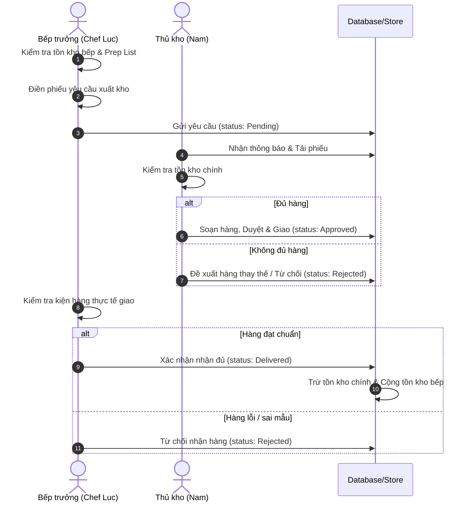

# Kitchen Requisition Workflow & Integration Guide

This document describes the workflow, roles, data structures, and accessibility standards for the **Kitchen Requisition (Yêu cầu xuất kho)** module in the Ngưu Cát POS kitchen inventory management system.

---

## 1. WORKFLOW PROCESS FLOW

The kitchen requisition system governs the transfer of stock from the main warehouse to the active kitchen stations. The process follows these operational stages (derived from `kitchen_requisition.mmd`):



---

## 2. USER ROLES & PERMISSIONS

### Bếp trưởng (Head Chef)
* **Permissions:**
  * Xem tồn kho thực tế tại bếp.
  * Tạo phiếu yêu cầu xuất kho (Internal Requisition).
  * Hủy phiếu yêu cầu nháp.
  * Kiểm tra và ký xác nhận nhận hàng bàn giao.
  * Từ chối nhận hàng lỗi/thiếu và nhập lý do.
* **Views Accessible:**
  * Màn hình tạo phiếu mới.
  * Màn hình lịch sử yêu cầu của bếp.
  * Màn hình xác nhận giao hàng (Delivery Confirmation).

### Thủ kho (Storekeeper / Warehouse Operator)
* **Permissions:**
  * Xem danh sách tất cả các phiếu yêu cầu từ tất cả các bếp.
  * Xác nhận độ sẵn có của hàng hóa (Đủ hàng / Thiếu hàng).
  * Nhập số lượng xuất thực tế.
  * Đề xuất hàng hóa thay thế nếu kho chính thiếu hụt.
  * Duyệt phiếu và chuyển sang trạng thái "Giao hàng".
  * Từ chối yêu cầu và nhập lý do từ chối.
* **Views Accessible:**
  * Màn hình danh sách xử lý phiếu xuất kho.
  * Màn hình chi tiết xử lý kho (Warehouse Processing).

---

## 3. AUDIT TRAIL REQUIREMENTS

To ensure compliance, tracking, and prevent inventory loss, every action must write to a persistent audit trail. Each log entry requires the following fields:

| Field Name | Type | Description |
| :--- | :--- | :--- |
| `id` | String / UUID | Khóa chính duy nhất cho log entry |
| `requisition_id`| String | ID của phiếu yêu cầu xuất kho liên kết |
| `action` | String | Hành động thực hiện (ví dụ: "Tạo phiếu", "Duyệt xuất kho", "Từ chối nhận hàng") |
| `actor` | String | Tên và vai trò của người thực hiện hành động |
| `timestamp` | String / Date | Thời gian chính xác thực hiện hành động |

### Example JSON Log:
```json
{
  "id": "log-1719417930000",
  "requisition_id": "REQ-001",
  "action": "Bếp trưởng Chef Luc ký xác nhận nhận hàng",
  "actor": "Chef Luc",
  "timestamp": "2026-06-26 10:45"
}
```

---

## 4. ACCESSIBILITY (W3C/WCAG Compliance)

The module conforms to accessibility standards to support all operators in high-pressure kitchen and warehouse environments:

* **Keyboard Navigation:** All button actions, selectors, and quantity input fields are fully reachable using standard `Tab` / `Shift+Tab` and triggerable using `Enter` or `Space`.
* **Focus Indicator:** Active interactive elements use a prominent blue border focus ring (`focus-visible { outline: 3px solid #2196F3; }`).
* **Screen Readers:** Screen reader descriptive labels (`sr-only` class) are embedded inside status badges, checkboxes, and counters to describe state changes explicitly.
* **Color Contrast:** Text and background colors meet the minimum WCAG AA contrast ratio of 4.5:1, ensuring high readability under dim or harsh kitchen lights.
* **Reduced Motion:** Animations for alerts and popups automatically disable when user-agent preferences have `prefers-reduced-motion` enabled.
