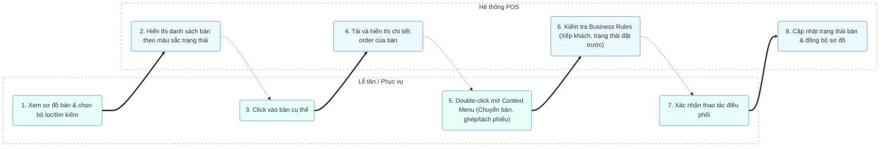

# MODULE 3: SƠ ĐỒ BÀN (FLOOR PLAN)

## 1. Tổng quan
- **Mục đích:** Giúp Lễ tân và Phục vụ theo dõi, quản lý trực quan trạng thái của tất cả các bàn trong nhà hàng theo từng khu vực, thực hiện các thao tác điều phối bàn (chuyển bàn, ghép/tách phiếu) nhanh chóng.
- **Phạm vi:** Quản lý sơ đồ bàn, lọc, tìm kiếm và thao tác nhanh với bàn.
- **Người dùng mục tiêu:** Lễ tân, Phục vụ.

## 2. Actors tham gia
- **Lễ tân / Phục vụ:** Theo dõi sơ đồ, tìm kiếm bàn, điều phối khách và thực hiện đổi bàn/ghép bàn.
- **Hệ thống:** Cập nhật trạng thái màu sắc bàn tự động và thực hiện các thay đổi cấu trúc phiếu khi điều phối bàn.

## 3. Luồng nghiệp vụ chính & Swimlanes (Activity Diagram)

## 4. Use Cases
- **UC-005: Chuyển bàn**
  - **Actor:** Phục vụ, Lễ tân
  - **Precondition:** Bàn nguồn đang có khách và bàn đích phải là bàn trống.
  - **Main flow:**
    1. Người dùng double-click vào bàn nguồn, chọn "Chuyển bàn".
    2. Chọn bàn đích trống trên danh sách.
    3. Xác nhận chuyển bàn.
    4. Hệ thống chuyển toàn bộ order từ bàn nguồn sang bàn đích.
  - **Postcondition:** Bàn nguồn chuyển thành Trống, bàn đích chuyển sang Đang có khách.

- **UC-006: Ghép phiếu**
  - **Actor:** Phục vụ, Lễ tân
  - **Precondition:** Cả hai bàn đều đang hoạt động và có order.
  - **Main flow:**
    1. Người dùng double-click vào bàn cần ghép, chọn "Ghép phiếu".
    2. Chọn bàn đích muốn ghép vào.
    3. Hệ thống gộp các món ăn của hai phiếu làm một.
  - **Postcondition:** Phiếu của bàn được chọn được gộp chung vào bàn đích.

## 5. Business Rules
- Quy định màu sắc hiển thị:
  - **Xanh lá:** Bàn trống
  - **Đỏ:** Bàn đang có khách
  - **Vàng:** Bàn chờ thanh toán
  - **Tím:** Bàn đã được đặt trước
  - **Xám:** Bàn bảo trì/không sử dụng
- Không thể xếp 2 nhóm khách vãng lai khác nhau vào cùng 1 bàn (trừ trường hợp chủ động chọn Ghép phiếu).
- Bàn đã được đặt trước (màu tím) không cho phép xếp khách vãng lai vào ngồi.
- Tự động chuyển sang trạng thái "chờ thanh toán" (màu vàng) sau 30 phút liên tục không phát sinh order mới.

## 6. Dữ liệu
- **Đầu vào:** Mã bàn, khu vực (Khu A, B, C, R, T), trạng thái lọc.
- **Đầu ra:** Trạng thái bàn cập nhật, sơ đồ bàn hiển thị theo thời gian thực.
