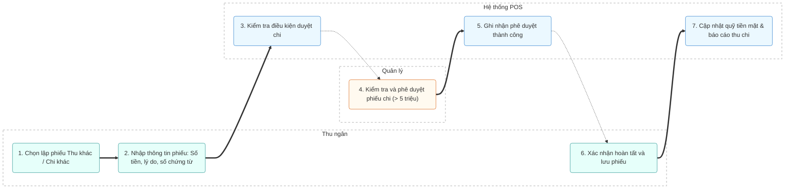

# MODULE 4: THU KHÁC / CHI KHÁC

## 1. Tổng quan
- **Mục đích:** Ghi nhận các khoản thu/chi phát sinh tại cửa hàng không liên quan trực tiếp đến hoạt động bán hàng (ví dụ: cọc tiệc, bồi thường, mua văn phòng phẩm, tiếp khách) nhằm quản lý dòng tiền mặt/tài khoản chính xác.
- **Phạm vi:** Tạo lập, phê duyệt và hủy các phiếu thu/chi ngoài bán hàng.
- **Người dùng mục tiêu:** Thu ngân, Quản lý.

## 2. Actors tham gia
- **Thu ngân:** Nhập liệu các phiếu thu/chi, điền chứng từ kèm theo.
- **Quản lý:** Duyệt các phiếu chi có giá trị lớn (> 5 triệu VNĐ).
- **Hệ thống:** Kiểm tra điều kiện phê duyệt, lưu trữ thông tin và cập nhật báo cáo quỹ tiền mặt/tài khoản.

## 3. Luồng nghiệp vụ chính & Swimlanes (Activity Diagram)

## 4. Use Cases
- **UC-007: Tạo phiếu thu khác**
  - **Actor:** Thu ngân
  - **Precondition:** Thu ngân đang trong ca làm việc.
  - **Main flow:**
    1. Thu ngân chọn chức năng "Thu khác".
    2. Chọn đối tượng thu (Khách hàng/Nhà cung cấp/Nhân viên).
    3. Chọn loại thu (Đặt cọc, bồi thường, thanh lý phế liệu).
    4. Nhập số tiền, phương thức thanh toán, số chứng từ và lý do.
    5. Nhấn "Lưu".
  - **Postcondition:** Dòng tiền thu được cộng vào số dư ca của thu ngân.

- **UC-008: Tạo phiếu chi khác**
  - **Actor:** Thu ngân, Quản lý
  - **Precondition:** Thu ngân đang trong ca làm việc.
  - **Main flow:**
    1. Thu ngân chọn chức năng "Chi khác".
    2. Nhập thông tin chi (mua nguyên liệu, tiếp khách, văn phòng phẩm...).
    3. Nếu số tiền > 5 triệu VNĐ, hệ thống khóa phiếu chờ Quản lý duyệt.
    4. Quản lý đăng nhập/xác nhận duyệt.
    5. Nhấn "Lưu".
  - **Postcondition:** Số tiền chi được trừ khỏi quỹ tiền mặt hiện tại.

## 5. Business Rules
- Bắt buộc phải nhập số chứng từ kèm theo đối với mọi phiếu thu/chi.
- Mọi khoản chi có giá trị **trên 5 triệu VNĐ** bắt buộc phải được Quản lý duyệt trước khi hệ thống ghi nhận.
- Phiếu thu/chi sau khi đã lưu **không thể chỉnh sửa hoặc xóa** (chỉ cho phép thực hiện thao tác "Hủy phiếu" và hệ thống sẽ lưu vết lịch sử hủy kèm lý do).
- Tự động đồng bộ số liệu thu/chi tức thì vào báo cáo lưu chuyển tiền tệ của nhà hàng.

## 6. Dữ liệu
- **Đầu vào:** Loại giao dịch, đối tượng, số tiền, phương thức, số chứng từ, lý do, thông tin phê duyệt.
- **Đầu ra:** Phiếu thu/chi (PDF), số dư quỹ cập nhật.
