# MODULE 5: QUẢN LÝ PHIẾU (RECEIPTS)

## 1. Tổng quan
- **Mục đích:** Cung cấp công cụ tra cứu, kiểm tra chi tiết và thực hiện các nghiệp vụ điều chỉnh (In lại, Hủy phiếu, Đổi thông tin thanh toán, Gọi lại phiếu) đối với các phiếu/hóa đơn đã phát sinh trong hệ thống.
- **Phạm vi:** Danh sách phiếu, bộ lọc trạng thái, context menu hành động và các sub-tabs chi tiết thông tin hóa đơn.
- **Người dùng mục tiêu:** Thu ngân, Quản lý.

## 2. Actors tham gia
- **Thu ngân / Quản lý:** Tìm kiếm phiếu, kiểm tra lịch sử thao tác và thực hiện điều chỉnh thông tin hóa đơn.
- **Hệ thống:** Quản lý cơ sở dữ liệu phiếu, áp dụng các ràng buộc nghiệp vụ và lưu vết lịch sử không cho phép chỉnh sửa.

## 3. Luồng nghiệp vụ chính & Swimlanes (Activity Diagram)

```mermaid
flowchart LR
    subgraph Lane_Cashier ["Thu ngân / Quản lý"]
        C1("1. Vào danh sách phiếu & áp dụng bộ lọc trạng thái")
        C2("3. Xem chi tiết phiếu tại các Sub-tabs")
        C3("4. Click phải chuột mở Context Menu để chọn hành động")
        C4("6. Xác nhận thao tác nhạy cảm (Gọi lại / Hủy phiếu)")
        C5("8. Yêu cầu Export Excel/PDF")
    end

    subgraph Lane_System ["Hệ thống POS"]
        S1("2. Tải danh sách phiếu tương ứng")
        S2("5. Kiểm tra Business Rules (HĐDT đã xuất, lịch sử thao tác)")
        S3("7. Thực hiện điều chỉnh & ghi lịch sử thao tác")
        S4("9. Tạo file Excel/PDF và tải xuống")
    end

    C1 ==> S1
    S1 -.-> C2
    C2 ==> C3
    C3 ==> S2
    S2 -.-> C4
    C4 ==> S3
    S3 -.-> C5
    C5 ==> S4

    style Lane_Cashier fill:transparent,stroke:#ccc,stroke-width:2px,stroke-dasharray: 5 5
    style Lane_System fill:transparent,stroke:#ccc,stroke-width:2px,stroke-dasharray: 5 5

    style C1 fill:#e6fffa,stroke:#319795,stroke-width:1px
    style C2 fill:#e6fffa,stroke:#319795,stroke-width:1px
    style C3 fill:#e6fffa,stroke:#319795,stroke-width:1px
    style C4 fill:#e6fffa,stroke:#319795,stroke-width:1px
    style C5 fill:#e6fffa,stroke:#319795,stroke-width:1px

    style S1 fill:#ebf8ff,stroke:#3182ce,stroke-width:1px
    style S2 fill:#ebf8ff,stroke:#3182ce,stroke-width:1px
    style S3 fill:#ebf8ff,stroke:#3182ce,stroke-width:1px
    style S4 fill:#ebf8ff,stroke:#3182ce,stroke-width:1px
```

## 4. Use Cases
- **UC-009: Gọi lại phiếu (Recall Receipt)**
  - **Actor:** Quản lý, Thu ngân
  - **Precondition:** Phiếu ở trạng thái "Đã thanh toán" và chưa xuất hóa đơn tài chính (HĐDT).
  - **Main flow:**
    1. Người dùng chọn phiếu trong danh sách.
    2. Click chuột phải, chọn "Gọi lại phiếu".
    3. Hệ thống mở lại giao diện order của bàn đó để chỉnh sửa.
    4. Trạng thái phiếu chuyển thành "Gọi lại" (Đang order).
  - **Postcondition:** Phiếu được mở lại để chỉnh sửa món ăn/thanh toán.

- **UC-010: Hủy phiếu (Cancel Receipt)**
  - **Actor:** Quản lý
  - **Precondition:** Phiếu chưa được xuất hóa đơn điện tử.
  - **Main flow:**
    1. Quản lý click phải vào phiếu, chọn "Hủy phiếu".
    2. Nhập lý do hủy bắt buộc.
    3. Hệ thống cập nhật trạng thái phiếu thành "Đã hủy" và lưu vết.
  - **Postcondition:** Phiếu bị hủy và không tham gia tính doanh thu thực tế.

## 5. Business Rules
- Phiếu đã xuất hóa đơn điện tử (Hóa đơn tài chính) **nghiêm cấm** thực hiện thao tác Hủy hoặc Gọi lại.
- Phiếu đã thanh toán chỉ được phép "Gọi lại" để điều chỉnh, không được phép xóa khỏi cơ sở dữ liệu.
- Phân hệ **Lịch sử thao tác hóa đơn** ghi nhận tự động mọi thay đổi của người dùng và **không bao giờ được phép chỉnh sửa hoặc xóa** thông tin lịch sử này (audit trail).
- Hỗ trợ xuất dữ liệu ra file Excel hoặc PDF theo đúng biểu mẫu thiết lập.

## 6. Dữ liệu
- **Đầu vào:** Bộ lọc trạng thái (9 loại), mã phiếu, lý do điều chỉnh.
- **Đầu ra:** Dữ liệu chi tiết sub-tabs, file kết xuất Excel/PDF, lịch sử lưu vết thao tác.
