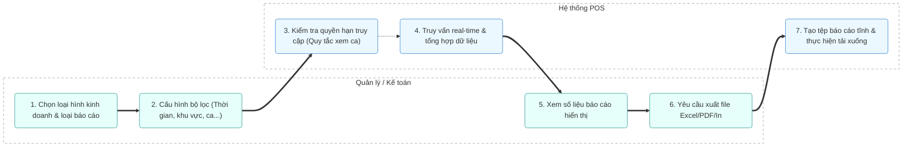

# MODULE 6: BÁO CÁO (REPORTS)

## 1. Tổng quan
- **Mục đích:** Cung cấp các loại báo cáo chi tiết về doanh thu, hàng hóa, thanh toán, ca làm việc nhằm giúp Quản lý và Kế toán theo dõi hiệu quả hoạt động kinh doanh và đưa ra quyết định kịp thời.
- **Phạm vi:** 4 loại hình kinh doanh (Restaurant, Retail, Distribution, Order Online) và các bộ lọc báo cáo đa chiều.
- **Người dùng mục tiêu:** Quản lý, Kế toán.

## 2. Actors tham gia
- **Quản lý / Kế toán:** Lựa chọn báo cáo, cấu hình bộ lọc và xuất file báo cáo.
- **Hệ thống:** Tổng hợp dữ liệu real-time và tạo báo cáo trực quan dưới dạng bảng biểu, file Excel/PDF.

## 3. Luồng nghiệp vụ chính & Swimlanes (Activity Diagram)

## 4. Use Cases
- **UC-011: Xem báo cáo doanh thu theo ca**
  - **Actor:** Quản lý, Kế toán
  - **Precondition:** Có quyền truy cập vào phân hệ báo cáo.
  - **Main flow:**
    1. Người dùng chọn mục Báo cáo theo ca làm việc.
    2. Chọn khoảng thời gian và ca cụ thể.
    3. Hệ thống hiển thị doanh thu tiền mặt, thẻ, chuyển khoản, voucher và chênh lệch tiền mặt trong ca.
  - **Postcondition:** Người dùng xem được báo cáo ca làm việc được chỉ định.

- **UC-012: Xuất báo cáo hàng hóa bán ra**
  - **Actor:** Kế toán
  - **Precondition:** Báo cáo hàng hóa đã được tải thành công trên giao diện.
  - **Main flow:**
    1. Người dùng nhấn nút "Xuất Excel" hoặc "Xuất PDF".
    2. Hệ thống biên dịch bảng dữ liệu hiện tại thành định dạng file đích.
    3. Trả về file tải xuống cho người dùng.
  - **Postcondition:** Người dùng lưu trữ được file báo cáo tĩnh.

## 5. Business Rules
- Nhân viên bình thường chỉ được phép xem báo cáo của ca làm việc hiện tại mà mình phụ trách. Quản lý và Kế toán có quyền xem toàn bộ báo cáo của tất cả các ca và các ngày.
- Báo cáo phải được cập nhật thời gian thực (Real-time) từ các giao dịch bán hàng, thu chi khác.
- Các báo cáo đã xuất ra file tĩnh không được phép thay đổi dữ liệu gốc trong hệ thống.

## 6. Dữ liệu
- **Đầu vào:** Tham số lọc (ngày bắt đầu - ngày kết thúc, khu vực, loại hình kinh doanh, quầy thu ngân, ca).
- **Đầu ra:** Biểu đồ xu hướng, bảng dữ liệu tổng hợp, file Excel/PDF tải xuống.
