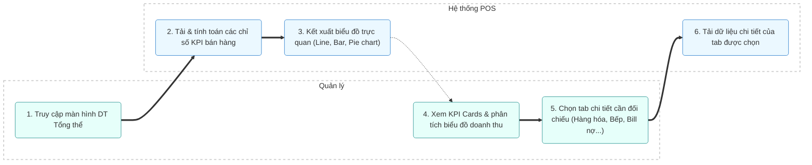

# MODULE 7: DT TỔNG THỂ (REVENUE OVERVIEW)

## 1. Tổng quan
- **Mục đích:** Cung cấp cho cấp Quản lý một Dashboard tổng quan về tình hình kinh doanh thông qua các chỉ số KPI then chốt và các biểu đồ trực quan hóa dữ liệu để theo dõi sức khỏe tài chính của nhà hàng.
- **Phạm vi:** Màn hình Dashboard quản trị doanh thu, các chỉ số KPI, các dạng biểu đồ (Line, Bar, Pie) và các Tab đối chiếu chuyên sâu.
- **Người dùng mục tiêu:** Quản lý.

## 2. Actors tham gia
- **Quản lý:** Theo dõi chỉ số, chuyển đổi các tab phân tích chi tiết để nắm bắt số liệu.
- **Hệ thống:** Tự động tính toán các chỉ số trung bình, biểu diễn dữ liệu dưới dạng đồ thị trực quan theo thời gian thực.

## 3. Luồng nghiệp vụ chính & Swimlanes (Activity Diagram)

## 4. Use Cases
- **UC-013: Phân tích tỷ trọng phương thức thanh toán**
  - **Actor:** Quản lý
  - **Precondition:** Đang xem Dashboard DT Tổng thể.
  - **Main flow:**
    1. Quản lý xem biểu đồ Pie chart thể hiện tỷ trọng thanh toán.
    2. Hệ thống hiển thị phần trăm tiền mặt, thẻ tín dụng, chuyển khoản ngân hàng.
    3. Quản lý di chuột vào các phần biểu đồ để xem số tiền chi tiết.
  - **Postcondition:** Quản lý có được cái nhìn tổng quan về phương thức thanh toán của khách hàng.

- **UC-014: Đối chiếu chênh lệch bếp**
  - **Actor:** Quản lý
  - **Precondition:** Đang xem Dashboard DT Tổng thể.
  - **Main flow:**
    1. Quản lý chọn tab "Đối chiếu bếp".
    2. Hệ thống tải dữ liệu so sánh số lượng món ăn đã gọi trên POS với số lượng món ăn bếp đã xác nhận làm xong.
    3. Hiển thị các món chênh lệch (nếu có) để quản lý xử lý.
  - **Postcondition:** Xác định được hao hụt hoặc sai lệch giữa bàn order và bếp.

## 5. Business Rules
- Quyền truy cập màn hình DT Tổng thể chỉ được phân quyền cho Quản lý cửa hàng trở lên.
- Các chỉ số KPI (Trung bình/phiếu, Trung bình/khách) phải được tính tự động dựa trên tổng doanh thu chia cho số lượng phiếu hoặc tổng số lượng khách hàng thực tế ghi nhận.
- Các tab chi tiết như "Bill khách nợ" phải được theo dõi công nợ chi tiết và có liên kết trực tiếp với thông tin khách hàng.

## 6. Dữ liệu
- **Đầu vào:** Lịch sử hóa đơn, dữ liệu bếp, nhật ký thu chi khác.
- **Đầu ra:** Chỉ số KPI, biểu đồ doanh thu (Line, Bar, Pie), bảng đối chiếu bếp/quà/nợ.
