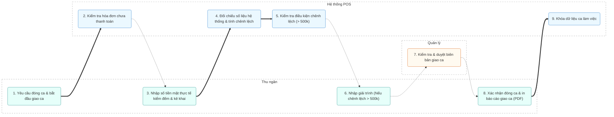

# MODULE 8: GIAO CA (SHIFT HANDOVER)

## 1. Tổng quan
- **Mục đích:** Đảm bảo bàn giao tiền mặt và các giao dịch thanh toán không tiền mặt (thẻ, chuyển khoản, voucher) chính xác giữa các ca làm việc, kiểm soát thất thoát và lưu trữ báo cáo giao ca đầy đủ.
- **Phạm vi:** Kiểm tra trạng thái hóa đơn, đối chiếu tiền mặt thực tế và in báo cáo đóng ca.
- **Người dùng mục tiêu:** Thu ngân, Quản lý.

## 2. Actors tham gia
- **Thu ngân:** Thực hiện kiểm đếm, kê khai số tiền thực tế thu được trong ca, lập báo cáo giải trình nếu có chênh lệch.
- **Quản lý:** Giám sát quá trình giao ca, duyệt các ca có chênh lệch tiền mặt lớn.
- **Hệ thống:** Kiểm tra điều kiện đóng ca, tự động đối chiếu số liệu hệ thống và số liệu thực tế kê khai, khóa dữ liệu ca làm việc.

## 3. Luồng nghiệp vụ chính & Swimlanes (Activity Diagram)

## 4. Use Cases
- **UC-015: Bàn giao ca làm việc**
  - **Actor:** Thu ngân
  - **Precondition:** Ca làm việc hiện tại đang mở.
  - **Main flow:**
    1. Thu ngân chọn "Đóng ca".
    2. Nhập số tiền mặt thực tế tại két.
    3. Nhập số lượng voucher nhận được.
    4. Hệ thống so sánh với số liệu ghi nhận trên POS.
    5. Đóng ca và in phiếu bàn giao ca (PDF).
  - **Postcondition:** Trạng thái ca chuyển sang Đã đóng, thu ngân đăng xuất.

## 5. Business Rules
- **Nghiêm cấm:** Không thể đóng ca nếu còn bất kỳ phiếu/order nào ở trạng thái "Đang order" hoặc "Chờ thanh toán" (phải thanh toán hoặc hủy trước khi đóng).
- Nếu phát hiện chênh lệch tiền mặt giữa thực tế kê khai và hệ thống **lớn hơn 500,000 VNĐ**, thu ngân bắt buộc phải nhập lý do giải trình và Quản lý phải ký duyệt.
- Báo cáo giao ca sau khi đã đóng và khóa **không được phép chỉnh sửa dưới bất kỳ hình thức nào** để đảm bảo tính minh bạch tài chính.

## 6. Dữ liệu
- **Đầu vào:** Số dư đầu ca, số tiền mặt đếm thực tế, số lượng voucher.
- **Đầu ra:** Biên bản giao ca PDF (bao gồm doanh thu theo giờ, VAT, giảm giá, chênh lệch), trạng thái ca đóng.
