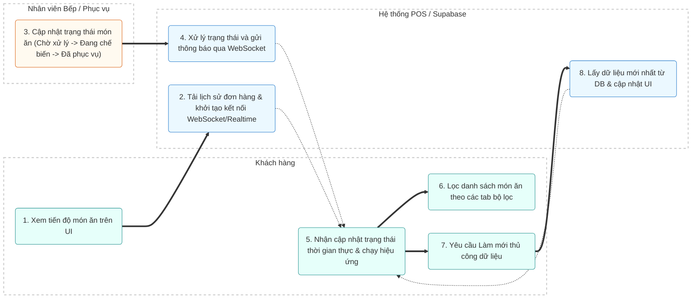

# MODULE 9: THEO DÕI TRẠNG THÁI MÓN ĂN (ORDER STATUS TRACKING)

## 1. Tổng quan
- **Mục đích:** Cung cấp giao diện trực quan theo thời gian thực (real-time) cho khách hàng tại bàn để theo dõi trạng thái chế biến và phục vụ của từng món ăn đã đặt. Việc này giúp minh bạch hóa quy trình vận hành nhà hàng, giảm bớt tâm lý chờ đợi của khách và nâng cao chất lượng trải nghiệm dịch vụ.
- **Phạm vi:** Danh sách các món ăn đã gọi trong phiên, số lượng tóm tắt theo 3 nhóm trạng thái (Chờ xử lý, Đang chế biến, Đã phục vụ), thanh phần trăm tiến trình từng món, timeline 3 bước cụ thể và bộ lọc nhanh.
- **Người dùng mục tiêu:** Khách hàng tại bàn, Phục vụ, Đầu bếp.

## 2. Actors tham gia
- **Khách hàng:** Xem và theo dõi trạng thái món ăn trực tiếp từ thiết bị di động/máy tính bảng tại bàn thông qua Modal/Trang theo dõi.
- **Nhân viên (Đầu bếp / Phục vụ):** Thực hiện cập nhật trạng thái chế biến trên hệ thống KDS (Kitchen Display System) hoặc POS khi món ăn bắt đầu làm hoặc đã hoàn thành phục vụ.
- **Hệ thống:** Tiếp nhận thay đổi, cập nhật cơ sở dữ liệu và đồng bộ trạng thái thời gian thực thông qua kênh truyền tải dữ liệu Realtime/WebSocket đến giao diện của khách hàng.

## 3. Luồng nghiệp vụ chính & Swimlanes (Activity Diagram)



## 4. Use Cases

### UC-017: Xem tiến độ chế biến và phục vụ món
- **Actor:** Khách hàng
- **Precondition:** Khách hàng đã mở phiên gọi món (session) và đã gửi order thành công đến hệ thống POS.
- **Main flow:**
  1. Khách hàng bấm vào biểu tượng Theo dõi món ăn 📋 trên Header.
  2. Hệ thống hiển thị Modal Theo dõi món ăn với giao diện Glassmorphism Dark thời thượng.
  3. Hệ thống hiển thị tổng số món ăn và thống kê nhanh theo 3 nhóm trạng thái: Đã phục vụ (Served), Đang chế biến (Preparing), Chờ xử lý (Pending).
  4. Hiển thị danh sách chi tiết các món ăn kèm tiến độ phần trăm (%) và timeline 3 bước cụ thể (Đã đặt -> Đang chế biến -> Đã phục vụ).
- **Postcondition:** Khách hàng nắm bắt được thông tin trạng thái phục vụ một cách trực quan, minh bạch.

### UC-018: Lọc món ăn theo trạng thái
- **Actor:** Khách hàng
- **Precondition:** Khách hàng đang ở màn hình/Modal Theo dõi món ăn.
- **Main flow:**
  1. Khách hàng lựa chọn một trong các tab bộ lọc: "Tất cả", "Đã phục vụ", "Đang chế biến", "Chờ xử lý".
  2. Hệ thống tức thì cập nhật danh sách món ăn hiển thị tương ứng với trạng thái được lựa chọn.
- **Postcondition:** Danh sách món ăn được lọc nhanh chóng, thuận tiện cho việc kiểm tra.

### UC-019: Đồng bộ trạng thái món ăn theo thời gian thực (Real-time Sync)
- **Actor:** Hệ thống
- **Precondition:** Khách hàng đang mở màn hình Theo dõi món ăn.
- **Main flow:**
  1. Bếp cập nhật trạng thái làm món hoặc Phục vụ hoàn thành mang món ra bàn trên POS/KDS.
  2. Hệ thống tự động kích hoạt sự kiện thay đổi dữ liệu và truyền thông tin qua kết nối WebSocket/Realtime đến trình duyệt của khách hàng.
  3. Giao diện khách hàng tự động cập nhật số liệu thống kê, cập nhật thanh phần trăm tiến độ của món ăn kèm theo hiệu ứng Pulse nhấp nháy chuyển trạng thái và thông báo Toast phát ra âm thanh thông báo.
- **Postcondition:** Dữ liệu hiển thị luôn đồng bộ chính xác với thực tế chế biến dưới bếp mà khách hàng không cần thao tác tải lại trang.

## 5. Business Rules
- **Quy trình vòng đời trạng thái món ăn:**
  - `pending` (Chờ xử lý): 0% - 33% tiến độ.
  - `confirmed` / `preparing` (Đang chế biến): 50% - 66% tiến độ.
  - `ready` / `served` (Đã phục vụ): 100% tiến độ.
  - `cancelled` (Đã hủy): 0% tiến độ và hiển thị trạng thái hủy riêng biệt (nền đỏ nhạt, chữ đỏ).
- **Quy tắc hủy món:**
  - Khách hàng không thể tự hủy món từ giao diện theo dõi một khi trạng thái món đã chuyển sang `preparing` hoặc muộn hơn. Mọi thao tác hủy lúc này phải được thông báo trực tiếp cho Phục vụ/Quản lý để thao tác trên KDS/POS.
- **Dữ liệu dự phòng (Fallback Mechanism):**
  - Trong trường hợp kết nối Realtime bị ngắt quãng hoặc không ổn định, hệ thống tự động kích hoạt cơ chế kéo dữ liệu (polling) định kỳ mỗi 30 giây để cập nhật lại trạng thái món ăn. Khách hàng cũng có thể click nút "Làm mới" thủ công để đồng bộ tức thì.

## 6. Dữ liệu
- **Đầu vào (Input Data Structure):**
  ```typescript
  interface OrderItem {
    id: string;
    orderId: string;
    itemName: string;
    quantity: number;
    status: 'pending' | 'confirmed' | 'preparing' | 'ready' | 'served' | 'cancelled';
    notes?: string;
    orderedAt: string;        // ISO timestamp
    preparingAt?: string;
    servedAt?: string;
  }
  ```
- **Đầu ra (Output/Summary Data Structure):**
  ```typescript
  interface OrderSummary {
    tableCode: string;
    totalItems: number;
    servedCount: number;
    preparingCount: number;
    pendingCount: number;
  }
  ```
