# BỘ TÀI LIỆU WORKFLOW NGHIỆP VỤ HỆ THỐNG NHÀ HÀNG NGƯU CÁT

Bộ tài liệu này được cấu trúc theo các **Domain nghiệp vụ riêng biệt** để đảm bảo tính nhất quán, dễ bảo trì và phân định trách nhiệm rõ ràng:

## [Restaurant Business Process Domain](restaurant_business_process/)

Quy trình vận hành thực tế của nhà hàng Ngưu Cát, được cấu trúc theo bộ phận nghiệp vụ.

## [POS System Workflow Domain](pos_system_workflow/)

Nghiệp vụ xử lý của hệ thống POS hỗ trợ vận hành (Validation, Rules, Chuyển trạng thái tự động, Tạo bản ghi, Trừ kho, Đồng bộ dữ liệu).

## [Data & Entity Lifecycle Domain](data_entity_lifecycle/)

Vòng đời và sự thay đổi trạng thái của các thực thể dữ liệu chính (Table, Booking, Order, Bill, Kitchen Ticket, Ingredient, Inventory Item, QR Code).

## [Module Interaction Domain](module_interaction/)

Tương tác và trao đổi thông tin giữa các phân hệ chức năng (Reception, POS, Kitchen, Inventory, CRM, Cashier, Manager Dashboard, Admin Config).

---

## Bản đồ liên kết tổng thể (Diagram Map)

```mermaid
graph TD
    classDef root fill:#ff7b89,stroke:#333,stroke-width:2px,color:#fff;
    classDef process fill:#fcc,stroke:#333,stroke-width:1px;
    classDef system fill:#bbf,stroke:#333,stroke-width:1px;
    classDef lifecycle fill:#ffc,stroke:#333,stroke-width:1px;
    classDef interaction fill:#9f9,stroke:#333,stroke-width:1px;

    ROOT[Bản đồ liên kết sơ đồ nghiệp vụ (Diagram Map)]:::root

    %% Links to Domains
    ROOT --> D_Process[1. Restaurant Business Process]:::process
    ROOT --> D_System[2. POS System Workflow]:::system
    ROOT --> D_Lifecycle[3. Data & Entity Lifecycle]:::lifecycle
    ROOT --> D_Interaction[4. Module Interaction]:::interaction

    %% Processes mapping
    D_Process --> D_Proc_Walkin[restaurant_business_process/01_customer/walkin_flow.mmd]:::process
    D_Process --> D_Proc_Booking[restaurant_business_process/01_customer/booking_flow.mmd]:::process
    D_Process --> D_Proc_Order[restaurant_business_process/03_service_staff/table_service_ordering_flow.mmd]:::process
    D_Process --> D_Proc_Kitchen[restaurant_business_process/04_kitchen/kitchen_operations_workflow.mmd]:::process
    D_Process --> D_Proc_Payment[restaurant_business_process/02_reception_cashier/payment_flow.mmd]:::process

    %% System mappings
    D_Proc_Walkin -.-> D_Sys_Table[pos_system_workflow/table_management_flow.mmd]:::system
    D_Proc_Booking -.-> D_Sys_Booking[pos_system_workflow/booking_system_flow.mmd]:::system
    D_Proc_Order -.-> D_Sys_Order[pos_system_workflow/order_processing_flow.mmd]:::system
    D_Proc_Kitchen -.-> D_Sys_Kitchen[pos_system_workflow/kitchen_ticket_flow.mmd]:::system
    D_Proc_Payment -.-> D_Sys_Payment[pos_system_workflow/payment_processing_flow.mmd]:::system

    %% Lifecycles mapping
    D_Sys_Table -.-> D_Life_Table[data_entity_lifecycle/table_lifecycle.mmd]:::lifecycle
    D_Sys_Booking -.-> D_Life_Booking[data_entity_lifecycle/booking_lifecycle.mmd]:::lifecycle
    D_Sys_Order -.-> D_Life_Order[data_entity_lifecycle/order_lifecycle.mmd]:::lifecycle
    D_Sys_Kitchen -.-> D_Life_Ticket[data_entity_lifecycle/kitchen_ticket_lifecycle.mmd]:::lifecycle
    D_Sys_Payment -.-> D_Life_Bill[data_entity_lifecycle/bill_lifecycle.mmd]:::lifecycle

    %% Interactions mapping
    D_Sys_Table -.-> D_Int_Staff[module_interaction/staff_interaction.mmd]:::interaction
    D_Sys_Booking -.-> D_Int_Recep[module_interaction/reception_interaction.mmd]:::interaction
    D_Sys_Order -.-> D_Int_Staff
    D_Sys_Kitchen -.-> D_Int_Kitchen[module_interaction/kitchen_interaction.mmd]:::interaction
    D_Sys_Payment -.-> D_Int_Cashier[module_interaction/cashier_interaction.mmd]:::interaction
```

---

## Danh sách chi tiết các sơ đồ theo từng Domain

### Domain: Restaurant Business Process Domain

#### Bộ phận/Phân mục: `00_overview`

*   **[Tongquan.mmd](restaurant_business_process/00_overview/Tongquan.mmd)**

```mermaid
graph TD
    classDef main fill:#ff7b89,stroke:#333,stroke-width:2px,color:#fff;
    classDef flow fill:#f9f,stroke:#333,stroke-width:1px;
    classDef entity fill:#bbf,stroke:#333,stroke-width:1px;
    classDef structural fill:#9f9,stroke:#333,stroke-width:1px;
    classDef admin fill:#ffd700,stroke:#333,stroke-width:1px;
    classDef delivery fill:#87ceeb,stroke:#333,stroke-width:1px;
    classDef crm fill:#ffb6c1,stroke:#333,stroke-width:1px;

    ROOT[Sơ đồ 1: Tổng quan Nghiệp vụ<br>overall_business_overview.mmd]:::main

    %% ============================================================
    %% PHẦN 1: KIẾN TRÚC HỆ THỐNG & PHÂN HỆ
    %% ============================================================
    ROOT --> |1. Kiến trúc hệ thống| D10[Sơ đồ 10: Mối quan hệ phân hệ<br>module_relationships.mmd]:::structural

    %% ============================================================
    %% PHẦN 2: LUỒNG KHÁCH HÀNG (Customer Entry Workflows)
    %% ============================================================
    ROOT --> |2. Phân loại Khách hàng| INLET{Lối vào của Khách}:::flow
    
    INLET --> |Đặt bàn trước| D3[Sơ đồ 3: Quy trình đặt bàn<br>booking_flow.mmd]:::flow
    INLET --> |Khách vãng lai| D2[Sơ đồ 2: Quy trình khách vãng lai<br>walkin_flow.mmd]:::flow
    INLET --> |Đơn giao hàng| D20[Sơ đồ 20: Quy trình Delivery<br>delivery_flow.mmd]:::delivery

    %% ============================================================
    %% PHẦN 3: NGHIỆP VỤ BÀN (Table Management)
    %% ============================================================
    D3 --> |Đoàn khách vào bàn| D4[Sơ đồ 4: Quy trình gọi món tại bàn<br>ordering_flow.mmd]:::flow
    D2 --> |Đoàn khách vào bàn| D4
    D20 --> |Đơn hàng đến bếp| D5

    D4 --> |Gửi đơn món ăn| D5[Sơ đồ 5: Quy trình chế biến ở bếp<br>kitchen_workflow.mmd]:::flow

    %% Table operations
    D4 --> |Chuyển/Ghép/Tách bàn| D11[Sơ đồ 11: Quản lý bàn ăn<br>table_management.mmd]:::flow
    D11 --> D4

    %% ============================================================
    %% PHẦN 4: QUẢN LÝ THỰC ĐƠN (Menu Management)
    %% ============================================================
    D4 --> |Chọn món từ Menu| D12[Sơ đồ 12: Quản lý thực đơn<br>menu_management.mmd]:::flow
    D12 --> |Recipe and COGS| D13[Sơ đồ 13: Quản lý công thức<br>recipe_workflow.mmd]:::flow

    %% ============================================================
    %% PHẦN 5: QUẢN LÝ NGUYÊN LIỆU (Inventory)
    %% ============================================================
    D5 --> |Trừ nguyên liệu| D14[Sơ đồ 14: Quản lý nguyên liệu<br>ingredient_management.mmd]:::flow
    D14 --> |Cảnh báo hết hàng| D12

    %% ============================================================
    %% PHẦN 6: THANH TOÁN & TÀI CHÍNH
    %% ============================================================
    D4 --> |Yêu cầu thanh toán| D6[Sơ đồ 6: Quy trình thanh toán<br>payment_flow.mmd]:::flow

    D6 --> |Đặt cọc/Hoàn cọc| D15[Sơ đồ 15: Quản lý tiền cọc<br>deposit_workflow.mmd]:::flow
    D6 --> |Hoàn tiền| D16[Sơ đồ 16: Quy trình hoàn tiền<br>refund_workflow.mmd]:::flow

    %% CRM tại quầy thanh toán
    D6 --> |Tích điểm/Voucher| D17[Sơ đồ 17: CRM and Loyalty<br>crm_loyalty_workflow.mmd]:::crm
    D6 --> |Khuyến mãi| D18[Sơ đồ 18: Marketing and Voucher<br>marketing_workflow.mmd]:::crm

    %% ============================================================
    %% PHẦN 7: CHỐT CA & BÁO CÁO
    %% ============================================================
    D6 --> |Bàn giao tiền ca| D7[Sơ đồ 7: Quy trình chốt ca<br>shift_closing_flow.mmd]:::flow
    D7 --> |Báo cáo doanh thu| D19[Sơ đồ 19: Báo cáo and KPI<br>reporting_workflow.mmd]:::flow

    %% ============================================================
    %% PHẦN 8: QUẢN TRỊ HỆ THỐNG (Admin)
    %% ============================================================
    ROOT --> |Quản trị hệ thống| ADMIN{Admin Operations}:::admin
    ADMIN --> D21[Sơ đồ 21: Quản lý nhân viên<br>employee_operations.mmd]:::admin
    ADMIN --> D22[Sơ đồ 22: Phân quyền người dùng<br>user_permission.mmd]:::admin
    ADMIN --> D23[Sơ đồ 23: Cấu hình chi nhánh<br>branch_configuration.mmd]:::admin

    %% ============================================================
    %% PHẦN 9: VÒNG ĐỜI THỰC THỂ (Entity Lifecycles)
    %% ============================================================
    
    %% Table & QR Lifecycles
    D2 -.-> |Thay đổi trạng thái bàn| D8[Sơ đồ 8: Vòng đời bàn ăn<br>table_lifecycle.mmd]:::entity
    D6 -.-> |Giải phóng bàn| D8
    
    D2 -.-> |Kích hoạt mã QR| D9[Sơ đồ 9: Vòng đời mã QR<br>qr_lifecycle.mmd]:::entity
    D6 -.-> |Vô hiệu hóa QR| D9

    %% Order & Bill Lifecycles (MỚI)
    D4 -.-> |Vòng đời Order| D24[Sơ đồ 24: Vòng đời Order<br>order_lifecycle.mmd]:::entity
    D6 -.-> |Vòng đời Hóa đơn| D25[Sơ đồ 25: Vòng đời Bill<br>bill_lifecycle.mmd]:::entity

    %% Kitchen Ticket Lifecycle (MỚI)
    D5 -.-> |Vòng đời phiếu bếp| D26[Sơ đồ 26: Vòng đời Kitchen Ticket<br>kitchen_ticket_lifecycle.mmd]:::entity

    %% Customer & Voucher Lifecycles (MỚI)
    D17 -.-> |Vòng đời Khách hàng| D27[Sơ đồ 27: Vòng đời Customer<br>customer_lifecycle.mmd]:::entity
    D18 -.-> |Vòng đời Voucher| D28[Sơ đồ 28: Vòng đời Voucher<br>voucher_lifecycle.mmd]:::entity

    %% Ingredient & Inventory Lifecycles (MỚI)
    D14 -.-> |Vòng đời Nguyên liệu| D29[Sơ đồ 29: Vòng đời Ingredient<br>ingredient_lifecycle.mmd]:::entity
    D14 -.-> |Vòng đời Tồn kho| D30[Sơ đồ 30: Vòng đời Inventory<br>inventory_lifecycle.mmd]:::entity

    %% Booking Lifecycle (MỚI)
    D3 -.-> |Vòng đời Booking| D31[Sơ đồ 31: Vòng đời Booking<br>booking_lifecycle.mmd]:::entity

    %% ============================================================
    %% PHẦN 10: TƯƠNG TÁC GIỮA CÁC MODULE (Module Interactions)
    %% ============================================================
    ROOT --> |Tương tác module| INTERACTIONS{Tương tác Module}:::structural
    
    INTERACTIONS --> I1[Reception - Staff<br>Bàn giao khách]
    INTERACTIONS --> I2[Staff - Kitchen<br>Gửi/Nhận order]
    INTERACTIONS --> I3[Kitchen - Inventory<br>Trừ nguyên liệu]
    INTERACTIONS --> I4[Reception - Cashier<br>Chuyển thanh toán]
    INTERACTIONS --> I5[Cashier - CRM<br>Điểm/Voucher]
    INTERACTIONS --> I6[Manager - Dashboard<br>KPI/Doanh thu]
    INTERACTIONS --> I7[Admin - All Modules<br>Cấu hình/Phân quyền]
    INTERACTIONS --> I8[POS - Delivery<br>Grab/Shopee/BE/Capichi]
```

*   **[overall_business_overview.mmd](restaurant_business_process/00_overview/overall_business_overview.mmd)**

```mermaid
graph TD
    classDef process fill:#fcc,stroke:#333,stroke-width:2px;

    subgraph "Quy trình Vận hành Tổng quan (Overall Business Overview)"
        A1[Khách đến cửa hàng / Có đặt trước] --> A2[Lễ tân tiếp đón & gán bàn trống]
        A2 --> A3[Phục vụ khai bàn, khóa Course & đưa Tablet]
        A3 --> A4[Khách tự gọi món trên Tablet]
        A4 --> A5[Đầu bếp chế biến món & chuyển ra quầy Pass]
        A5 --> A6[Khách dùng bữa & yêu cầu thanh toán]
        A6 --> A7[Thu ngân in bill, áp CRM/Voucher & thối tiền]
        A7 --> A8[Phục vụ dọn dẹp bàn ăn]
        A8 --> A9[Thu ngân chốt ca kiểm két tiền cuối ngày]
    end

    class A1,A2,A3,A4,A5,A6,A7,A8,A9 process;
```

#### Bộ phận/Phân mục: `01_customer`

*   **[booking_flow.mmd](restaurant_business_process/01_customer/booking_flow.mmd)**

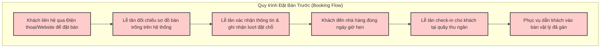

*   **[walkin_flow.mmd](restaurant_business_process/01_customer/walkin_flow.mmd)**

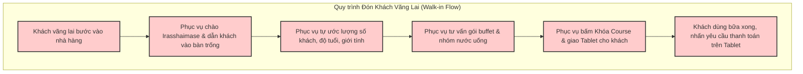

#### Bộ phận/Phân mục: `02_reception_cashier`

*   **[booking_management_flow.mmd](restaurant_business_process/02_reception_cashier/booking_management_flow.mmd)**

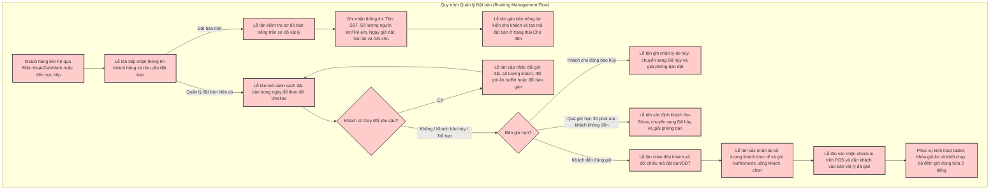

*   **[payment_flow.mmd](restaurant_business_process/02_reception_cashier/payment_flow.mmd)**

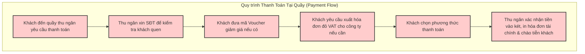

*   **[shift_closing_flow.mmd](restaurant_business_process/02_reception_cashier/shift_closing_flow.mmd)**

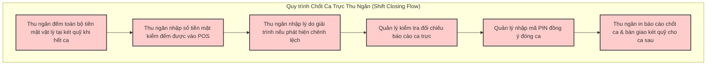

#### Bộ phận/Phân mục: `03_service_staff`

*   **[table_service_ordering_flow.mmd](restaurant_business_process/03_service_staff/table_service_ordering_flow.mmd)**

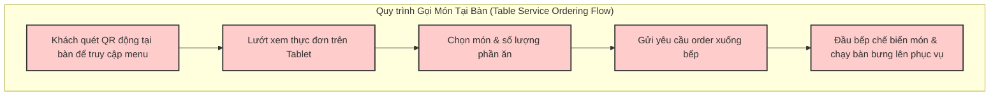

#### Bộ phận/Phân mục: `04_kitchen`

*   **[kitchen_operations_workflow.mmd](restaurant_business_process/04_kitchen/kitchen_operations_workflow.mmd)**

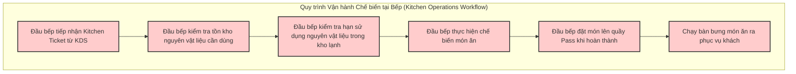

#### Bộ phận/Phân mục: `05_inventory_procurement`

*   **[inventory_workflow.mmd](restaurant_business_process/05_inventory_procurement/inventory_workflow.mmd)**

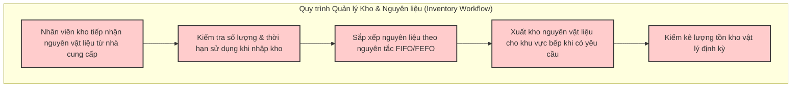

#### Bộ phận/Phân mục: `06_accounting`

*Không có sơ đồ nào.*

#### Bộ phận/Phân mục: `07_manager`

*   **[manager_operations.mmd](restaurant_business_process/07_manager/manager_operations.mmd)**

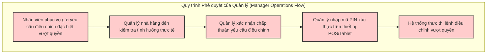

#### Bộ phận/Phân mục: `08_crm`

*   **[crm_workflow.mmd](restaurant_business_process/08_crm/crm_workflow.mmd)**

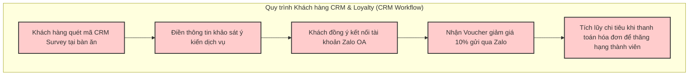

#### Bộ phận/Phân mục: `09_admin`

*   **[admin_configuration.mmd](restaurant_business_process/09_admin/admin_configuration.mmd)**

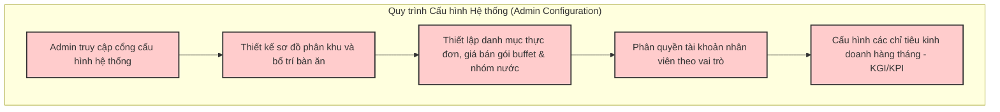

### Domain: POS System Workflow Domain

*   **[booking_system_flow.mmd](pos_system_workflow/booking_system_flow.mmd)**

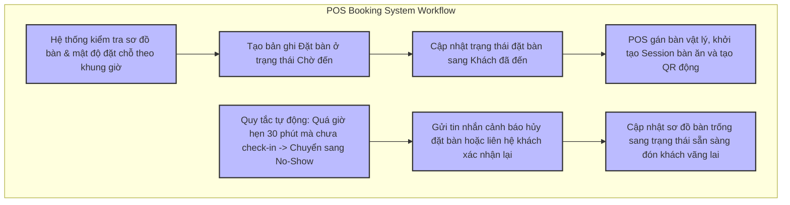

*   **[crm_processing_flow.mmd](pos_system_workflow/crm_processing_flow.mmd)**

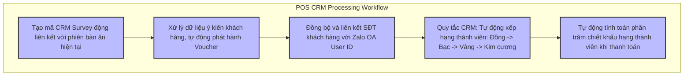

*   **[inventory_processing_flow.mmd](pos_system_workflow/inventory_processing_flow.mmd)**

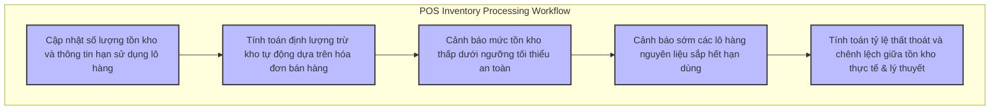

*   **[kitchen_ticket_flow.mmd](pos_system_workflow/kitchen_ticket_flow.mmd)**

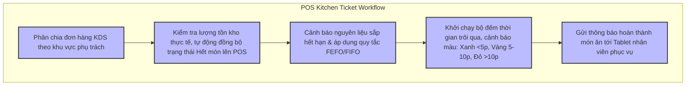

*   **[order_processing_flow.mmd](pos_system_workflow/order_processing_flow.mmd)**

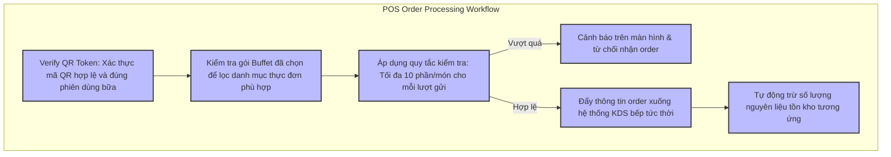

*   **[payment_processing_flow.mmd](pos_system_workflow/payment_processing_flow.mmd)**

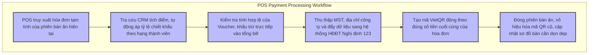

*   **[shift_processing_flow.mmd](pos_system_workflow/shift_processing_flow.mmd)**

```mermaid
graph TD
    classDef system fill:#bbf,stroke:#333,stroke-width:2px;

    subgraph "POS Shift Processing Workflow"
        B1[Hệ thống khóa toàn bộ giao dịch mới gắn với ca trực hiện tại] --> B2[Tính toán công thức doanh thu lý thuyết trong ca trực]
        B2 --> B3[So sánh đối chiếu tiền mặt thực đếm với doanh thu lý thuyết trên POS]
        B3 --> B4[Ghi nhận chênh lệch thừa/thiếu kèm lý do giải trình vào Audit Log]
        B3 --> B5[Xác thực quyền quản lý bằng mã PIN phê duyệt đóng ca]
        B5 --> B6[Xuất báo cáo tổng kết doanh thu gửi về phòng kế toán]
    end

    class B1,B2,B3,B4,B5,B6 system;
```

*   **[table_management_flow.mmd](pos_system_workflow/table_management_flow.mmd)**

```mermaid
graph TD
    classDef system fill:#bbf,stroke:#333,stroke-width:2px;

    subgraph "POS Table Management Workflow"
        B1[Cập nhật trạng thái bàn sang Trống trên Seat Map] --> B2[Chuyển trạng thái bàn sang Đặt trước, liên kết thông tin đặt bàn]
        B2 --> B3[Chuyển trạng thái bàn sang Đang phục vụ, kích hoạt Table Session & QR]
        B3 --> B4[Khách thanh toán -> Chuyển trạng thái bàn sang Cần dọn dẹp, hủy QR]
        B4 --> B5[Chuyển trạng thái bàn sang Bảo trì, khóa không cho phép khai bàn]
    end

    class B1,B2,B3,B4,B5 system;
```

### Domain: Data & Entity Lifecycle Domain

*   **[bill_lifecycle.mmd](data_entity_lifecycle/bill_lifecycle.mmd)**

```mermaid
graph TD
    classDef lifecycle fill:#ffc,stroke:#333,stroke-width:2px;

    subgraph "Bill Lifecycle"
        L_State[Trạng thái Hóa đơn: Nháp -> Đang xử lý -> Đã thanh toán -> Đã hủy]
    end

    class L_State lifecycle;
```

*   **[booking_lifecycle.mmd](data_entity_lifecycle/booking_lifecycle.mmd)**

```mermaid
graph TD
    classDef lifecycle fill:#ffc,stroke:#333,stroke-width:2px;

    subgraph "Booking Lifecycle"
        L_State[Trạng thái Đặt bàn: Chờ đến -> Đã đến / Đã hủy / Trễ hẹn No-Show]
    end

    class L_State lifecycle;
```

*   **[ingredient_lifecycle.mmd](data_entity_lifecycle/ingredient_lifecycle.mmd)**

```mermaid
graph TD
    classDef lifecycle fill:#ffc,stroke:#333,stroke-width:2px;

    subgraph "Ingredient Lifecycle"
        L_State[Nguyên liệu: Tồn kho -> Tạm tính hao phí -> Đã sử dụng]
    end

    class L_State lifecycle;
```

*   **[inventory_item_lifecycle.mmd](data_entity_lifecycle/inventory_item_lifecycle.mmd)**

```mermaid
graph TD
    classDef lifecycle fill:#ffc,stroke:#333,stroke-width:2px;

    subgraph "Inventory Item Lifecycle"
        L_State[Stock Item: Mới nhập -> Trong kho -> Tạm giữ -> Đã trừ kho / Hết hạn]
    end

    class L_State lifecycle;
```

*   **[kitchen_ticket_lifecycle.mmd](data_entity_lifecycle/kitchen_ticket_lifecycle.mmd)**

```mermaid
graph TD
    classDef lifecycle fill:#ffc,stroke:#333,stroke-width:2px;

    subgraph "Kitchen Ticket Lifecycle"
        L_State[Kitchen Ticket: Waiting -> Cooking -> Ready -> Served]
    end

    class L_State lifecycle;
```

*   **[order_lifecycle.mmd](data_entity_lifecycle/order_lifecycle.mmd)**

```mermaid
graph TD
    classDef lifecycle fill:#ffc,stroke:#333,stroke-width:2px;

    subgraph "Order Lifecycle"
        L_State[Trạng thái Món ăn: Chờ xử lý -> Đang chế biến -> Sẵn sàng phục vụ -> Đã phục vụ / Đã hủy]
    end

    class L_State lifecycle;
```

*   **[qr_lifecycle.mmd](data_entity_lifecycle/qr_lifecycle.mmd)**

```mermaid
graph TD
    classDef lifecycle fill:#ffc,stroke:#333,stroke-width:2px;

    subgraph "QR Code Lifecycle"
        L_State[Mã QR động: Khởi tạo -> Đang hoạt động -> Hết hạn]
    end

    class L_State lifecycle;
```

*   **[table_lifecycle.mmd](data_entity_lifecycle/table_lifecycle.mmd)**

```mermaid
graph TD
    classDef lifecycle fill:#ffc,stroke:#333,stroke-width:2px;

    subgraph "Table Lifecycle"
        L_State[Trạng thái bàn ăn: Trống -> Đặt trước -> Đang phục vụ -> Cần dọn dẹp -> Bảo trì]
    end

    class L_State lifecycle;
```

### Domain: Module Interaction Domain

*   **[admin_interaction.mmd](module_interaction/admin_interaction.mmd)**

```mermaid
graph TD
    classDef interaction fill:#9f9,stroke:#333,stroke-width:2px;

    subgraph "Admin Module Interaction"
        M_Admin[Admin Config Portal] <--> M_RBAC[RBAC Role Management]
        M_Admin <--> M_Menu[Menu & Package Management]
        M_Admin <--> M_Floor[Floor Space & Table Config]
        M_Admin <--> M_KPI[KPI & Target Dashboard]
    end

    class M_Admin,M_RBAC,M_Menu,M_Floor,M_KPI interaction;
```

*   **[cashier_interaction.mmd](module_interaction/cashier_interaction.mmd)**

```mermaid
graph TD
    classDef interaction fill:#9f9,stroke:#333,stroke-width:2px;

    subgraph "Cashier Module Interaction"
        M_POS[Cashier POS] <--> M_CRM[CRM & Loyalty System]
        M_POS <--> M_Voucher[Promotion & Voucher Manager]
        M_POS <--> M_EInvoice[E-Invoice Partner API]
        M_POS <--> M_Floor[Floor Space & Table Session]
    end

    class M_POS,M_CRM,M_Voucher,M_EInvoice,M_Floor interaction;
```

*   **[crm_interaction.mmd](module_interaction/crm_interaction.mmd)**

```mermaid
graph TD
    classDef interaction fill:#9f9,stroke:#333,stroke-width:2px;

    subgraph "CRM Module Interaction"
        M_CRM[CRM Core] <--> M_Tablet[Tablet Survey Interface]
        M_CRM <--> M_Zalo[Zalo OA Integration]
        M_CRM <--> M_POS[Cashier Checkout POS]
    end

    class M_CRM,M_Tablet,M_Zalo,M_POS interaction;
```

*   **[inventory_interaction.mmd](module_interaction/inventory_interaction.mmd)**

```mermaid
graph TD
    classDef interaction fill:#9f9,stroke:#333,stroke-width:2px;

    subgraph "Inventory Module Interaction"
        M_Inventory[Inventory Management] <--> M_Recipe[Recipe Config]
        M_Inventory <--> M_KDS[Kitchen Display System]
        M_Inventory <--> M_POS[Sales Checkout POS]
    end

    class M_Inventory,M_Recipe,M_KDS,M_POS interaction;
```

*   **[kitchen_interaction.mmd](module_interaction/kitchen_interaction.mmd)**

```mermaid
graph TD
    classDef interaction fill:#9f9,stroke:#333,stroke-width:2px;

    subgraph "Kitchen Module Interaction"
        M_KDS[Kitchen Display System - KDS] <--> M_Inventory[Inventory & Expiration Check]
        M_KDS <--> M_Dashboard[Kitchen Coordinator Dashboard]
        M_KDS <--> M_POS[Cashier POS / Tablet]
    end

    class M_KDS,M_Inventory,M_Dashboard,M_POS interaction;
```

*   **[manager_interaction.mmd](module_interaction/manager_interaction.mmd)**

```mermaid
graph TD
    classDef interaction fill:#9f9,stroke:#333,stroke-width:2px;

    subgraph "Manager Module Interaction"
        M_Manager[Manager Override Auth] <--> M_POS[Cashier POS / Tablet]
        M_Manager <--> M_Audit[Audit Log System]
        M_Manager <--> M_RBAC[RBAC Privilege Verify]
    end

    class M_Manager,M_POS,M_Audit,M_RBAC interaction;
```

*   **[module_relationships.mmd](module_interaction/module_relationships.mmd)**

```mermaid
graph TD
    classDef interaction fill:#9f9,stroke:#333,stroke-width:2px;

    subgraph "Mối Quan Hệ Giữa Các Phân Hệ (Module Relationships)"
        M_Admin[Admin Config Module] <--> M_Floor[Floor Map & Session Manager]
        M_Floor <--> M_Ordering[Tablet Ordering Module]
        M_Ordering <--> M_KDS[Kitchen Display System - KDS]
        M_Floor <--> M_POS[Cashier POS Checkout]
        M_POS <--> M_CRM[CRM & Voucher System]
        M_POS <--> M_Inventory[Inventory stock link]
    end

    class M_Admin,M_Floor,M_Ordering,M_KDS,M_POS,M_CRM,M_Inventory interaction;
```

*   **[reception_interaction.mmd](module_interaction/reception_interaction.mmd)**

```mermaid
graph TD
    classDef interaction fill:#9f9,stroke:#333,stroke-width:2px;

    subgraph "Reception Module Interaction"
        M_Reception[Reception Desk] <--> M_POS[Cashier POS]
        M_Reception <--> M_Floor[Floor Space & Seat Map]
        M_Reception <--> M_Booking[Booking System]
    end

    class M_Reception,M_POS,M_Floor,M_Booking interaction;
```

*   **[staff_interaction.mmd](module_interaction/staff_interaction.mmd)**

```mermaid
graph TD
    classDef interaction fill:#9f9,stroke:#333,stroke-width:2px;

    subgraph "Staff Module Interaction"
        M_Staff[Waiter / Staff POS] <--> M_Floor[Table Session Management]
        M_Staff <--> M_Tablet[Tablet Ordering Interface]
        M_Staff <--> M_Cashier[Cashier Checkout POS]
    end

    class M_Staff,M_Floor,M_Tablet,M_Cashier interaction;
```
